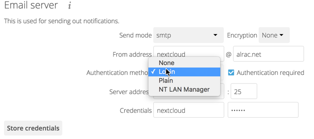
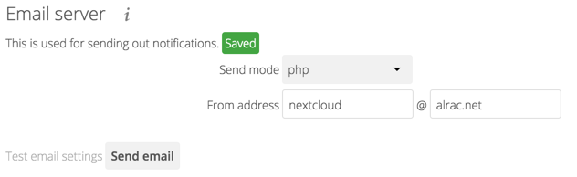

Email Configuration
===================

ownCloud is capable of sending password reset emails, notifying users of new 
file shares, changes in files, and activity notifications. Your users configure 
which notifications they want to receive on their Personal pages. 

ownCloud does not contain a full email server, but rather connects to your 
existing mail server. You must have a functioning mail server for ownCloud to be 
able to send emails. You may have a mail server on the same machine as ownCloud, 
or it may be a remote server.

ownCloud 7 introduces a new feature, the graphical Email Configuration Wizard.

.. figure:: ../images/smtp-config-wizard.png
   
With the new wizard, connecting ownCloud to your mail server is fast and easy. 
The wizard fills in the values in ``config/config.php``, so you may use either 
or both as you prefer.

The ownCloud Email wizard supports three types of mail server connections: 
SMTP, PHP, and Sendmail. Use the SMTP configurator for a remote server, and PHP 
or Sendmail when your mail server is on the same machine as ownCloud. 

.. note:: The Sendmail option refers to the Sendmail SMTP server, and any 
   drop-in Sendmail replacement such as Postfix, Exim, or Courier. All of 
   these include a ``sendmail`` binary, and are freely-interchangeable.

Configuring an SMTP Server
--------------------------

You need the following information from your mailserver administrator to 
connect ownCloud to a remote SMTP server:

* Encryption type: None, SSL, or TLS

* The From address you want your outgoing ownCloud mails to use

* Whether authentication is required

* Authentication method: None, Login, Plain, or NT LAN Manager

* The server's IP address or fully-qualified domain name

* Login credentials, if required

Your changes are saved immediately, and you can click the Send Email button to 
test your configuration. This sends a test message to the email address you 
configured on your Personal page. The test message says::

  If you received this email, the settings seem to be correct.
  
  --
  ownCloud
  web services under your control

Configuring PHP and Sendmail
----------------------------

Configuring PHP or Sendmail requires only that you select one of them, and then 
enter your desired return address.

   
How do you decide which one to use? PHP mode uses your local ``sendmail`` 
binary. Use this if you want to use ``php.ini`` to control some of your mail 
server functions, such as setting paths, headers, or passing extra command 
options to the ``sendmail`` binary. These vary according to which server you 
are using, so consult your server's documentation to see what your options are.

In most cases the ``smtp`` option is best, because it removes the extra step of 
passing through PHP, and you can control all of your mail server options in one 
place, in your mail server configuration.

Using Email Templates
---------------------

Another useful new feature is editable email templates. Now you can edit 
ownCloud's email templates on your Admin page. These are your available 
templates:

* Sharing email (HTML) -- HTML version of emails notifying users of new file 
  shares

* Sharing email  (plain text fallback) -- Plain text email notifying users of new file shares

* Lost password mail -- Password reset email for users who lose their passwords.

* Activity notification mail -- Notification of activities that users have 
  enabled in the Notifications section of their Personal pages.

In addition to providing the email templates, this feature enables you to apply 
any preconfigured themes to the email.

To modify an email template to users:

1. Access the Admin page.

2. Scroll to the Mail templates section.

3. Select a template from the drop-down menu.

4. Make any desired modifications to the template.

The templates are written in PHP and HTML, and are already loaded with the 
relevant variables such as username, share links, and filenames. You can, if you 
are careful, edit these even without knowing PHP or HTML; don't touch any of the 
code, but you can edit the text portions of the messages. For example, this the 
lost password mail template:

.. code-block:: php

  <?php
  
     echo str_replace('{link}', $_['link'], $l->t('Use the following link to
     reset your password: {link}'));

You could change the text portion of the template, ``Use the following link to 
reset your password:`` to say something else, such as ``Click the following link 
to reset your password. If you did not ask for a password reset, ignore this 
message.``

Again, be very careful to change nothing but the message text, because the 
tiniest coding error will break the template.

.. note:: You can edit the templates directly in the template text box, or you 
   can copy and paste them to a text editor for modification and then copy and 
   paste them back to the template text box for use when you are done.

Setting Mail Server Parameters in config.php
--------------------------------------------

If you prefer, you may set your mail server parameters in ``config/config.php``. 
The following examples are for SMTP, PHP, Sendmail, and Qmail.

SMTP
~~~~
If you want to send email using a local or remote SMTP server it is necessary
to enter the name or IP address of the server, optionally followed by a colon
separated port number, e.g. **:425**. If this value is not given the default
port 25/tcp will be used unless you will change that by modifying the
**mail_smtpport** parameter. Multiple servers can be entered, separated by
semicolons:

.. code-block:: php

  <?php

    "mail_smtpmode"     => "smtp",
    "mail_smtphost"     => "smtp-1.server.dom;smtp-2.server.dom:425",
    "mail_smtpport"     => 25,

or

.. code-block:: php

  <?php

    "mail_smtpmode"     => "smtp",
    "mail_smtphost"     => "smtp.server.dom",
    "mail_smtpport"     => 425,

If a malware or SPAM scanner is running on the SMTP server it might be
necessary that you increase the SMTP timeout to e.g. 30s:

.. code-block:: php

  <?php

    "mail_smtptimeout"  => 30,

If the SMTP server accepts insecure connections, the default setting can be
used:

.. code-block:: php

  <?php

  "mail_smtpsecure"   => '',

If the SMTP server only accepts secure connections you can choose between
the following two variants:

SSL
^^^
A secure connection will be initiated using the outdated SMTPS protocol
which uses the port 465/tcp:

.. code-block:: php

  <?php

    "mail_smtphost"     => "smtp.server.dom:465",
    "mail_smtpsecure"   => 'ssl',

TLS
^^^
A secure connection will be initiated using the STARTTLS protocol which
uses the default port 25/tcp:

.. code-block:: php

  <?php

    "mail_smtphost"     => "smtp.server.dom",
    "mail_smtpsecure"   => 'tls',

And finally it is necessary to configure if the SMTP server requires
authentication, if not, the default values can be taken as is.

.. code-block:: php

  <?php

    "mail_smtpauth"     => false,
    "mail_smtpname"     => "",
    "mail_smtppassword" => "",

If SMTP authentication is required you have to set the required username
and password and can optionally choose between the authentication types
**LOGIN** (default) or **PLAIN**.

.. code-block:: php

  <?php

    "mail_smtpauth"     => true,
    "mail_smtpauthtype" => "LOGIN",
    "mail_smtpname"     => "username",
    "mail_smtppassword" => "password",

PHP mail
~~~~~~~~
If you want to use PHP mail it is necessary to have an installed and working
email system on your server. Which program in detail is used to send email is
defined by the configuration settings in the **php.ini** file. (On \*nix
systems this will most likely be Sendmail.) ownCloud should be able to send
email out of the box.

.. code-block:: php

  <?php

    "mail_smtpmode"     => "php",
    "mail_smtphost"     => "127.0.0.1",
    "mail_smtpport"     => 25,
    "mail_smtptimeout"  => 10,
    "mail_smtpsecure"   => "",
    "mail_smtpauth"     => false,
    "mail_smtpauthtype" => "LOGIN",
    "mail_smtpname"     => "",
    "mail_smtppassword" => "",

Sendmail
~~~~~~~~
If you want to use the well known Sendmail program to send email, it is
necessary to have an installed and working email system on your \*nix server.
The sendmail binary (**/usr/sbin/sendmail**) is usually part of that system.
ownCloud should be able to send email out of the box.

.. code-block:: php

  <?php

    "mail_smtpmode"     => "sendmail",
    "mail_smtphost"     => "127.0.0.1",
    "mail_smtpport"     => 25,
    "mail_smtptimeout"  => 10,
    "mail_smtpsecure"   => "",
    "mail_smtpauth"     => false,
    "mail_smtpauthtype" => "LOGIN",
    "mail_smtpname"     => "",
    "mail_smtppassword" => "",

qmail
~~~~~

If you want to use the qmail program to send email, it is necessary to have an
installed and working qmail email system on your server. The sendmail binary
(**/var/qmail/bin/sendmail**) will then be used to send email. ownCloud should
be able to send email out of the box.

.. code-block:: php

  <?php

    "mail_smtpmode"     => "qmail",
    "mail_smtphost"     => "127.0.0.1",
    "mail_smtpport"     => 25,
    "mail_smtptimeout"  => 10,
    "mail_smtpsecure"   => "",
    "mail_smtpauth"     => false,
    "mail_smtpauthtype" => "LOGIN",
    "mail_smtpname"     => "",
    "mail_smtppassword" => "",

Send a Test Email
-----------------

To test your email configuration, save your email address in your personal
settings and then use the **Send email** button in *Email Server* section
of the Admin settings page.

Troubleshooting
---------------

If you are unable to send email, try turning on debugging. Do this by enabling 
the ``mail_smtpdebug parameter`` in ``config/config.php``.

.. code-block:: php

  <?php

    "mail_smtpdebug" => true;

.. note:: Immediately after pressing the **Send email** button, as described 
   before, several **SMTP -> get_lines(): ...** messages appear on the screen.  
   This is expected behavior and can be ignored.

**Question**: Why is my web domain different from my mail domain?

**Answer**: The default domain name used for the sender address is the hostname 
where your ownCloud installation is served.  If you have a different mail domain 
name you can override this behavior by setting the following configuration 
parameter:

.. code-block:: php

  <?php

    "mail_domain" => "example.com",

This setting results in every email sent by ownCloud (for example, the password 
reset email) having the domain part of the sender address appear as follows::

  no-reply@example.com

**Question**: How can I find out if a SMTP server is reachable?

**Answer**: Use the ping command to check the server availability::

  ping smtp.server.dom

::

  PING smtp.server.dom (ip-address) 56(84) bytes of data.
  64 bytes from your-server.local.lan (192.168.1.10): icmp_req=1 ttl=64
  time=3.64ms

**Question**: How can I find out if the SMTP server is listening on a specific 
TCP port?

**Answer**: The best way to get mail server information is to ask your mail 
server admin. If you are the mail server admin, or need information in a 
hurry, you can use the ``netstat`` command. This example shows all active 
servers on your system, and the ports they are listening on. The SMTP server is 
listening on localhost port 25.

::

# netstat -pant

::

 Active Internet connections (servers and established)
 Proto Recv-Q Send-Q Local Address   Foreign Address  State  ID/Program name
 tcp    0      0    0.0.0.0:631     0.0.0.0:*        LISTEN   4418/cupsd
 tcp    0      0    127.0.0.1:25    0.0.0.0:*        LISTEN   2245/exim4
 tcp    0      0    127.0.0.1:3306  0.0.0.0:*        LISTEN   1524/mysqld

*  25/tcp is unencrypted smtp 

* 110/tcp/udp is unencrypted pop3 

* 143/tcp/udp is unencrypted imap4

* 465/tcp is encrypted ssmtp

* 993/tcp/udp is encrypted imaps
      
* 995/tcp/udp is encrypted pop3s 

**Question**: How can I determine if the SMTP server supports the outdated SMTPS 
protocol?

**Answer**: A good indication that the SMTP server supports the SMTPS protocol 
is that it is listening on port **465**. 

**Question**: How can I determine what authorization and encryption protocols 
the mail server supports?

**Answer**: SMTP servers usually announce the availability of STARTTLS 
immediately after a connection has been established. You can easily check this 
using the ``telnet`` command.

.. note:: You must enter the marked lines to obtain the information displayed.

::

  telnet smtp.domain.dom 25

::

  Trying 192.168.1.10...
  Connected to smtp.domain.dom.
  Escape character is '^]'.
  220 smtp.domain.dom ESMTP Exim 4.80.1 Tue, 22 Jan 2013 22:39:55 +0100
  EHLO your-server.local.lan                   # <<< enter this command
  250-smtp.domain.dom Hello your-server.local.lan [ip-address]
  250-SIZE 52428800
  250-8BITMIME
  250-PIPELINING
  250-AUTH PLAIN LOGIN CRAM-MD5                 # <<< Supported auth protocols
  250-STARTTLS                                  # <<< Encryption is supported
  250 HELP
  QUIT                                          # <<< enter this command
  221 smtp.domain.dom closing connection
  Connection closed by foreign host.

Enabling Debug Mode
-------------------

If you are unable to send email, it might be useful to activate further debug
messages by enabling the mail_smtpdebug parameter:

.. code-block:: php

  <?php

    "mail_smtpdebug" => true,

.. note:: Immediately after pressing the **Send email** button, as described
   before, several **SMTP -> get_lines(): ...** messages appear on the screen.
   This is expected behavior and can be ignored.
