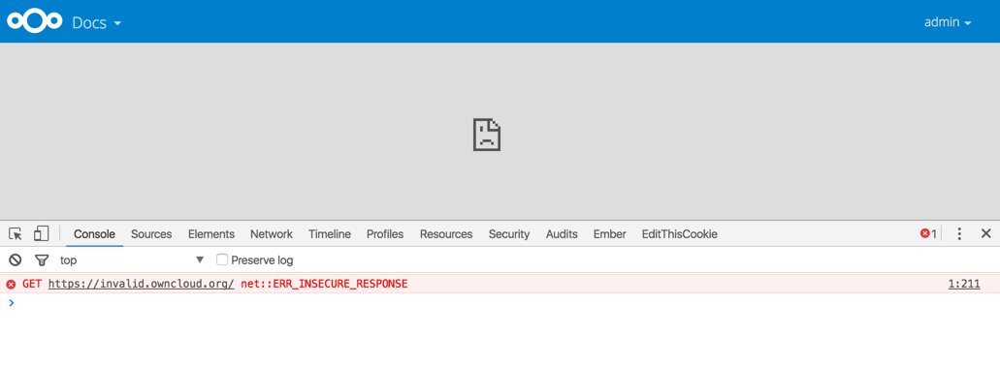

======================
Linking External Sites
======================

You can embed external Web sites inside your ownCloud pages with the External 
Sites app, as this screenshot shows.

   *Click to enlarge*

This is useful for quick access to important Web pages such as the 
ownCloud manuals and informational pages for your company, and for presenting 
external pages inside your custom ownCloud branding, if you use your own custom 
themes.

The External sites app is included in all versions of ownCloud. Go to **Apps >  
Not Enabled** to enable it. Then go to your ownCloud Admin page to create your 
links, which are saved automatically. There is a dropdown menu to select an 
icon, but there is only one default icon so you don't have to select one. Hover 
your cursor to the right of your links to make the trashcan icon appear when you 
want to remove them.

.. figure:: ../images/external-sites-2.png
   :scale: 80%

   *Click to enlarge*
   
The links appear in the ownCloud dropdown menu on the top left after 
refreshing your page, and have globe icons.

.. figure:: ../images/external-sites-3.png

Your links may or may not work correctly due to the various ways that Web 
browsers and Web sites handle HTTP and HTTPS URLs, and because the External 
Sites app embeds external links in IFrames. Modern Web browsers try very hard 
to protect Web surfers from dangerous links, and safety apps like 
`Privacy Badger <https://www.eff.org/privacybadger>`_ and ad-blockers may block 
embedded pages. It is strongly recommended to enforce HTTPS on your ownCloud 
server; do not weaken this, or any of your security tools, just to make 
embedded Web pages work. After all, you can freely access them outside of 
ownCloud.

Most Web sites that offer login functionalities use the ``X-Frame-Options`` or 
``Content-Security-Policy`` HTTP header which instructs browsers to not 
allow their pages to be embedded for security reasons (e.g. "Clickjacking"). You 
can usually verify the reason why embedding the website is not possible by using 
your browser's console tool. For example, this page has an invalid SSL 
certificate.

On this page, X-Frame-Options prevents the embedding.

There isn't much you can do about these issues, but if you're curious you can 
see what is happening.