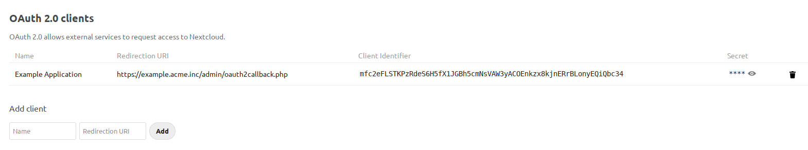

======
OAuth2
======

Nextcloud allows connecting external services (for example Moodle) to your Nextcloud.
This is done via ``OAuth2``. See `RFC6749 <https://tools.ietf.org/html/rfc6749>`_ for the
OAuth2 specification.

.. note:: Nextcloud does only support confidential clients.

Add an OAuth2 Application
-------------------------

Head over to your Administrator Security Settings. Here you can add a new ``OAuth2`` client.

Enter the name of your application and provide a redirection url.
You should now have a Client Identifier and Secret. Enter those into your ``OAuth2`` client.

Please provide the OAuth2 application the following details:

* Authorization endpoint: ``https://cloud.example.org/apps/oauth2/authorize``
* Token endpoint: ``https://cloud.example.org/apps/oauth2/api/v1/token``

Note that you must include ``index.php`` if pretty URL is not configured - i.e. ``https://cloud.example.org/index.php/apps/oauth2/api/v1/token``.

The access token
----------------

The access token obtained is a so called Bearer token. Which means that for request to the
Nextcloud server you will have to send the proper authorization header.

Authorization: Bearer <TOKEN>

Note that apache by default strips this. Make sure you have ``mod_headers``, ``mod_rewrite`` and ``mod_env`` enabled.

Security considerations
-----------------------

Nextcloud ``OAuth2`` implementation currently does not support scoped access. This means that every token has full access to the complete account including read and write permission to the stored files. It is essential to store the ``OAuth2`` tokens in a safe way! 

Without scopes and restrictable access it is not recommended to use a Nextcloud instance as a user authentication service.
