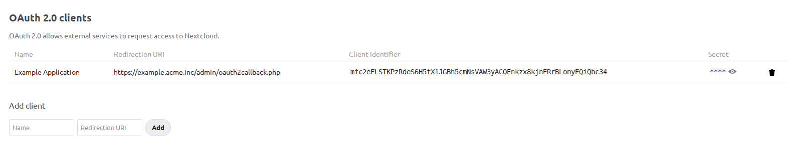

======
OAuth2
======

Nextcloud allows connecting external services (for example Moodle) to your Nextcloud.
This is done via ``OAuth2``. See `RFC6749 <https://tools.ietf.org/html/rfc6749>`_ for the
OAuth2 specification.

.. note:: Nextcloud supports only confidential clients.

Add an OAuth2 Application
-------------------------

Head over to your Administrator Security Settings. Here you can add a new ``OAuth2`` client.

Enter the name of your application and provide a redirection url.
You should now have a Client Identifier and Secret. Enter those into your ``OAuth2`` client.

Please provide the OAuth2 application the following details:

* Authorization endpoint: ``https://cloud.example.org/apps/oauth2/authorize``
* Token endpoint: ``https://cloud.example.org/apps/oauth2/api/v1/token``

Note that you must include ``index.php`` if pretty URL is not configured - i.e. ``https://cloud.example.org/index.php/apps/oauth2/api/v1/token``.

The access token
----------------

The access token obtained is a so called Bearer token. Which means that for request to the
Nextcloud server you will have to send the proper authorization header.

Authorization: Bearer <TOKEN>

Note that apache by default strips this. Make sure you have ``mod_headers``, ``mod_rewrite`` and ``mod_env`` enabled.

Security considerations
-----------------------

Nextcloud's ``OAuth2`` implementation does not support scoped access. Every access token therefore grants read and write
access to all data available to the account. Treat the token like the account credentials and only provide it to clients
and intermediaries that you fully trust.

This risk applies whenever a service receives or stores the Nextcloud access token and can use it to call Nextcloud
APIs. If an authentication proxy completes the OAuth2 flow without exposing the token to its upstream application,
that application does not receive direct access to Nextcloud. The proxy still holds a full-access token and must store
and handle it securely.

Do not use Nextcloud's built-in OAuth2 provider when the client requires restricted access to account data. If you want
to use Nextcloud as an identity provider, see :doc:`../configuration_user/user_auth_oidc`.

Skipping pre-login warning
--------------------------

In Nextcloud default ``OAuth2`` flow, a confirmation step is shown before login if the user is not yet logged-in, and a second one is shown after login.
To skip the pre-login one for a trusted application, the configuration option ``skipAuthPickerApplications`` can be set through occ::

 sudo -E -u www-data php occ config:app:set oauth2 skipAuthPickerApplications --type array --value '["myapplication"]'
