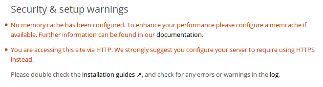

======================
Warnings on Admin Page
======================

Your ownCloud server has a built-in configuration checker, and it reports its 
findings at the top of your Admin page. These are some of the warnings you 
might see, and what to do about them.

Cache Warnings
--------------

"No memory cache has been configured. To enhance your performance please 
configure a memcache if available." ownCloud supports multiple php caching
extentions:

* APC
* APCu (minimum required php extension version: 4.0.6)
* Memcached
* Redis (minimum required php extension version: 2.2.5)
* Xcache

You will see this warning if you have no caches installed or if your cache
does not have the required minimum version installed; older versions are
disabled because of performance problems.

If you see "*{Cache}* below version *{Version}* is installed. for stability and
performance reasons we recommend to update to a newer *{Cache}* version" then
you need to upgrade, or, if you're not using it, remove it.

It is not required to use any caches, but caches improve server performance. See 
:doc:`performance_tuning` for more information on installing and using caches.

You are accessing this site via HTTP
------------------------------------

"You are accessing this site via HTTP. We strongly suggest you configure your 
server to require using HTTPS instead." Please take this warning seriously; 
using HTTPS is a fundamental security measure. You must configure your Web 
server to support it, and then there are some settings in the **Security** 
section of your ownCloud Admin page to enable. The following manual pages 
describe how to enable HTTPS on the Apache and Nginx Web servers.

`Enabling SSL (on Apache) 
<https://doc.owncloud.org/server/8.1/admin_manual/installation/ 
source_installation.html#enabling-ssl>`_

`Use HTTPS 
<https://doc.owncloud.org/server/8.1/admin_manual/configuration_server/ 
harden_server.html#use-https>`_

`Nginx 
Configuration <https://doc.owncloud.org/server/8.1/admin_manual/installation/ 
nginx_configuration.html>`_
