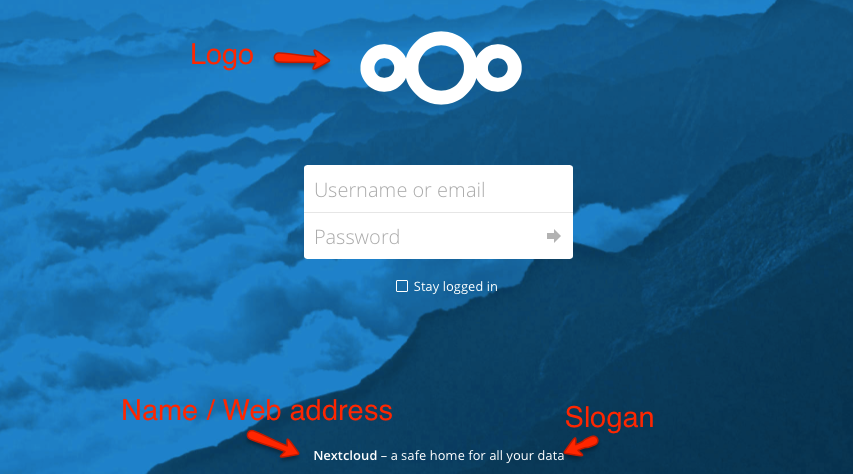

=======
Theming
=======

In the administrative settings you can modify the appearance of Nextcloud:

* Name 
* Web Address 
* Slogan
* Color: The color of header bar, checkboxes and folder icon
* Logo: The logo will appear in the header and on the log in page. Default has 62/34 px.
* Log in image: The background image of the log in page

.. figure:: ../configuration_server/images/theming.png

Log in page   

Theming of icons
================

Nextcloud will automatically generate favicons and home screen icons
depending on the current app and theming color. 

This requires the following additional dependencies:

 - PHP module imagick
 - SVG support for imagick (e.g. `libmagickcore5-extra`)

