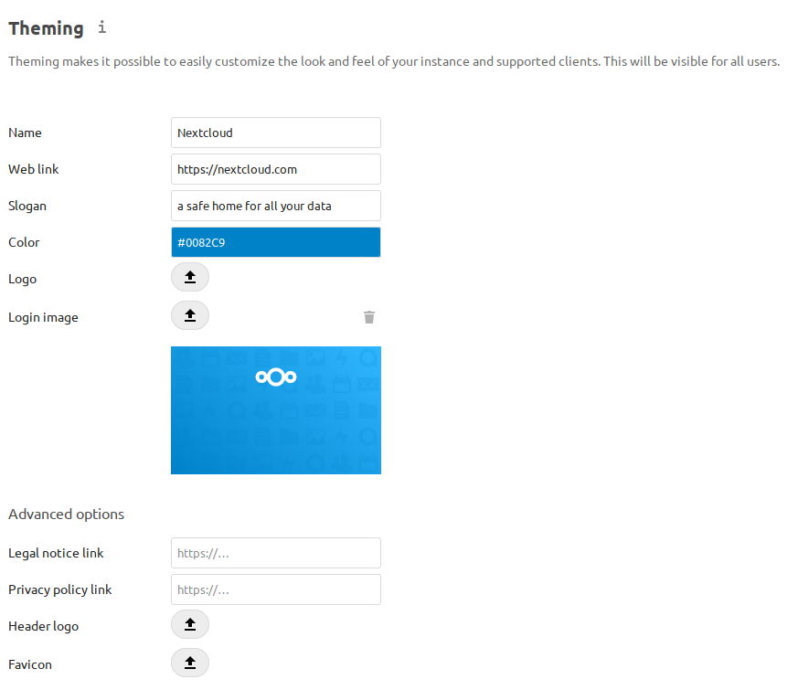

=======
Theming
=======

With our theming feature you are able to customize the look and feel of your
Nextcloud instance according to the corporate design of your organization by
replacing Nextcloud logo and color with your own assets.

The theming-app is enabled by default so the section should appear by default in
your admin-settings. If not, check in the apps management that this app is enabled.

Modify the appearance of Nextcloud
----------------------------------

You can change the following parameters of the look and feel on your instance:

* Name (e.g. ACME Inc. Cloud)
* Web Address (e.g. https://acme.inc/)
* Slogan
* Color: The color of header bar, checkboxes and folder icon
* Logo: The logo will appear in the header and on the log in page. Default has 62/34 px.
* Login image: The background image of the login page
* Additional legal links (Legal notice and Privacy policy link)
* Custom header logo and favicon as alternative to auto-generation based on logo

Configure theming through CLI
-----------------------------

Theming configuration can also be adjusted through the ``occ theming:config`` command.

The following values are available to be set through this:

- name, url, imprintUrl, privacyUrl, slogan, color ``occ theming:config name "My Example Cloud"``
- background, logo, favicon, logoheader ``occ theming:config logo /tmp/mylogo.png``

.. note:: Images require to be read from a local file on the Nextcloud server

Theming of icons
----------------

According to the parameters you have set, Nextcloud will automatically generate
favicons and a header logo depending on the current logo and theming color.

This requires the following additional dependencies:

 - PHP module ``imagick``
 - SVG support for imagick (e.g. ``libmagickcore-6.q16-3-extra`` on Debian 9 and Ubuntu 18.04)

.. note:: In the advanced options of the theming app you are able to set a custom
   favicon in case you do not want to use the same logo resources you have set above
   or you do not want to install the mentioned dependencies.

Branded clients
---------------

.. note:: Nextcloud GmbH provides branding services, delivering sync clients (mobile
   and desktop) which use your corporate identity and are pre-configured to help your
   users get up and running in no time. If you are interested in our advanced branding &
   support subscription, `contact our sales team <https://nextcloud.com/enterprise/>`_.

The theming app supports to change the URLs to the mobile apps (Android & iOS) that
is shown when the webinterface is opened on one of those devices. Then there was a
header shown, that redirects the user to the app in the app store. By default
this redirects to the Nextcloud apps. In some cases it is wanted that this
links to branded versions of those apps. In those cases the IDs and URLs can be
set via the ``occ``-command::

    occ config:app:set theming AndroidClientUrl --value "https://play.google.com/store/apps/details?id=com.nextcloud.client"
    occ config:app:set theming iTunesAppId --value "1125420102"
    occ config:app:set theming iOSClientUrl --value "https://itunes.apple.com/us/app/nextcloud/id1125420102?mt=8"
