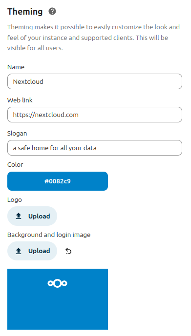

=======
Theming
=======

The theming feature lets you customize the look and feel of your Nextcloud instance to match your organization's design (or - if for personal use - your own style). You can replace the Nextcloud logo and background images with your own assets, customize colors and slogans, and add dedicated legal and privacy links.

Theme customization is provided by the shipped and always-enabled ``theming`` app. Use the **Theming** section within the *Administration settings* menu to access all theming-related settings.

Customize the appearance of Nextcloud
-------------------------------------

You can change the following aspects of your instance's appearance:

* **Name** (e.g., ACME Inc. Cloud).
* **Web link** (e.g., https://acme.inc/).
* **Slogan**.
* **Primary color**: Used for important buttons, checkboxes, and folder icons.
* **Background color**: Used when no image is set; header bar icon color is also derived from this.
* **Logo**: Appears in the header and on the login page (default size: 62x34 px).
* **Background and login image**: Sets the page background.

.. figure:: ../configuration_server/images/theming2.png

* **Additional legal links**: Legal notice and privacy policy.
* **Custom header logo and favicon**: Optionally override the auto-generated favicon based on your logo.
* **Disable user theming**: Prevent users from changing backgrounds and colors. Toggle this to enforce your custom theme.

Configure theming via CLI
-------------------------

You can also configure theming using the ``occ theming:config`` command.

Available settings include:

- `name`, `url`, `imprintUrl`, `privacyUrl`, `slogan`, `color`, `primary_color`.
  Example: ``occ theming:config name "My Example Cloud"``
- `background`, `logo`, `favicon`, `logoheader`.
  Example: ``occ theming:config logo /tmp/mylogo.png``
- `disable-user-theming` (yes/no).
  Example: ``occ theming:config disable-user-theming yes``

.. note:: Images must be read from a local file on the Nextcloud server.

To use a color (instead of an image) for the background:

::

   occ theming:config color "#0082c9"
   occ theming:config background backgroundColor

Icon theming
------------

Based on your settings, Nextcloud will automatically generate favicons and a header logo using your logo and theme color.

This requires:

 - The PHP ``imagick`` module.
 - SVG support for imagick (e.g., ``libmagickcore-7.q16-10-extra`` on Debian 13 and ``libmagickcore-6.q16-7-extra`` on Ubuntu 24.04).

.. tip:: In the advanced options of the theming app, you can set a custom favicon if you do not want to use auto-generated resources or install the above dependencies.

Branded clients
---------------

.. TODO: Consider dropping this section (other than the note) since this isn't even available/applicable for non-enterprise users (who presumably will use docs at https://portal.nextcloud.com).

.. note:: Nextcloud GmbH - the company that employs Nextcloud's core maintainers - offers branding services, providing sync clients (mobile and desktop) that use your corporate identity and are pre-configured for your users. For more information on advanced branding and enterprise support offerings, `contact Nextcloud GmbH <https://nextcloud.com/enterprise/>`_.

The theming app supports changing the URLs for the mobile apps (Android and iOS) that appear when users access the web interface from mobile devices. By default, these links point to the official Nextcloud apps, but you can set them to branded versions.

Set custom app links using the ``occ`` command:

::

    occ config:app:set theming AndroidClientUrl --value "https://play.google.com/store/apps/details?id=com.nextcloud.client"
    occ config:app:set theming iTunesAppId --value "1125420102"
    occ config:app:set theming iOSClientUrl --value "https://itunes.apple.com/us/app/nextcloud/id1125420102?mt=8"
