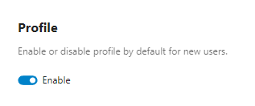

.. _profile:

========
Profiles
========

The user profile displays information about an account.
Profiles are enabled by default.

Users can enable or disable their own profile in **Personal settings** under
**Personal info**.

As an administrator, you can:

- set the default profile state for new users, and
- disable profiles globally.

Profile data can also be used by other features (for example the
:ref:`system address book<system-address-book>`), but what is exposed depends
on privacy controls.

.. note::
   Profile visibility is layered.

   - **Profile enablement** determines if the profile feature is active at all.
   - **Profile field visibility settings** control whether a field is shown.
   - **Account property scopes** (for example ``private``, ``local``, ``federated``,
     ``published``) define the intended audience for each property.
   - **Discovery restrictions** (for example sharing/autocomplete enumeration rules)
     can further reduce what other accounts can find or see.

   In short: effective visibility is the most restrictive result of all applicable controls.

Configuration
-------------

Set the profile default for new users
^^^^^^^^^^^^^^^^^^^^^^^^^^^^^^^^^^^^^

In **Administration settings** -> **Basic settings**, use the profile default toggle.

You can also set this via ``occ``:

::

  occ config:app:set settings profile_enabled_by_default --value="0"

Use ``--value="1"`` to enable it by default again.

See :doc:`../occ_command` for more ``occ`` usage details.

Disable profiles globally
^^^^^^^^^^^^^^^^^^^^^^^^^

To disable profile functionality for all users, add this to ``config.php``:

::

  'profile.enabled' => false,

Profile field visibility settings
---------------------------------

Each profile field has its own **profile visibility** setting (stored per user in the
profile configuration):

- **Show to everyone** (``show``): visible to anyone, including unauthenticated visitors,
  *subject to the field's property scope*.
- **Show to logged in accounts only** (``show_users_only``): visible only to authenticated
  users, *subject to the field's property scope*.
- **Hide** (``hide``): never shown on profile surfaces regardless of property scope.

These correspond to the visibility options in **Personal settings** -> **Personal info**
-> **Edit your Profile visibility**.

.. important::
   Effective visibility is the most restrictive result of **both** controls:
   the profile visibility setting and the property scope.

Defaults
^^^^^^^^

By default, most profile fields are configured as **Show to everyone**, while some
contact-related fields default to **Show to logged in accounts only**.

Administrators should note that these defaults are independent from the default
*property scopes* described below.

.. _profile-property-scopes:

Property visibility scopes
--------------------------

User properties (Display name, Address, Website, Role, etc.) have visibility scopes:
Private, Local, Federated, Published.

These scopes are evaluated per attribute. A profile being reachable does not imply
that all its attributes are visible.

The visibility scopes are:

:Private:
  The most restrictive level. Data is hidden from public profiles, federation, and
  public lookup. On the local server, it is only shown in specific features and
  typically only to authenticated users who have a recognized relationship with the
  account owner (for example, as a known contact).

:Local:
  Contact details visible on the local instance and in some public contexts where
  profile/account attributes are required (for example owner/uploader metadata).
  Not shared to federated servers and not published to the public lookup server.

:Federated:
  Contact details visible on the local instance, in relevant public contexts,
  and on trusted federated servers.

:Published:
  Contact details visible on the local instance, in relevant public contexts,
  on trusted federated servers, and published to the public lookup server.

.. note::
   **Public lookup server**: a public directory used to find users across Nextcloud instances.
   Only profile fields marked Published may be exposed there.

.. note::
   Not all fields are eligible for lookup publication even if their scope is set to
   ``Published``. Some fields are intentionally never published (for example Biography,
   Headline, Organisation, Role, Birthdate).

   In other words: ``Published`` is necessary but not always sufficient for lookup publication.

.. important::
   A reachable profile does not mean all attributes are public. Each attribute is
   filtered by its own scope, and effective visibility can also depend on the
   consuming feature.

.. important::
   On profile surfaces, the effective visibility is the more restrictive of
   profile-visibility settings and property scope.

Scope visibility matrix
^^^^^^^^^^^^^^^^^^^^^^^

+------------+-------------------+-------------------------------------------------------+--------------------------------------+---------------------+----------------------+
| Scope      | User themself [1] | Other users on same local instance                    | Public contexts (feature-dependent)  | Trusted federation  | Public lookup server |
+============+===================+=======================================================+======================================+=====================+======================+
| Private    | Yes               | Limited on profile surfaces:                          | No                                   | No                  | No                   |
|            |                   | authenticated + known-user relation required [3]      |                                      |                     |                      |
+------------+-------------------+-------------------------------------------------------+--------------------------------------+---------------------+----------------------+
| Local      | Yes               | Yes                                                   | Yes (where applicable) [2]           | No                  | No                   |
+------------+-------------------+-------------------------------------------------------+--------------------------------------+---------------------+----------------------+
| Federated  | Yes               | Yes                                                   | Yes (where applicable) [2]           | Yes                 | No                   |
+------------+-------------------+-------------------------------------------------------+--------------------------------------+---------------------+----------------------+
| Published  | Yes               | Yes                                                   | Yes (where applicable) [2]           | Yes                 | Yes                  |
+------------+-------------------+-------------------------------------------------------+--------------------------------------+---------------------+----------------------+

Notes:

1. Scope primarily governs exposure to others; owner access follows account/endpoint behavior.
2. Public-context visibility depends on feature path; scope alone does not guarantee display.
3. Some non-profile surfaces may exclude Private-scoped properties entirely (for example
   generated system address book cards), even for authenticated users.

.. note::
   The matrix describes **profile visibility behavior**. Other consuming features may apply
   additional filtering and may not expose Private-scoped properties at all.

Known-user rule for ``Private`` scope
^^^^^^^^^^^^^^^^^^^^^^^^^^^^^^^^^^^^^

For ``Private`` properties, Nextcloud may allow visibility on specific local feature
paths only when the requester is considered a *known user* of the target user.

In practical terms, this relation is derived by server-side *known-contact matching*.
In current Nextcloud versions this matching is primarily established via **phone-number
matching** (for example through the Talk mobile contact integration), and it is directional
(e.g., Alice might be known to Bob, but Bob isn't necessarily known to Alice).
Users are always known to themselves.

What local users can see
^^^^^^^^^^^^^^^^^^^^^^^^

A common question is what one user can see about another user on the same instance.

In general, profile visibility is controlled by each property's scope, but the
exact UI/API surface depends on the consuming feature (for example profile page,
share dialogs, search, mentions, Contacts, and other integrations).

For local users on the same instance:

- ``Private``: not generally visible to all local users; visibility is restricted
  on applicable paths to authenticated users that satisfy the known-user relation
  and other feature constraints.
- ``Local``: visible on the local instance.
- ``Federated``: visible on the local instance (and also shared with trusted federated servers).
- ``Published``: visible on the local instance (and also federated + public lookup).

.. note::
   System address book exposure is scope-aware and context-aware:
   private/empty-scope properties are excluded from generated cards, and
   federated reads strip local-scoped properties.

How to verify scope behavior
^^^^^^^^^^^^^^^^^^^^^^^^^^^^

Because effective visibility can vary by feature path, administrators should verify
scope behavior in their own deployment.

Recommended test procedure:

1. Create test users:

   - ``alice`` (target profile owner)
   - ``bob`` (authenticated local user)
   - ``charlie`` (second local user for control)

2. As ``alice``, set distinct test values for profile fields and assign different
   scopes where possible (for example Private vs Local via the UI, and Federated/Published
   via API/administrative tooling if supported in your deployment).

3. Verify as ``alice``:

   - Confirm owner-visible values as expected.

4. Verify as ``bob`` (authenticated local user):

   - Check the feature paths used in your instance (for example profile page,
     user card, share dialog, search, mentions, Contacts integrations).
   - Confirm ``Local/Federated/Published`` fields are visible where expected.
   - Confirm ``Private`` fields are visible only on paths that satisfy the known-user
     relation and other feature constraints.

5. Verify as unauthenticated user (private browser session):

   - Confirm only public-appropriate fields are visible.

6. Verify federation/publication behavior (if enabled):

   - From a trusted federated server, confirm Federated/Published behavior.
   - Confirm only Published fields are exposed to the public lookup server.

7. Re-test with a newly created user after changing
   ``account_manager.default_property_scope``:

   - Confirm new defaults apply only to newly initialized accounts.
   - Confirm existing users retain stored scopes unless explicitly changed.

Scope defaults and precedence
^^^^^^^^^^^^^^^^^^^^^^^^^^^^^

Visibility is determined per property using this order:

1. **Server defaults** from ``OC\Accounts\AccountManager::DEFAULT_SCOPES``.
2. **Administrator default override** via ``account_manager.default_property_scope``.
3. **User-set value** in personal/profile settings (subject to server-side constraints).

Practical implications:

- Admin overrides in ``account_manager.default_property_scope`` are applied at account
  initialization and therefore affect **new users**.
- Existing users keep already stored scopes unless changed explicitly.
- ``PROPERTY_DISPLAYNAME`` and ``PROPERTY_EMAIL`` cannot be ``Private``; server-side
  validation/enforcement requires at least ``Local``.

Default scope values (reference)
^^^^^^^^^^^^^^^^^^^^^^^^^^^^^^^^

Default values are defined in server code and may change over time. The authoritative
source is the ``DEFAULT_SCOPES`` constant in ``OC\Accounts\AccountManager``:
`latest source <https://github.com/nextcloud/server/blob/master/lib/private/Accounts/AccountManager.php>`_.

Example defaults (verify against your deployed version):

+--------------+--------------------------+
| Property     | Default visibility scope |
+==============+==========================+
| Display name | Federated                |
+--------------+--------------------------+
| Address      | Local                    |
+--------------+--------------------------+
| Website      | Local                    |
+--------------+--------------------------+
| Email        | Federated                |
+--------------+--------------------------+
| Avatar       | Federated                |
+--------------+--------------------------+
| Phone        | Local                    |
+--------------+--------------------------+
| Twitter      | Local                    |
+--------------+--------------------------+
| Bluesky      | Local                    |
+--------------+--------------------------+
| Fediverse    | Local                    |
+--------------+--------------------------+
| Organisation | Local                    |
+--------------+--------------------------+
| Role         | Local                    |
+--------------+--------------------------+
| Headline     | Local                    |
+--------------+--------------------------+
| Biography    | Local                    |
+--------------+--------------------------+
| Birthdate    | Local                    |
+--------------+--------------------------+
| Pronouns     | Federated                |
+--------------+--------------------------+

Override default scopes in ``config.php``
^^^^^^^^^^^^^^^^^^^^^^^^^^^^^^^^^^^^^^^^^

To override one or several default visibility scopes for *new users*, use
``account_manager.default_property_scope`` (default: empty array):

.. code-block:: php

  'account_manager.default_property_scope' => [
    \OCP\Accounts\IAccountManager::PROPERTY_PHONE => \OCP\Accounts\IAccountManager::SCOPE_PRIVATE,
    \OCP\Accounts\IAccountManager::PROPERTY_ROLE => \OCP\Accounts\IAccountManager::SCOPE_FEDERATED,
  ]

In the above example, phone and role are overwritten to ``Private`` and
``Federated`` respectively.

.. note::
   Use ``\OCP\Accounts\IAccountManager`` constants for both property keys and scope values.

FAQ: How to lock profile visibility down
^^^^^^^^^^^^^^^^^^^^^^^^^^^^^^^^^^^^^^^^

If your goal is maximum privacy:

1. Disable profiles globally (strictest option):

   .. code-block:: php

     'profile.enabled' => false,

   Effect:

   - Profile functionality is removed.
   - Profile-based discoverability/usability features are reduced accordingly.

2. If profiles must remain enabled, set restrictive defaults for new users:

   .. code-block:: php

     'account_manager.default_property_scope' => [
       \OCP\Accounts\IAccountManager::PROPERTY_ADDRESS => \OCP\Accounts\IAccountManager::SCOPE_PRIVATE,
       \OCP\Accounts\IAccountManager::PROPERTY_PHONE => \OCP\Accounts\IAccountManager::SCOPE_PRIVATE,
       \OCP\Accounts\IAccountManager::PROPERTY_WEBSITE => \OCP\Accounts\IAccountManager::SCOPE_PRIVATE,
       \OCP\Accounts\IAccountManager::PROPERTY_TWITTER => \OCP\Accounts\IAccountManager::SCOPE_PRIVATE,
       \OCP\Accounts\IAccountManager::PROPERTY_BLUESKY => \OCP\Accounts\IAccountManager::SCOPE_PRIVATE,
       \OCP\Accounts\IAccountManager::PROPERTY_FEDIVERSE => \OCP\Accounts\IAccountManager::SCOPE_PRIVATE,
       \OCP\Accounts\IAccountManager::PROPERTY_ORGANISATION => \OCP\Accounts\IAccountManager::SCOPE_PRIVATE,
       \OCP\Accounts\IAccountManager::PROPERTY_ROLE => \OCP\Accounts\IAccountManager::SCOPE_PRIVATE,
       \OCP\Accounts\IAccountManager::PROPERTY_HEADLINE => \OCP\Accounts\IAccountManager::SCOPE_PRIVATE,
       \OCP\Accounts\IAccountManager::PROPERTY_BIOGRAPHY => \OCP\Accounts\IAccountManager::SCOPE_PRIVATE,
       \OCP\Accounts\IAccountManager::PROPERTY_BIRTHDATE => \OCP\Accounts\IAccountManager::SCOPE_PRIVATE,
       \OCP\Accounts\IAccountManager::PROPERTY_PRONOUNS => \OCP\Accounts\IAccountManager::SCOPE_PRIVATE,
       \OCP\Accounts\IAccountManager::PROPERTY_AVATAR => \OCP\Accounts\IAccountManager::SCOPE_PRIVATE,
     ]

   Notes:

   - ``PROPERTY_DISPLAYNAME`` and ``PROPERTY_EMAIL`` cannot be set to ``Private``; server-side enforcement requires at least ``Local``.
   - Defaults apply to **new users**. Existing users keep stored scopes unless changed.

What becomes limited when you lock it down?
~~~~~~~~~~~~~~~~~~~~~~~~~~~~~~~~~~~~~~~~~~~

With more restrictive scopes (especially ``Private``), expect reduced visibility in:

- User discovery/search/user cards
- Share dialogs and mention/autocomplete context
- Public/share-related contexts where account metadata may be shown
- Federated visibility of profile attributes
- Public lookup publication (only ``Published`` appears there)

In short: tighter privacy reduces profile-based convenience and discoverability.

Scopes and existing users
-------------------------

The ``account_manager.default_property_scope`` config only applies to **new** users.
Existing users keep their stored scopes.

There is currently no admin-level mechanism to bulk-change scopes for existing
users. The OCS provisioning API only allows users to change their **own** scopes —
admins cannot set scopes on behalf of other users.

Users can update their own scopes in **Personal settings** → **Personal info** →
**Edit your Profile visibility**, or via the API::

  curl -s -u alice:password -X PUT \
    "https://cloud.example.com/ocs/v2.php/cloud/users/alice" \
    -H "OCS-APIRequest: true" \
    -d "key=phoneScope&value=v2-private"

The scope key is the property name with ``Scope`` appended. Available keys:

``displaynameScope``, ``emailScope``, ``phoneScope``, ``addressScope``,
``websiteScope``, ``twitterScope``, ``blueskyScope``, ``fediverseScope``,
``organisationScope``, ``roleScope``, ``headlineScope``, ``biographyScope``,
``birthdateScope``, ``avatarScope``, ``pronounsScope``

Allowed scope values:

- ``v2-private`` — Private
- ``v2-local`` — Local
- ``v2-federated`` — Federated
- ``v2-published`` — Published

.. note::
   ``displaynameScope`` and ``emailScope`` cannot be set to ``v2-private``.
   The server enforces a minimum of ``v2-local`` for these properties.

See also
--------

- :doc:`../configuration_files/file_sharing_configuration` — sharing and autocomplete settings that interact with profile visibility
- `User manual: Personal settings <../../user_manual/userpreferences.html>`_ — user-facing profile and personal info settings

