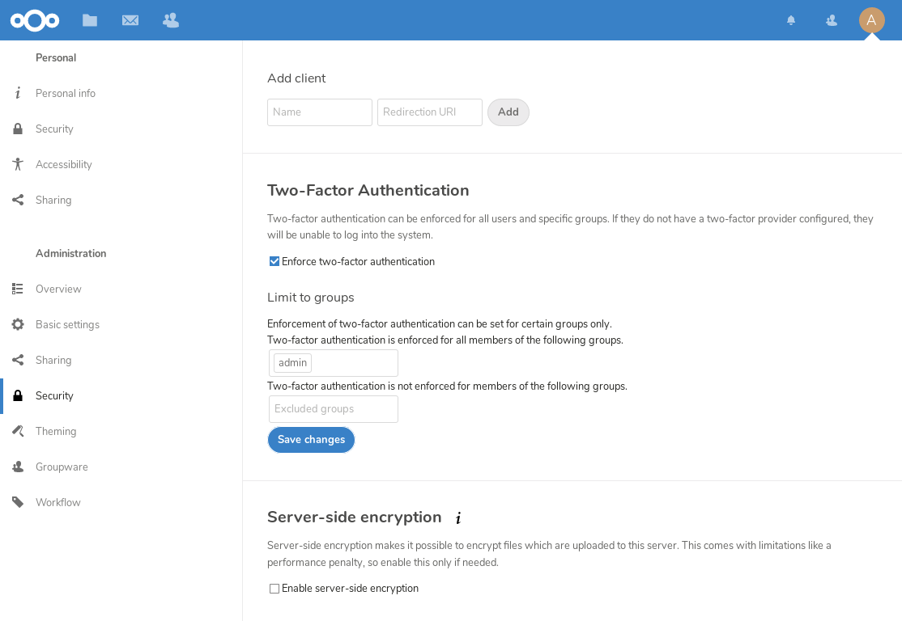

.. _two-factor-auth:

=========================
Two-factor authentication
=========================

Two-factor authentication adds an additional layer of security to user accounts. In order to log
in on an account when two-factor authentication (2FA) enabled, you must provide both the
login password and another factor. 

To use 2FA two things must happen:

- At least one 2FA provider must be enabled by the administrator.
- A user must activate 2FA on their account (or) the administrator must enforce the use of 2FA.

Developers can `build new two-factor provider apps <https://docs.nextcloud.com/server/31/developer_manual/digging_deeper/two-factor-provider.html>`_.

.. TODO ON RELEASE: Update version number above on release

Enabling two-factor authentication
----------------------------------

2FA in Nextcloud is pluggable, meaning that various 2FA providers can be used to support different 
types of factors. Three providers are automatically installed (but may need to be enabled):

**Two-Factor TOTP Provider**

Once 2FA has been enabled, users have to `activate it in their personal settings. <https://docs.nextcloud.com/server/31/user_manual/en/user_2fa.html>`_

.. TODO ON RELEASE: Update version number above on release

.. figure:: ../images/2fa-app-install.png

Developers can also `implement new two-factor provider 
apps <https://docs.nextcloud.com/server/latest/developer_manual/digging_deeper/two-factor-provider.html>`_.

.. TODO ON RELEASE: Update version number above on release

Enforcing two-factor authentication
-----------------------------------

By default 2FA is *optional*, hence users are given the choice whether to enable
it for their account `under their personal settings <https://docs.nextcloud.com/server/latest/user_manual/en/user_2fa.html>`_.
Admins may, however, enforce the use of 2FA.

Enforcement is possible system-wide (all users) or for selected groups only. Select groups
can also be excluded from 2FA requirements. 

These settings can be found under *Administration Settings->Security*.

When groups are selected/excluded, they use the following logic to determine if
a user has 2FA enforced:

* If no groups are selected, 2FA is enabled for everyone except members of the excluded groups
* If groups are selected, 2FA is enabled for all members of these. If a user is both in a
  selected *and* excluded group, the selected takes precedence and 2FA is enforced.

Provider removal
----------------

Nextcloud keeps records about the enabled two-factor authentication providers of every user.
If a provider is simply removed/:ref:`disabled <apps_commands_label>`,
Nextcloud will still consider the provider active for the user at login and show a warning like *Could not load at least one of your enabled two-factor auth methods*.

The associations of removed providers can be cleaned up via :ref:`occ <occ>`::

 sudo -u www-data php occ twofactorauth:cleanup <provider_id>

.. warning:: This operation is irreversible. Only run it for providers you do not intend to enable again as then you have to setup the configuration for all users from scratch.

Disabling two-factor authentication
-----------------------------------

Two-factor providers can be disabled via :ref:`occ <occ>`::

 sudo -u www-data php occ twofactorauth:disable <uid> <provider_id>

This can be useful if the user forgot or lost their second factor.
Afterwards users are free to enable this provider again via their personal settings.

.. note:: This operation has to be supported by the provider. If this support is missing, Nextcloud will abort and show an error.

It is also possible to check the current two-factor user status via :ref:`occ <occ>`::

  sudo -u www-data php occ twofactorauth:state <uid>
