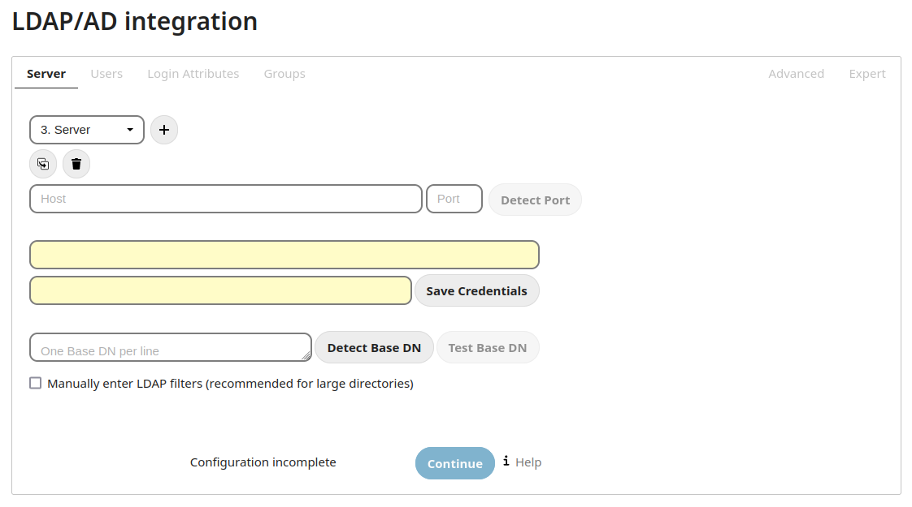

=============================
User authentication with LDAP
=============================

Nextcloud ships with an LDAP application to allow LDAP users (including Active
Directory) to appear in your Nextcloud user listings. These users will
authenticate to Nextcloud with their LDAP credentials, so you don't have to
create separate Nextcloud user accounts for them. You will manage their Nextcloud
group memberships, quotas, and sharing permissions just like any other Nextcloud
user.

.. note:: The PHP LDAP module is required; this is supplied by ``php-ldap`` on
   most distributions.

The LDAP application supports:

* LDAP group support
* File sharing with Nextcloud users and groups
* Access via WebDAV and Nextcloud Desktop Client
* Versioning, external Storage and all other Nextcloud features
* Seamless connectivity to Active Directory, with no extra configuration
  required
* Support for primary groups in Active Directory
* Auto-detection of LDAP attributes such as base DN, email, and the LDAP server
  port number
* Only read access to your LDAP (edit or delete of users on your LDAP is not
  supported)
* Optional: Allow users to change their LDAP password from Nextcloud

.. note:: A non-blocking or correctly configured SELinux setup is needed
   for the LDAP backend to work. Please refer to the :ref:`selinux-config-label`.

Configuration
-------------

First enable the ``LDAP user and group backend`` app on the Apps page in
Nextcloud. Then go to your Admin page to configure it.

The LDAP configuration panel has four tabs. A correctly completed first tab
("Server") is mandatory to access the other tabs. A green indicator lights when
the configuration is correct. Hover your cursor over the fields to see some
pop-up tooltips.

Server tab
^^^^^^^^^^

Start with the Server tab. You may configure multiple servers if you have them.
At a minimum you must supply the LDAP server's hostname. If your server requires
authentication, enter your credentials on this tab. Nextcloud will then attempt
to auto-detect the server's port and base DN. The base DN and port are
mandatory, so if Nextcloud cannot detect them you must enter them manually.



Server configuration:
  Configure one or more LDAP servers. Click the **Delete Configuration**
  button to remove the active configuration.

Host:
  The host name or IP address of the LDAP server. It can also be a **ldaps://**
  URI. If you enter the port number, it speeds up server detection.

  Examples:

  * *directory.my-company.com*
  * *ldaps://directory.my-company.com*
  * *directory.my-company.com:9876*

Port:
  The port on which to connect to the LDAP server. The field is disabled in the
  beginning of a new configuration. If the LDAP server is running on a standard
  port, the port will be detected automatically. If you are using a
  non-standard port, Nextcloud will attempt to detect it. If this fails you must
  enter the port number manually.

  Example:

  * *389*

User DN:
  The name as DN of a user who has permissions to do searches in the LDAP
  directory. Leave it empty for anonymous access. We recommend that you have a
  special LDAP system user for this.

  Example:

  * *uid=nextcloudsystemuser,cn=sysusers,dc=my-company,dc=com*

Password:
  The password for the user given above. Empty for anonymous access.

Base DN:
  The base DN of LDAP, from where all users and groups can be reached. You may
  enter multiple base DNs, one per line. (Base DNs for users and groups can be
  set in the Advanced tab.) This field is mandatory. Nextcloud attempts to
  determine the Base DN according to the provided User DN or the provided
  Host, and you must enter it manually if Nextcloud does not detect it.

  Example:

  * *dc=my-company,dc=com*

Users tab
^^^^^^^^^

Use this to control which LDAP users are listed as Nextcloud users on your
Nextcloud server. In order to control which LDAP users can login to your Nextcloud
server use the **Login Attributes** tab. Those LDAP users who have access but are not listed
as users (if there are any) will be hidden users. You may bypass the form fields
and enter a raw LDAP filter if you prefer.

.. figure:: ../images/ldap-wizard-2-user.png
   :alt: User filter

Only those object classes:
  Nextcloud will determine the object classes that are typically available for
  user objects in your LDAP. Nextcloud will automatically select the object
  class that returns the highest amount of users. You may select multiple
  object classes.

Only from those groups:
  If your LDAP server supports the ``member-of-overlay`` in LDAP filters, you
  can define that only users from one or more certain groups are allowed to
  appear in user listings in Nextcloud. By default, no value will be selected.
  You may select multiple groups.

  If your LDAP server does not support the ``member-of-overlay`` in LDAP filters,
  the input field is disabled. Please contact your LDAP administrator.

Edit LDAP Query:
  Clicking on this text toggles the filter mode and you can enter the raw LDAP
  filter directly. Example::

   (&(objectClass=inetOrgPerson)(memberOf=cn=nextcloudusers,ou=groups,
   dc=example,dc=com))

x users found:
  This is an indicator that tells you approximately how many users will be
  listed in Nextcloud. The number updates automatically after any changes.

Login attributes tab
^^^^^^^^^^^^^^^^^^^^

The settings in the Login Attributes tab determine which LDAP users can log in to
your Nextcloud system and which attribute or attributes the provided login name
is matched against (e.g. LDAP/AD username, email address). You may select
multiple user details. (You may bypass the form fields and enter a raw LDAP
filter if you prefer.)

You may override your User Filter settings on the Users tab by using a raw
LDAP filter.

.. figure:: ../images/ldap-wizard-3-login.png
   :alt: Login filter

LDAP Username:
  If this value is checked, the login value will be compared to the username in
  the LDAP directory. The corresponding attribute, usually *uid* or
  *samaccountname* will be detected automatically by Nextcloud.

LDAP Email Address:
  If this value is checked, the login value will be compared to an email address
  in the LDAP directory; specifically, the *mailPrimaryAddress* and *mail*
  attributes.

Other Attributes:
  This multi-select box allows you to select other attributes for the
  comparison. The list is generated automatically from the user object
  attributes in your LDAP server.

Edit LDAP Query:
  Clicking on this text toggles the filter mode and you can enter the raw LDAP
  filter directly.

  The **%uid** placeholder is replaced with the login name entered by the
  user upon login.

  Examples:

  * only username::

     (&(objectClass=inetOrgPerson)(memberOf=cn=nextcloudusers,ou=groups,
     dc=example,dc=com)(uid=%uid)

  * username or email address::

     ((&(objectClass=inetOrgPerson)(memberOf=cn=nextcloudusers,ou=groups,
     dc=example,dc=com)(|(uid=%uid)(mail=%uid)))

Groups tab
^^^^^^^^^^

By default, no LDAP groups will be available in Nextcloud. The settings in the
Groups tab determine which groups will be available in Nextcloud. You may
also elect to enter a raw LDAP filter instead.

.. figure:: ../images/ldap-wizard-4-group.png
   :alt: Group filter

Only these object classes:
  Nextcloud will determine the object classes that are typically available for
  group objects in your LDAP server. Nextcloud will only list object
  classes that return at least one group object. You can select multiple
  object classes. A typical object class is "group", or "posixGroup".

Only from these groups:
  Nextcloud will generate a list of available groups found in your LDAP server.
  Then you select the group or groups that get access to your Nextcloud
  server.

Edit LDAP Query:
  Clicking on this text toggles the filter mode and you can enter the raw LDAP
  filter directly.

  Example:

  * *objectClass=group*
  * *objectClass=posixGroup*

y groups found:
  This tells you approximately how many groups will be available in Nextcloud.
  The number updates automatically after any change.


Advanced settings
-----------------

The LDAP Advanced Setting section contains options that are not needed for a
working connection. This provides controls to disable the current
configuration,
configure replica hosts, and various performance-enhancing options.

The Advanced Settings are structured into three parts:

* Connection Settings
* Directory Settings
* Special Attributes

Connection settings
^^^^^^^^^^^^^^^^^^^

.. figure:: ../images/ldap-advanced-1-connection.png
   :alt: Advanced settings

Configuration Active:
  Enables or Disables the current configuration. By default, it is turned off.
  When Nextcloud makes a successful test connection it is automatically turned
  on.

Backup (Replica) Host:
  If you have a backup LDAP server, enter the connection settings here.
  Nextcloud will then automatically connect to the backup when the main server
  cannot be reached. The backup server must be a replica of the main server so
  that the object UUIDs match.

  Example:

  * *directory2.my-company.com*

Backup (Replica) Port:
  The connection port of the backup LDAP server. If no port is given,
  but only a host, then the main port (as specified above) will be used.

  Example:

  * *389*

Disable Main Server:
  You can manually override the main server and make Nextcloud only connect to
  the backup server. This is useful for planned downtimes.

Turn off SSL certificate validation:
  Turns off SSL certificate checking. Use it for testing only!
  *Note*: The effect of this setting depdends on the PHP system configuration.
  It does for example not work with the
  [official Nextcloud container image](https://github.com/nextcloud/docker).
  To disable certificate verification for a particular use, append the following
  configuration line to your `/etc/ldap/ldap.conf`:

  ```
  TLS_REQCERT ALLOW
  ```

Cache Time-To-Live:
  A cache is introduced to avoid unnecessary LDAP traffic, for example caching
  usernames so they don't have to be looked up for every page, and speeding up
  loading of the Users page. Saving the configuration empties the cache. The
  time is given in seconds.

  Note that almost every PHP request requires a new connection to the LDAP
  server. If you require fresh PHP requests we recommend defining a minimum
  lifetime of 15s or so, rather than completely eliminating the cache.

  Examples:

  * ten minutes: *600*
  * one hour: *3600*

See the Caching section below for detailed information on how the cache
operates.

.. _ldap_directory_settings:

Directory settings
^^^^^^^^^^^^^^^^^^

.. figure:: ../images/ldap-advanced-2-directory.png
   :alt: Directory settings.

User Display Name Field:
  The attribute that should be used as display name in Nextcloud.

  *  Example: *displayName*

2nd User Display Name Field:
  An optional second attribute displayed in brackets after the display name,
  for example using the ``mail`` attribute displays as ``Molly Foo
  (molly@example.com)``.

Base User Tree:
  The base DN of LDAP, from where all users can be reached. This must be a
  complete DN, regardless of what you have entered for your Base DN in the
  Basic setting. You can specify multiple base trees, one on each line.

  * Example:

    | *cn=programmers,dc=my-company,dc=com*
    | *cn=designers,dc=my-company,dc=com*

User Search Attributes:
  These attributes are used when searches for users are performed, for example
  in the share dialogue. The user display name attribute is the
  default. You may list multiple attributes, one per line.

  If an attribute is not available on a user object, the user will not be
  listed, and will be unable to login. This also affects the display name
  attribute. If you override the default you must specify the display name
  attribute here.

  * Example:

    | *displayName*
    | *mail*

Group Display Name Field:
  The attribute that should be used as Nextcloud group name. Nextcloud allows a
  limited set of characters (a-zA-Z0-9.-_@). Once a group name is assigned it
  cannot be changed.

  * Example: *cn*

Base Group Tree:
  The base DN of LDAP, from where all groups can be reached. This must be a
  complete DN, regardless of what you have entered for your Base DN in the
  Basic setting. You can specify multiple base trees, one in each line.

  * Example:

    | *cn=barcelona,dc=my-company,dc=com*
    | *cn=madrid,dc=my-company,dc=com*

Group Search Attributes:
  These attributes are used when a search for groups is done, for example in
  the share dialogue. By default the group display name attribute as specified
  above is used. Multiple attributes can be given, one in each line.

  If you override the default, the group display name attribute will not be
  taken into account, unless you specify it as well.

  * Example:

    | *cn*
    | *description*

Group Member association:
  The attribute that is used to indicate group memberships, i.e. the attribute
  used by LDAP groups to refer to their users.

  Nextcloud detects the value automatically. You should only change it if you
  have a very valid reason and know what you are doing.

  * Example: *uniquemember*

Nested groups:
  Enable group member retrieval from sub groups.

  To allow user listing and login from nested groups, please see **User listing
  and login per nested groups** in the section **Troubleshooting, Tips and
  Tricks**.

Enable LDAP password changes per user:
  Allow LDAP users to change their password and allow Super Administrators and Group Administrators to change the password of their LDAP users.

  To enable this feature, the following requirements have to be met:

  * General requirements:

   * Access control policies must be configured on the LDAP server to grant permissions for password changes. The User DN as configured in *Server Settings* needs to have write permissions in order to update the userPassword attribute.
   * Passwords are sent in plaintext to the LDAP server. Therefore, transport encryption must be used for the communication between Nextcloud and the LDAP server, e.g. employ LDAPS.
   * Enabling password hashing on the LDAP server is highly recommended. While Active Directory stores passwords in a one-way format by default, OpenLDAP users could configure the ``ppolicy_hash_cleartext`` directive of the ppolicy overlay that ships with OpenLDAP.

  * Additional requirements for Active Directory:

   * At least a 128-bit transport encryption must be used for the communication between Nextcloud and the LDAP server.
   * Make sure that the ``fUserPwdSupport`` char of the dSHeuristics is configured to employ the ``userPassword`` attribute as ``unicodePwd`` alias. While this is set accordingly on AD LDS by default, this is not the case on AD DS.

Default password policy DN:
  This feature requires OpenLDAP with ppolicy. The DN of a default password policy will be used for password expiry handling in the absence of any user specific password policy. Password expiry handling features the following:

  * When a LDAP password is about to expire, display a warning message to the user showing the number of days left before it expires. Password expiry warnings are displayed through the notifications app for Nextcloud.

  * Prompt LDAP users with expired passwords to reset their password during login, provided that an adequate number of grace logins is still available.

  Leave the setting empty to keep password expiry handling disabled.

  For the password expiry handling feature to work, LDAP password changes per user must be enabled and the LDAP server must be running OpenLDAP with its ppolicy module configured accordingly.

  * Example:

    | *cn=default,ou=policies,dc=my-company,dc=com*


Special attributes
^^^^^^^^^^^^^^^^^^

.. figure:: ../images/ldap-advanced-3-attributes.png
   :alt: Special Attributes.

Quota Field:
  Nextcloud can read an LDAP attribute and set the user quota according to its
  value. Specify the attribute here, and it will return human-readable values,
  e.g. "2 GB". Any quota set in LDAP overrides quotas set on the Nextcloud user
  management page.

  * Example: *NextcloudQuota*

Quota Default:
  Override Nextcloud default quota for LDAP users who do not have a quota set in
  the Quota Field.

  * Example: *15 GB*

Email Field:
  Set the user's email from their LDAP attribute. Leave it empty for default
  behavior.

  * Example: *mail*

User Home Folder Naming Rule:
  By default, the Nextcloud server creates the user directory in your Nextcloud
  data directory and gives it the Nextcloud username, .e.g ``/var/www/nextcloud/data/alice``. You may want to override this setting and name it after an LDAP
  attribute value. The attribute can also return an absolute path, e.g.
  ``/mnt/storage43/alice``. Leave it empty for default behavior.

  * Example: *cn*

In new Nextcloud installations the home folder rule is enforced. This means that once you set a home folder naming rule (get a home folder from an LDAP attribute), it must be available for all users. If it isn't available for a user, then that user will not be able to login. Also, the filesystem will not be set up for that user, so their file shares will not be available to other users.

In migrated Nextcloud installations the old behavior still applies, which is using the Nextcloud username as the home folder when an LDAP attribute is not set. You may change this enforcing the home folder rule with the ``occ`` command in Nextcloud, like this example on Ubuntu::

  sudo -u www-data php occ config:app:set user_ldap enforce_home_folder_naming_rule --value=1

Expert settings
---------------

.. figure:: ../images/ldap-expert.png
   :alt: Expert settings.

In the Expert Settings fundamental behavior can be adjusted to your needs. The
configuration should be well-tested before starting production use.

Internal Username:
  The internal username is the identifier in Nextcloud for LDAP users. By default
  it will be created from the UUID attribute. The UUID attribute ensures that
  the username is unique, and that characters do not need to be converted. Only
  these characters are allowed: [\a-\zA-\Z0-\9_.@-]. Other characters are
  replaced with their ASCII equivalents, or are simply omitted.

  The LDAP backend ensures that there are no duplicate internal usernames in
  Nextcloud, i.e. that it is checking all other activated user backends
  (including local Nextcloud users). On collisions a random number (between 1000
  and 9999) will be attached to the retrieved value. For example, if "alice"
  exists, the next username may be "alice_1337".

  The internal username is the default name for the user home folder in
  Nextcloud. It is also a part of remote URLs, for instance for all \*DAV
  services.

  You can override all of this with the Internal Username setting. Leave it
  empty for default behavior. Changes will affect only newly mapped LDAP users.

  * Example: *uid*

Override UUID detection
  By default, Nextcloud auto-detects the UUID attribute. The UUID attribute is
  used to uniquely identify LDAP users and groups. The internal username will
  be created based on the UUID, if not specified otherwise.

  You can override the setting and pass an attribute of your choice. You must
  make sure that the attribute of your choice can be fetched for both users and
  groups and it is unique. Leave it empty for default behavior. Changes will
  have effect only on newly mapped LDAP users and groups. It also will
  have effect when a user's or group's DN changes and an old UUID was cached,
  which will result in a new user. Because of this, the setting should be
  applied before putting Nextcloud in production use and clearing the bindings
  (see the ``User and Group Mapping`` section below).

  * Example: *cn*

Username-LDAP User Mapping
  Nextcloud uses usernames as keys to store and assign data. In order to
  precisely identify and recognize users, each LDAP user will have a internal
  username in Nextcloud. This requires a mapping from Nextcloud username to LDAP
  user. The created username is mapped to the UUID of the LDAP user.
  Additionally the DN is cached as well to reduce LDAP interaction, but it is
  not used for identification. If the DN changes, the change will be detected by
  Nextcloud by checking the UUID value.

  The same is valid for groups.

  The internal Nextcloud name is used all over in Nextcloud. Clearing the Mappings
  will have leftovers everywhere. Never clear the mappings in a production
  environment, but only in a testing or experimental server.

.. warning:: Clearing the Mappings is not configuration sensitive, it affects all LDAP
  configurations!

Testing the configuration
-------------------------

The **Test Configuration** button checks the values as currently given in the
input fields. You do not need to save before testing. By clicking on the
button, Nextcloud will try to bind to the Nextcloud server using the
settings currently given in the input fields. If the binding fails you'll see a
yellow banner with the error message "The configuration is invalid. Please have
a look at the logs for further details."

When the configuration test reports success, save your settings and check if the
users and groups are fetched correctly on the Users page.

Additional configuration options via occ
----------------------------------------

Few configuration settings can only be set on command line via ``occ``.

Attribute update interval
^^^^^^^^^^^^^^^^^^^^^^^^^

The LDAP backend will update user information that is used within Nextcloud
with the values provided by the LDAP server. For instance these are email,
quota or the avatar. This happens on every login, the first detection of a user
from LDAP and regularly by a background job.

The interval value determines the time between updates of the values and is
used to avoid frequent overhead, including time-expensive write actions to
the database.

The interval is described in seconds and it defaults to 86400 equalling a day.
It is not a per-configuration option.

The value can be modified by::

  sudo -u www-data php occ config:app:set user_ldap updateAttributesInterval --value=86400

A value of 0 will update it on every of the named occasions.

Nextcloud avatar integration
----------------------------

Nextcloud supports user profile pictures, which are also called avatars. If a user
has a photo stored in the *jpegPhoto* or *thumbnailPhoto* attribute on your LDAP
server, it will be used as their avatar. In this case the user cannot alter their
avatar (on their Personal page) as it must be changed in LDAP. *jpegPhoto* is
preferred over *thumbnailPhoto*.


If the *jpegPhoto* or *thumbnailPhoto* attribute is not set or empty, then
users can upload and manage their avatars on their Nextcloud Personal pages.
Avatars managed in Nextcloud are not stored in LDAP.

The *jpegPhoto* or *thumbnailPhoto* attribute is fetched once a day to make
sure the current photo from LDAP is used in Nextcloud. LDAP avatars override
Nextcloud avatars, and when an LDAP avatar is deleted then the most recent
Nextcloud avatar replaces it.

Photos served from LDAP are automatically cropped and resized in Nextcloud. This
affects only the presentation, and the original image is not changed.

Use a specific attribute or turn off loading of images
^^^^^^^^^^^^^^^^^^^^^^^^^^^^^^^^^^^^^^^^^^^^^^^^^^^^^^

It is possible to turn off the avatar integration or specify a single,
different attribute to read the image from. It is expected to contain image
data just like *jpegPhoto* or *thumbnailPhoto* do.

The behaviour can be changed using the occ command line tool only. Essentially
those options are available:

* The default behaviour as described above should be used

  ``occ ldap:set-config "s01" "ldapUserAvatarRule" "default"``

* User images shall not be fetched from LDAP

  ``occ ldap:set-config "s01" "ldapUserAvatarRule" "none"``

* The image should be read from the attribute "selfiePhoto"

  ``occ ldap:set-config "s01" "ldapUserAvatarRule" "data:selfiePhoto"``

The "s01" refers to the configuration ID as can be retrieved per
``occ ldap:show-config``.

Troubleshooting, tips and tricks
--------------------------------

SSL certificate verification (LDAPS, TLS)
^^^^^^^^^^^^^^^^^^^^^^^^^^^^^^^^^^^^^^^^^

A common mistake with SSL certificates is that they may not be known to PHP.
If you have trouble with certificate validation make sure that

* You have the certificate of the server installed on the Nextcloud server
* The certificate is announced in the system's LDAP configuration file (usually
  */etc/ldap/ldap.conf*)
* Using LDAPS, also make sure that the port is correctly configured (by default
  636)

Microsoft Active Directory
^^^^^^^^^^^^^^^^^^^^^^^^^^

Compared to earlier Nextcloud versions, no further tweaks need to be done to
make Nextcloud work with Active Directory. Nextcloud will automatically find the
correct configuration in the set-up process.

memberOf / read memberof permissions
^^^^^^^^^^^^^^^^^^^^^^^^^^^^^^^^^^^^

If you want to use ``memberOf`` within your filter you might need to give your
querying user the permissions to use it. For Microsoft Active Directory this
is described `here <https://serverfault.com/questions/167371/what-permissions-are
-required-for-enumerating-users-groups-in-active-directory/167401#167401>`_.

User listing and login per nested groups
^^^^^^^^^^^^^^^^^^^^^^^^^^^^^^^^^^^^^^^^

When it is intended to allow user listing and login based on a specific group
having subgroups ("nested groups"), checking **Nested groups** on **Directory
Settings** is not enough. Also the User (and Login) filter need to be changed,
by specifying the ``LDAP_MATCHING_RULE_IN_CHAIN`` matching rule. Change the
filter parts containing the *memberof* condition according to this example:

   * (memberof=cn=Nextcloud Users Group,ou=Groups,…)

to

   * (memberof:1.2.840.113556.1.4.1941:=cn=Nextcloud Users Group,ou=Groups,…)


Duplicating server configurations
^^^^^^^^^^^^^^^^^^^^^^^^^^^^^^^^^

In case you have a working configuration and want to create a similar one or
"snapshot" configurations before modifying them you can do the following:

#. Go to the **Server** tab
#. On **Server Configuration** choose *Add Server Configuration*
#. Answer the question *Take over settings from recent server configuration?*
   with *yes*.
#. (optional) Switch to **Advanced** tab and uncheck **Configuration Active**
   in the *Connection Settings*, so the new configuration is not used on Save
#. Click on **Save**

Now you can modify and enable the configuration.

Nextcloud LDAP internals
------------------------

Some parts of how the LDAP backend works are described here.

User and group mapping
^^^^^^^^^^^^^^^^^^^^^^

In Nextcloud the user or group name is used to have all relevant information in
the database assigned. To work reliably a permanent internal user name and
group name is created and mapped to the LDAP DN and UUID. If the DN changes in
LDAP it will be detected, and there will be no conflicts.

Those mappings are done in the database table ``ldap_user_mapping`` and
``ldap_group_mapping``. The user name is also used for the user's folder (except
if something else is specified in *User Home Folder Naming Rule*), which
contains files and meta data.

As of Nextcloud 5 the internal user name and a visible display name are separated.
This is not the case for group names, yet, i.e. a group name cannot be altered.

That means that your LDAP configuration should be good and ready before putting
it into production. The mapping tables are filled early, but as long as you are
testing, you can empty the tables any time. Do not do this in production.

Caching
^^^^^^^

The LDAP information is cached in Nextcloud memory cache, and you must install
and configure the memory cache (see
:doc:`../configuration_server/caching_configuration`). The Nextcloud  **Cache**
helps to speed up user interactions and sharing. It is populated on demand,
and remains populated until the **Cache Time-To-Live** for each unique request
expires. User logins are not cached, so if you need to improve login times set
up a slave LDAP server to share the load.

You can adjust the **Cache Time-To-Live** value to balance performance and
freshness of LDAP data. All LDAP requests will be cached for 10 minutes by
default, and you can alter this with the **Cache Time-To-Live** setting. The
cache answers each request that is identical to a previous request, within the
time-to-live of the original request, rather than hitting the LDAP server.

The **Cache Time-To-Live** is related to each single request. After a cache
entry expires there is no automatic trigger for re-populating the information,
as the cache is populated only by new requests, for example by opening the
User administration page, or searching in a sharing dialog.

There is one trigger which is automatically triggered by a certain background
job which keeps the ``user-group-mappings`` up-to-date, and always in cache.

Under normal circumstances, all users are never loaded at the same time.
Typically the loading of users happens while page results are generated, in
steps of 30 until the limit is reached or no results are left. For this to
work on an oC-Server and LDAP-Server, **Paged Results** must be supported.

Nextcloud remembers which user belongs to which LDAP-configuration. That means
each request will always be directed to the right server unless a user is
defunct, for example due to a server migration or unreachable server. In this
case the other servers will also receive the request.

Handling with backup server
^^^^^^^^^^^^^^^^^^^^^^^^^^^

When Nextcloud is not able to contact the main LDAP server, Nextcloud assumes it
is offline and will not try to connect again for the time specified in **Cache
Time-To-Live**. If you have a backup server configured Nextcloud will connect to
it instead. When you have scheduled downtime, check **Disable Main Server**  to
avoid unnecessary connection attempts.

Note
----

When a LDAP object's name or surname, that is display name attribute, by default
"displayname", is left empty, Nextcloud will treat it as an empty object, therefore
no results from this user or AD-Object will be shown to avoid gathering of
technical accounts.
