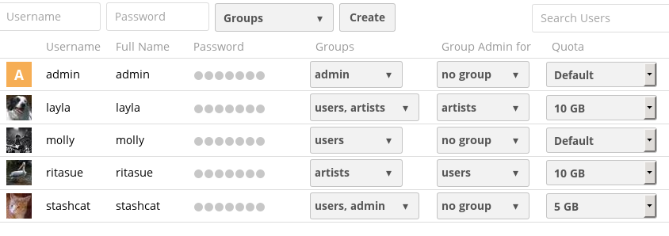
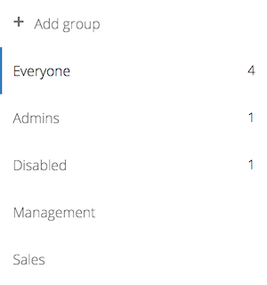
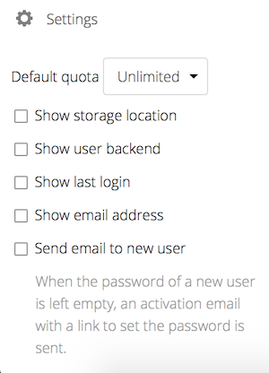
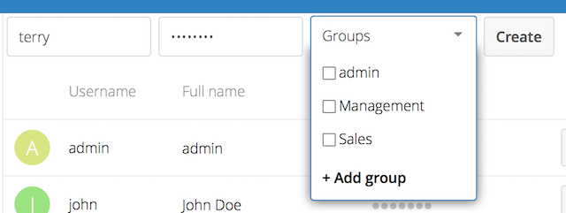
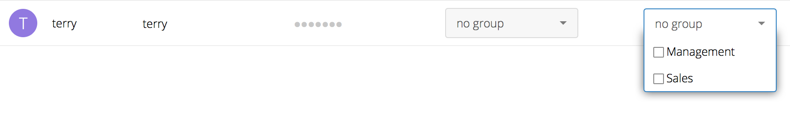

===============
User Management
===============

On the User management page of your ownCloud Web UI you can:

* Create new users
* View all of your users in a single scrolling window
* Filter users by group
* See what groups they belong to
* Edit their full names and passwords
* See their data storage locations
* View and set quotas
* Create and edit their email addresses
* Send an automatic email notification to new users
* Delete them with a single click

The default view displays basic information about your users.

The Group filters on the left sidebar lets you quickly filter users by their 
group memberships, and create new groups.

Click the gear icon on the lower left sidebar to set a default storage quota, 
and to display additional fields: **Show storage location, Show last log in, 
Show user backend, Send email to new users,** and **Show email address**.

User accounts have the following properties:

*Login Name (Username)*
  The unique ID of an ownCloud user, and it cannot be changed.

*Full Name*
  The user's display name that appears on file shares, the ownCloud Web 
  interface, and emails. Admins and users may change the Full Name anytime. If 
  the Full Name is not set it defaults to the login name.

*Password*
  The admin sets the new user's first password. Both the user and the admin can 
  change the user's password at anytime.

*Groups*
  You may create groups, and assign group memberships to users. By default new 
  users are not assigned to any groups.

*Group Admin*
  Group admins are granted administrative privileges on specific groups, and 
  can add and remove users from their groups.

*Quota*
  The maximum disk space assigned to each user. Any user that exceeds the quota 
  cannot upload or sync data. You have the the option to include external 
  storage in user quotas.

Creating a New User
~~~~~~~~~~~~~~~~~~~

To create a user account:

* Enter the new user's **Login Name** and their initial **Password** 
* Optionally, assign **Groups** memberships
* Click the **Create** button

Login names may contain letters (a-z, A-Z), numbers (0-9), dashes (-), 
underscores (_), periods (.) and at signs (@). After creating the user, you 
may fill in their **Full Name** if it is different than the login name, or 
leave it for the user to complete.

If you have checked **Send email to new user** in the control panel on the 
lower left sidebar, you may also enter the new user's email address, and 
ownCloud will automatically send them a notification with their new login 
information. You may edit this email using the email template editor on your 
Admin page (see :doc:`../configuration_server/email_configuration`).

Reset a User's Password
~~~~~~~~~~~~~~~~~~~~~~~

You cannot recover a user's password, but you can set a new one:

* Hover your cursor over the user's **Password** field
* Click on the **pencil icon** 
* Enter the user's new password in the password field, and remember to provide 
  the user with their password
  
If you have encryption enabled, there are special considerations for user 
password resets. Please see 
:doc:`../configuration_files/encryption_configuration`.

Renaming a User
~~~~~~~~~~~~~~~

Each ownCloud user has two names: a unique **Login Name** used for 
authentication, and a **Full Name**, which is their display name. You can edit 
the display name of a user, but you cannot change the login name of any user.

To set or change a user's display name:

* Hover your cursor over the user's **Full Name** field
* Click on the **Pencil icon** 
* Enter the user's new display name

Granting Administrator Privileges to a User
~~~~~~~~~~~~~~~~~~~~~~~~~~~~~~~~~~~~~~~~~~~

ownCloud has two types of administrators: **Super Administrators** and **Group 
Administrators**. Group administrators have the rights to create, edit and 
delete users in their assigned groups. Group administrators cannot access 
system settings, or add or modify users in the groups that they are not **Group 
Administrators** for. Use the dropdown menus in the **Group Admin** column to 
assign group admin privileges.

**Super Administrators** have full rights on your ownCloud server, and can 
access and modify all settings. To assign the **Super Administrators** role to 
a user, simply add them to the ``admin`` group.

Managing Groups
~~~~~~~~~~~~~~~

You can assign new users to groups when you create them, and create new groups 
when you create new users. You may also use the **Add Group** button at the top 
of the left pane to create new groups. New group members will immediately 
have access to file shares that belong to their new groups.

Setting Storage Quotas
~~~~~~~~~~~~~~~~~~~~~~

Click the gear on the lower left pane to set a default storage quota. This is 
automatically applied to new users. You may assign a different quota to any user 
by selecting from the **Quota** dropdown, selecting either a preset value or 
entering a custom value. When you create custom quotas, use the normal 
abbreviations for your storage values such as 500 MB, 5 GB, 5 TB, and so on.

You now have a configurable option in ``config.php`` that controls whether 
external storage is counted against user's quotas. This is still 
experimental, and may not work as expected. The default is to not count 
external storage as part of user storage quotas. If you prefer to include it, 
then change the default ``false`` to ``true``.::

   'quota_include_external_storage' => false,

Metadata (such as thumbnails, temporary files, and encryption keys) takes up 
about 10% of disk space, but is not counted against user quotas. Users can check 
their used and available space on their Personal pages. Only files that 
originate with users count against their quotas, and not files shared with them 
that originate from other users. For example, if you upload files to a 
different user's share, those files count against your quota. If you re-share a 
file that another user shared with you, that file does not count against your 
quota, but the originating user's.

Encrypted files are a little larger than unencrypted files; the unencrypted size 
is calculated against the user's quota.

Deleted files that are still in the trash bin do not count against quotas. The 
trash bin is set at 50% of quota. Deleted file aging is set at 30 days. When 
deleted files exceed 50% of quota then the oldest files are removed until the 
total is below 50%.

When version control is enabled, the older file versions are not counted 
against quotas.

When a user creates a public share via URL, and allows uploads, any uploaded 
files count against that user's quota.

Deleting users
~~~~~~~~~~~~~~

Deleting a user is easy: hover your cursor over their name on the **Users** page 
until a trashcan icon appears at the far right. Click the trashcan, and they're 
gone. You'll see an undo button at the top of the page, which remains until you 
refresh the page. When the undo button is gone you cannot recover the deleted 
user.

All of the files owned by the user are deleted as well, including all files they 
have shared. If you need to preserve the user's files and shares, you must first 
download them from your ownCloud Files page, which compresses them into a zip 
file, or use a sync client to copy them to your local computer. See 
:doc:`../configuration_files/file_sharing_configuration` to learn how to create 
persistent file shares that survive user deletions.
