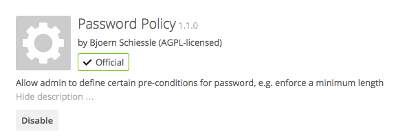

========================
User Password Policy App
========================

A password policy is a set of rules designed to enhance computer security by encouraging users to employ strong passwords and use them properly. 
To be able to to so you need to

* enable the Password Policy app.
* configure the Password Policy app.

Enable the Password Policy app.

Configure the Password Policy app.

You can configure 
* a minimal length of a password. Default is 10 characters.
* to forbid common passwords like 'california' or 'enterprise'.  
* enforce upper and lower case characters
* Enforce numeric characters
* Enforce special characters like ! or :

.. figure:: ../images/user_password_policy_configuration_app.png
