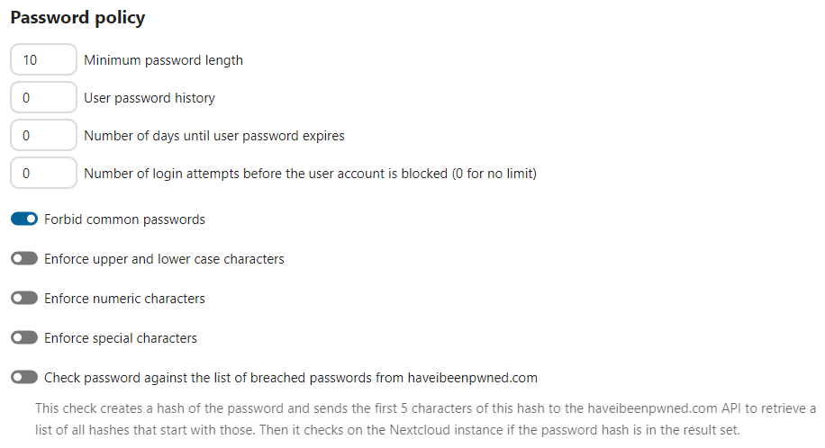

====================
User password policy
====================

A password policy is a set of rules designed to enhance computer security by encouraging users to employ strong passwords and use them properly.

In the security-section of your administrator-settings you can configure 

* a minimal length of a password. Default is 8 characters.
* a password history
* a password expiration period
* a lockout policy
* to forbid common passwords like 'password' or 'login'. 
* to enforce upper and lower case characters
* to enforce numeric characters
* to enforce special characters like ! or :
* to check the password against the list of breached passwords from haveibeenpwnd.com (hashed check via haveibeenpwnd.com-API)

