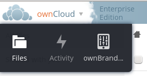
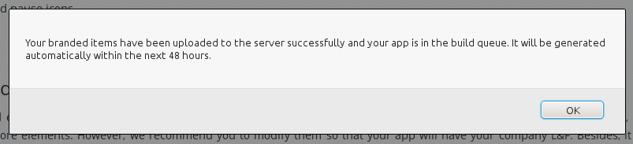
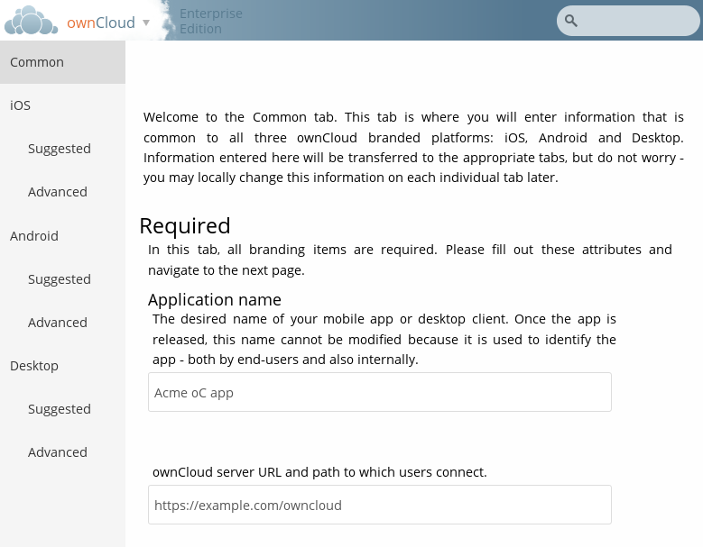
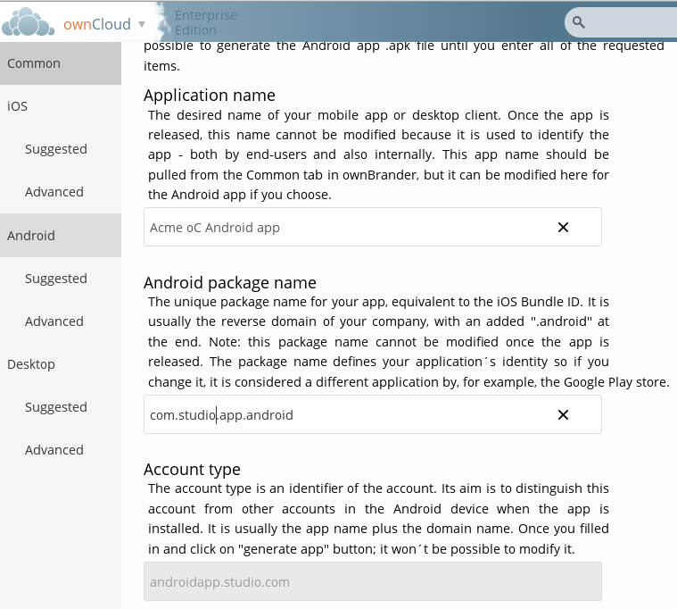
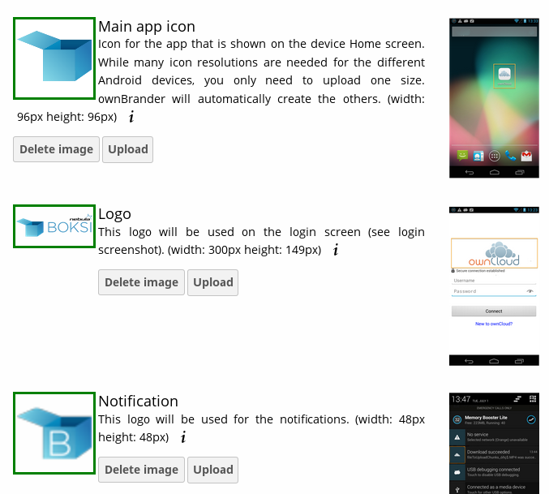
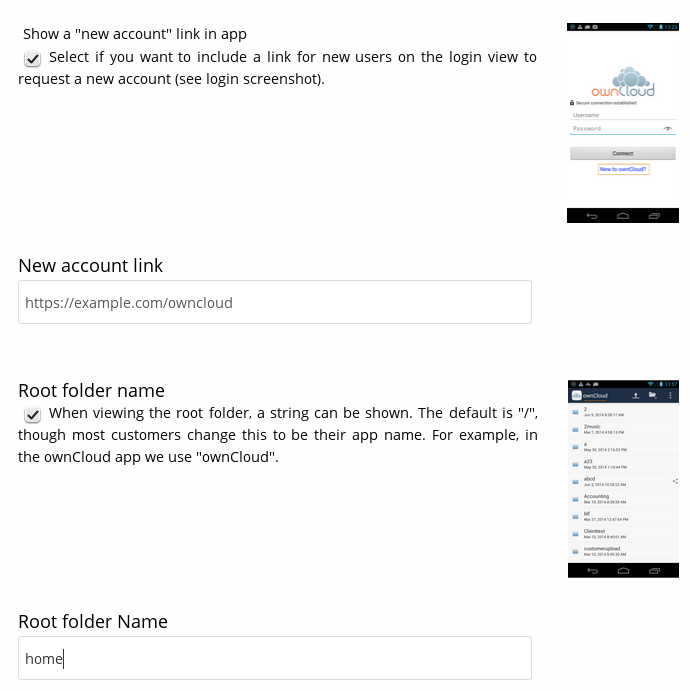
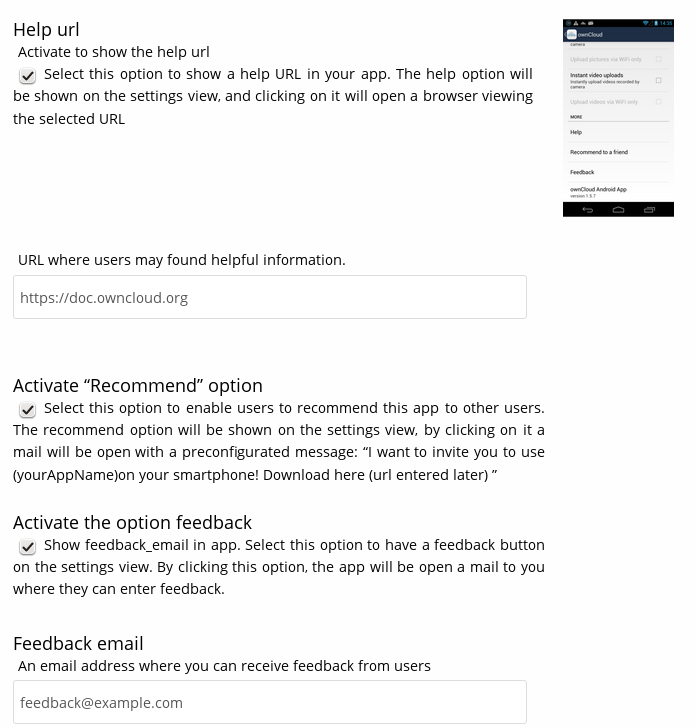
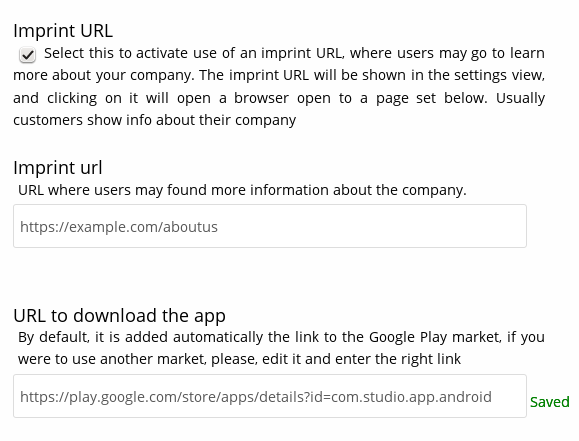
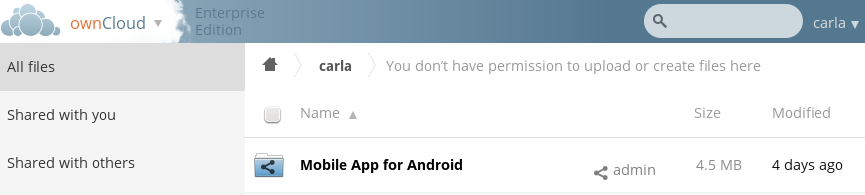

=======================================================
Creating Branded iOS and Android Apps (Enterprise Only)
=======================================================

Overview
--------

ownBrander is an ownCloud build service that is exclusive to Enterprise 
customers, for easily creating your own branded Android and iOS 
ownCloud sync apps, and your own branded ownCloud desktop sync client. Customers 
will access the app through their `customer.owncloud.com 
<https://customer.owncloud.com>`_ accounts.

You need to supply your own artwork, and the wizard tells you the required 
dimensions. To build Android and Desktop sync apps you need to supply only your 
own custom branded artwork. Building any iOS app requires custom branded 
artwork plus obtaining and installing a P12 certificate and provisioning 
profile from Apple (see :ref:`creating-ios-apps`). Then, to create the app, you 
follow a simple graphical wizard. 

.. image:: ../images/ownbrander-2.png

When you have completed the wizard, you will either get messages warning you 
of any items that need to be corrected, or a success message: 

And then when your new app is built, which may take up to 48 hours, it will 
appear in your personal folder on the Files page.

.. image:: ../images/ownbrander-4.png

Creating Branded Android or Desktop Sync Clients
------------------------------------------------

You can play around with ownBrander and create some apps for testing and 
learning. The Android and Desktop sync clients are the easiest to use for 
testing, and we'll walk through creating an Android app. You need a just a few 
images, and the wizard tells you their required dimensions. They must be the 
exact specified dimensions, preferably in PNG format.

First, start on the Common tab and enter your application name and the URL to 
your ownCloud server.  For testing purposes these can be anything. These are 
your global defaults, and you can change them when you create your apps. When 
you create production apps, then you must use your real app name, and the URL 
must point to your real ownCloud server.

Now go to the Android tab. There is a lot of helpful information on this page. 
Fill in your Application name, or keep the default set from the Common tab, 
and the Android package name.

Next, upload your images. The wizard tells you the exact size they must be, and 
click the images on the right to see some example screenshots.

Next, you have the option to display a New Account link on users' login 
screens. This is a simple mechanism for users to create new accounts. Then you 
can have a default root folder name that displays at the top of users' screens, 
such as home, your company name, or anything you want.

The next option is enabling a help URL. This can be a link to documentation on 
your own site, or to `doc.owncloud.org <https://doc.owncloud.org>`_. Then you 
have options to enable a "Recommend" feature so your users can recommend your 
app to other users, and a feedback option so they can tell you what they think 
of your app.

The Imprint URL option allows you to enter a link to information about your 
company. The URL to download the app is automatically generated by ownBrander, 
or you may enter an alternate download link.

Finally, if you are creating a paid app then check the checkbox for Paid Users 
and upload an icon. 

.. image:: ../images/ownbrander-11.png

Now you are finished. Click the Generate Android App button, and you will 
either see a success message, or an error message telling you what you need to 
fix. When all of your options are entered correctly and you click the Generate 
Android App button, it takes up to 48 hours for your app to appear on your 
Files page.

.. _creating-ios-apps:

Creating Apps for iOS
---------------------

You need many more images for creating an iOS app so that your app works on all 
iPhones and iPads in both portrait and landscape modes. You also need an Apple 
developer account, and a `P12 certificate and provisioning profile 
<https://developer.apple.com/library/ios/documentation/Security/Conceptual/
CertKeyTrustProgGuide/iPhone_Tasks/iPhone_Tasks.html#//apple_ref/doc/uid/
TP40001358-CH208-SW13>`_. We will install these for you on your 
`customer.owncloud.com 
<https://customer.owncloud.com>`_ account. Contact branding@owncloud.com if you 
have any questions.
