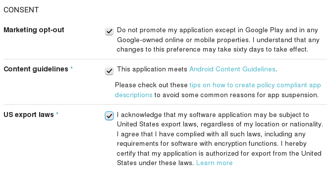

=======================================================
Distributing Your Branded Android App (Enterprise Only)
=======================================================

Now that you have created your branded Android app with ownCloud's ownBuilder 
service (:doc:`creating_branded_apps`) how do you distribute it to your users? 
There are multiple ways: :ref:`email`, :ref:`publish_server`, or 
:ref:`publish_google_play`. However you distribute it, the first step is to 
digitally sign your new app. Signing your app verifies authorship and 
authenticity.

When you create your branded Android app we supply you with two ``.apk`` files: 
one for debugging and testing, and one for deployment, like these examples::
 
 acmecloud_1.7.0-debug.apk
 acmecloud_1.7.0-release-unsigned.apk
 
The second  ``.apk`` file, ``acmecloud_1.7.0-release-unsigned.apk``, is the one 
you will sign and distribute.

Digitally Signing Android Apps
------------------------------

Signing your app is required, and the most time-consuming part is installing 
the commands you need to sign them. You need three commands to sign your app: 
``keytool``, ``jarsigner``, and ``zipalign``. Follow these steps:

1. Install the signing commands
2. Create a self-signed certificate with ``keytool``
3. Use ``jarsigner`` to sign the app, and to verify signing
4. Use ``zipalign`` to optimize your app

You only need to create a certificate once, and then use it to sign all of your 
branded ownCloud apps. If you publish your apps on Google Play they must all be 
signed with the same certificate.

Installing the App Signing Tools
^^^^^^^^^^^^^^^^^^^^^^^^^^^^^^^^

``keytool`` and ``jarsigner`` are in Java runtimes. Linux users 
can get these in OpenJDK. For example, on current versions of Debian, 
Mint, and Ubuntu Linux you need to install two packages. The first one supplies 
``keytool`` and the second one supplies ``jarsigner``::

 $ sudo apt-get install openjdk-7-jre-headless
 $ sudo apt-get install openjdk-7-jdk
 
On SUSE systems, install this package::
 
 $ sudo zypper install java-1_7_0-openjdk-devel
 
It is simpler to get these on CentOS and Red Hat Enterprise Linux, as they have 
created some nice 
wrapper scripts around ``keytool`` and ``jarsigner`` that you can install 
standalone::
 
 $ sudo yum install keytool-maven-plugin.noarch
 $ sudo yum install maven-jarsigner-plugin.noarch
 
Mac OS X and Windows users can download the Oracle JDK from `Oracle's Java 
Download 
<http://www.oracle.com/technetwork/java/javase/downloads/index.html>`_ 
page. 
 
``zipalign`` is included in the `Android Software Development Kit 
<https://developer.android.com/sdk/index.html>`_. It is a large download, but 
once you have downloaded it you can copy the ``zipalign`` binary to any 
computer and use it. Go to `Android Software Development Kit 
<https://developer.android.com/sdk/index.html>`_ and click the 
"Download Android Studio" button.

Download the appropriate **SDK Tools Only** package for your operating system.

   
Unpack it and change to the unpacked directory, which is ``android-sdk-linux`` 
on Linux systems, ``android-sdk-macosx`` on Mac systems, and 
``android-sdk-windows`` on Windows systems. There is one more step, and that is 
to install additional tools. Run this command from the unpacked directory::
 
 tools/android update sdk --no-ui
 
This will take some time, as it is a large download. When it's finished you'll 
find ``zipalign`` in the ``build-tools`` directory. For convenience, you could 
copy ``zipalign`` to your home folder or other location of your choice, and to 
any other computer without installing the whole Android SDK.

Digitally Signing Your App
^^^^^^^^^^^^^^^^^^^^^^^^^^

After installing your signing tools, signing your app takes just a few steps. 
In these examples the name of the app, as supplied 
by ownBuilder, is ``acmecloud_1.7.0-release-unsigned.apk``.

To create your certificate copy the following command, replacing 
``acme-release-key.keystore`` and ``acme_key`` with your own keystore name and 
alias, which can be anything you want. The keystore name and alias 
must both have a password, which can be same for both. Then enter your company 
information as you are prompted::

 $ keytool -genkey -v -keystore acme-release-key.keystore -alias acme_key 
 -keyalg RSA -keysize 2048 
 Enter keystore password:  
 Re-enter new password: 
 What is your first and last name?
  [Unknown]:  Acme Boss  
 What is the name of your organizational unit?
  [Unknown]:  Acme Headquarters
 What is the name of your organization?
  [Unknown]:  Acme, Inc. 
 What is the name of your City or Locality?
  [Unknown]:  Anytown
 What is the name of your State or Province?
  [Unknown]:  CA
 What is the two-letter country code for this unit?
  [Unknown]:  US
 Is CN=Acme Boss, OU=Acme Headquarters, O="Acme, Inc.", L=Anytown, ST=CA, C=US 
 correct?
  [no]:  yes

 Generating 2,048 bit RSA key pair and self-signed certificate (SHA256withRSA) 
 with a validity of 10,000 days
        for: CN=Acme Boss, OU=Acme Headquarters, O="Acme, Inc.", L=Anytown, 
        ST=CA, C=US
 Enter key password for <acme_key>
        (RETURN if same as keystore password):  
 [Storing acme-release-key.keystore]

Now use ``jarsigner`` to sign your app. Replace ``acme-release-key.keystore`` 
and ``acme_key`` with your own keystore name and alias::

 $ jarsigner -verbose -sigalg SHA1withRSA -digestalg SHA1 -keystore 
 acme-release-key.keystore acmecloud_1.7.0-release-unsigned.apk acme_key
 Enter Passphrase for keystore: 
   adding: META-INF/MANIFEST.MF
   adding: META-INF/ACME_KEY.SF
   adding: META-INF/ACME_KEY.RSA
  signing: res/anim/disappear.xml
  signing: res/anim/grow_from_bottom.xml
  [...]
  jar signed.

  Warning: 
  No -tsa or -tsacert is provided and this jar is not timestamped. Without a 
  timestamp, users may not be able to validate this jar after the signer 
  certificate's expiration date (2042-07-28) or after any future revocation 
  date.
 
You can ignore the warning at the end; you should see  a ``jar signed`` message 
when it is finished.

Now you can verify that your app is signed::

 $ jarsigner -verify -verbose -certs acmecloud_1.7.0-release-unsigned.apk
 
      sm       943 Thu Mar 12 12:47:56 PDT 2015 
      res/drawable-mdpi/abs__dialog_full_holo_light.9.png

      X.509, CN=Acme Boss, OU=Acme Headquarters, O="Acme, Inc.", L=Anytown, 
      ST=CA, C=US

This will spit out hundreds of lines of output. If it ends with the following 
it's good::

  s = signature was verified 
  m = entry is listed in manifest
  k = at least one certificate was found in keystore
  i = at least one certificate was found in identity scope

  jar verified.
  
The last step for preparing your ``.apk`` for release is to run ``zipalign`` on 
it. ``zipalign`` optimizes your file to use less memory. You must specify both 
an input and an output file, so this is good time to give your app a shorter 
name, and it should not say "unsigned". Our example file will be renamed to 
``acmecloud_1.7.0.apk``::

 $ zipalign -v 4 acmecloud_1.7.0-release-unsigned.apk acmecloud_1.7.0.apk
 Verifying alignment of acmecloud_1.7.0.apk (4)...
      50 META-INF/MANIFEST.MF (OK - compressed)
   13277 META-INF/ACME_KEY.SF (OK - compressed)
   27035 META-INF/ACME_KEY.RSA (OK - compressed)
   28206 res/anim/disappear.xml (OK - compressed)
   [..]
   Verification succesful

Again, this emits a lot of output, and when you see **Verification succesful** 
at the end you know it succeeded, and it is ready to distribute.

.. _email:

Distribution via Email
----------------------

You can download your branded Android app from your account on 
`Customer.owncloud.com <https://customer.owncloud.com/owncloud>`_, and send it 
as an email attachment to your users. (This is not the optimal way to distribute 
it as it is over 2 megabytes in size.) When they open your email on their 
Android phone or tablet, they must first click the the download arrow (bottom 
right of the screenshot) to download your app.

.. image:: ../images/android_custom_1.png

When the arrow changes to a green checkbox, it has been downloaded. 

.. image:: ../images/android_custom_2.png

Now your user must click on the green checkbox, and this launches the app 
installer, and all they have to do is follow the installation wizard to install 
your branded app.

.. image:: ../images/android_custom_3.png
   :scale: 75%

When the installation is complete, the `ownCloud Android App Manual 
<https://doc.owncloud.com/android/>`_ contains instructions for using the app.

.. _publish_server:

Publish On Your ownCloud Server
-------------------------------

You can distribute your branded app from your ownCloud server. Simply upload it 
to your ownCloud server and share it like any other file: you can create normal 
ownCloud shares with ownCloud users and groups, and you may create a link share 
to share it with anyone. (See the **Files & Synchronization** section of the 
`ownCloud User Manual 
<https://doc.owncloud.org/server/8.0/user_manual/files/index.html>`_ to learn 
more about sharing files.)

.. _publish_google_play:

Publish to the Google Play Store
--------------------------------

You may elect to publish your app in the Google Play store, either as a free 
or paid app. There are several steps to publishing a free app:

1. Create a Google Play Publisher account.

2. Sign your branded app with your own signing certificate.

3. Upload your signed branded app to your Google Play Publisher account.

As part of creating your Google Play Publisher account you will have to create 
some screenshots of your app in specific sizes, and create a store description.

Create a Google Play Publisher Account
^^^^^^^^^^^^^^^^^^^^^^^^^^^^^^^^^^^^^^

Start at Google's `Get Started With Publishing 
<http://developer.android.com/distribute/googleplay/start.html>`_ page. Have a 
credit card ready, because it costs $25. If you already have a Google account, 
it is usually better to create a separate new account just for publishing apps 
to the Google Play Store.

Google's process for uploading apps is fairly streamlined, and the most 
time-consuming task is creating all the required graphics. After registering, 
you'll see the welcome screen for the Google Dev Console. Click **Publish an 
Android app on Google Play**. 

.. image:: ../images/android_custom_6.png

This opens the **Add New Application** screen. Click the **Prepare Store 
Listing** button. (Note that as you navigate the various screens, you can click 
the Save Draft button to preserve your changes.)

.. image:: ../images/android_custom_7.png

On the next screen, enter your product description.

.. image:: ../images/android_custom_8.png
   :scale: 75%

Then you'll have to upload a batch of graphics in various sizes for the 
**Graphic Assets** section, like these images for a smartphone and seven-inch 
tablet. You are required to upload at least two images.

.. image:: ../images/android_custom_9.png

You must also upload a 512x512-pixel logo, and a 1024x500 banner.

.. image:: ../images/android_custom_10.png

Now choose the store categories for your app.

.. image:: ../images/android_custom_11.png

Then enter your contact information, which will be visible on your store 
listing.

.. image:: ../images/android_custom_12.png

On the next line you may optionally link to your privacy policy. It is 
recommended to have a privacy policy.

When you're finished with the **Store Listing** page, go to the **Pricing and 
Distribution** page. You may make this a paid or free app. You cannot convert a 
free app to paid. You may convert a paid app to free, but then you can't 
convert it back to paid. You'll have numerous options for paid apps, such as 
Android Wear, Android TV, and various Google marketing tie-ins, and many more. 

For now let's make this a free app, so click the Free button and select the 
countries you want to distribute it in.

.. image:: ../images/android_custom_13.png
   :scale: 75%

Now you may upload your app.
 
Uploading to Google Play Store
^^^^^^^^^^^^^^^^^^^^^^^^^^^^^^

Now you can upload your app to your Google Play Store page. Go to the **APK** 
page and click **Upload your first APK to Production**. You don't need a license 
key for a free app.

.. image:: ../images/android_custom_14.png
   :scale: 75%

Drag-and-drop, or browse to select your app.

.. image:: ../images/android_custom_15.png

A successful upload looks like this:

Your app is not yet published, but only uploaded to your account. There is one 
more step to take before you can publish, and that is to go back to the 
**Pricing & Distribution** page and fill out the **Consent** section. 

Click the Save Draft button, and if you followed all the required steps you 
should now see a **Publish App** button. 

It will not be published immediately, but after review by Google, which usually 
takes just a few hours.

After it has been published, your store listing is updated as PUBLISHED, and it 
includes a link to your Play Store listing.

Now all you need to do is distribute the URL to your users, and they can 
install it either from their Web browsers, or from their Google Play Store 
apps. This is how it looks to your users.

See :doc:`custom_client_repos` to learn how to configure your ownCloud server 
to use the link to your branded app instead of the ownCloud app, and see the 
**Theming the First Run Wizard** section of :doc:`../operations/theming` to 
learn how to create a custom icon for your branded app.

Publishing a Paid App in Google Play
^^^^^^^^^^^^^^^^^^^^^^^^^^^^^^^^^^^^

If you would rather not give your branded app away you can sell it on Google 
Play. You may convert a paid app to free, but you may not convert a free app to 
paid.

You must establish a Google Wallet Merchant Account. On your Google Dev Console 
click the **Learn more** link under the Free/Paid button for a nice thorough 
review of the process and tools. It requires verifying your business 
information and bank account, and you should expect it to take 3-4 days. 

.. image:: ../images/android_custom_26.png

When you're ready to set it up, click the **Set up a merchant account now** 
link under the Free/Paid button.

Resources
---------

* `Get Started With Publishing 
  <http://developer.android.com/distribute/googleplay/start.html>`_

* `Signing Your App Manually  
  <https://developer.android.com/tools/publishing/app-signing.html#signing-manually>`_

* `Developer Console 
  <http://developer.android.com/distribute/googleplay/developer-console.html>`_