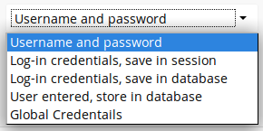

======================================
Enterprise-Only Authentication Options
======================================

In ownCloud 9.0+, there are five authentication backends for external storage 
mounts:

* Username and password
* Log-in credentials, save in session
* Log-in credentials, save in database
* User entered, store in database
* Global credentials

The first two are common to all editions of ownCloud, and the last three are 
only in the Enterprise edition. These are available to:

* FTP
* ownCloud
* SFTP
* SMB/CIFS
* WebDAV
* Windows Network Drive
 
Username and password
 This is the default; a login entered by the admin when the external mount is 
 created. The login is stored in the database, which allows sharing, and 
 background jobs, such as file scanning, to operate.
 
Log-in credentials, save in session
 Credentials are only stored in the session and not captured in the database. 
 Files cannot be shared, as credentials are not stored.
 
Log-in credentials, save in database
 Credentials are stored in the database, and files can be shared.
 
User entered, store in database
 Users provide their own login credentials, rather than using admin-supplied 
 credentials. User credentials are stored in the  database, and files can be 
 shared.
 
Global credentials
 Re-usable credentials entered by the admin, files can be shared.
 
 
Global credentials are entered in a separate form.

.. figure:: images/auth_backends-2.png
   :alt: Global credentials form.
   
Use the dropdown selector to choose the authentication backend when you create a 
new external mount.   
 

