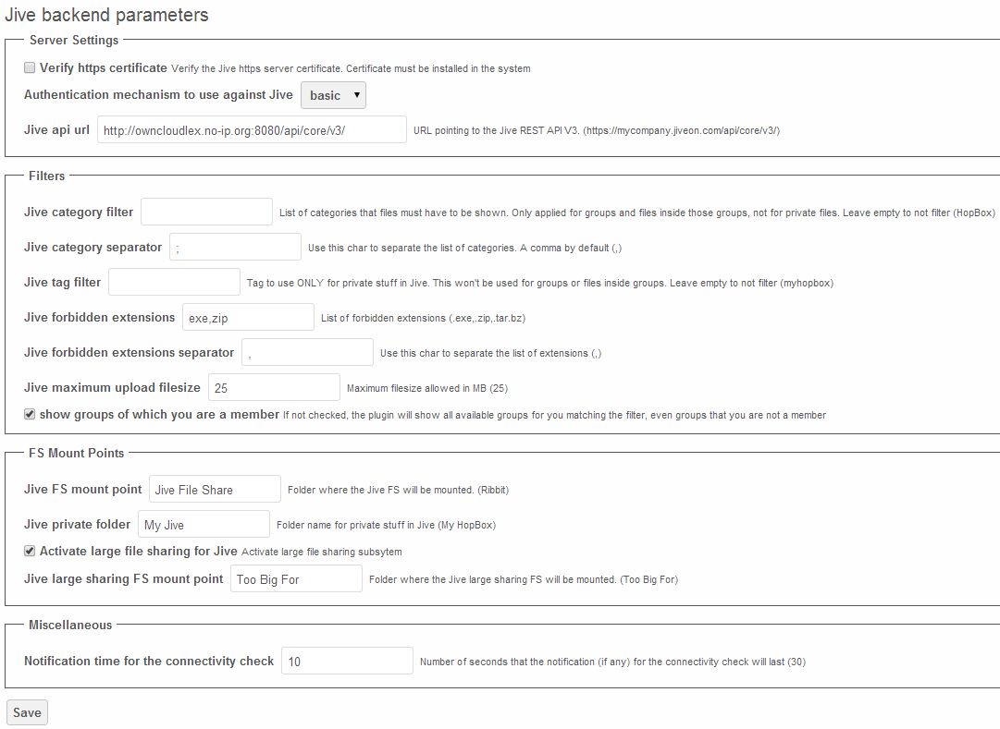
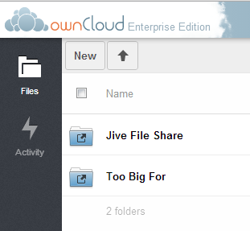

================
Jive Integration
================

.. toctree::
    :maxdepth: 2
    :hidden:

The Jive application allows Jive users to access files stored in Jive
from a mobile device, tablet, or desktop client. Users have complete access
through ownCloud Enterprise edition to upload, edit or download their files.

Jive can be configured as a data storage location for ownCloud, which means
files saved in Jive appear in folders within ownCloud. Jive remains the system
of record while ownCloud acts as a proxy, providing end-to-end file access for
users at their desks and on the go.

Configuration
=============

The Jive application is installed under the owncloud/apps directory on the server and enabled via the ownCloud
admin screen. This app is only available for ownCloud EE v6 or higher. Go to the ownCloud admin screen section
“Jive backend parameters” to configure the app to match your Jive server system parameters.

+----------------------------------------+----------------------------------------------------------------------------------------------------------------------------------------------------------------------------------------------------------+----------------------------------------------------+
| Parameter                              | Description                                                                                                                                                                                              | Values                                             |
|                                        |                                                                                                                                                                                                          |                                                    |
+----------------------------------------+----------------------------------------------------------------------------------------------------------------------------------------------------------------------------------------------------------+----------------------------------------------------+
| Https                                  | Verify the https server certificate. Certificate must be installed on the system.                                                                                                                        | Checkbox – enabled/disable                         |
|                                        |                                                                                                                                                                                                          |                                                    |
+----------------------------------------+----------------------------------------------------------------------------------------------------------------------------------------------------------------------------------------------------------+----------------------------------------------------+
| Authentication                         | Chose the Authentication mechanism to use against Jive                                                                                                                                                   | basic OR oAuth                                     |
|                                        |                                                                                                                                                                                                          |                                                    |
+----------------------------------------+----------------------------------------------------------------------------------------------------------------------------------------------------------------------------------------------------------+----------------------------------------------------+
| Jive api url                           | URL string pointing to the Jive API                                                                                                                                                                      | Example: https://mycompany.jiveon.com/api/core/v3/ |
|                                        |                                                                                                                                                                                                          |                                                    |
+----------------------------------------+----------------------------------------------------------------------------------------------------------------------------------------------------------------------------------------------------------+----------------------------------------------------+
| Jive FS mount point                    | Folder where the Jive File share will be mounted                                                                                                                                                         | String value up to 10 characters max               |
|                                        |                                                                                                                                                                                                          |                                                    |
+----------------------------------------+----------------------------------------------------------------------------------------------------------------------------------------------------------------------------------------------------------+----------------------------------------------------+
| Jive category filter                   | List of categories that files have to be shown                                                                                                                                                           | Jive categories list, or blank                     |
|                                        |                                                                                                                                                                                                          |                                                    |
+----------------------------------------+----------------------------------------------------------------------------------------------------------------------------------------------------------------------------------------------------------+----------------------------------------------------+
| Jive category separator                | Separator for Jive catagories list                                                                                                                                                                       | Comma by default or any single character           |
|                                        |                                                                                                                                                                                                          |                                                    |
+----------------------------------------+----------------------------------------------------------------------------------------------------------------------------------------------------------------------------------------------------------+----------------------------------------------------+
| Jive tag filter                        | Tag to use for private stuff in jive                                                                                                                                                                     | Jive tag or blank                                  |
|                                        |                                                                                                                                                                                                          |                                                    |
+----------------------------------------+----------------------------------------------------------------------------------------------------------------------------------------------------------------------------------------------------------+----------------------------------------------------+
| Jive forbidden extensions              | List of forbidden extensions                                                                                                                                                                             | Examples include: .exe,.zip                        |
|                                        |                                                                                                                                                                                                          |                                                    |
|                                        | These will not be allowed for upload or download with Jive.                                                                                                                                              |                                                    |
|                                        |                                                                                                                                                                                                          |                                                    |
+----------------------------------------+----------------------------------------------------------------------------------------------------------------------------------------------------------------------------------------------------------+----------------------------------------------------+
| Jive forbidden extensions separator    | Use this character to separate the list of extensions                                                                                                                                                    | Comma by default or any single character           |
|                                        |                                                                                                                                                                                                          |                                                    |
+----------------------------------------+----------------------------------------------------------------------------------------------------------------------------------------------------------------------------------------------------------+----------------------------------------------------+
| Jive maximum upload filesize           | Maximum file size allowed in MB. This includes upload and downloads.                                                                                                                                     | Numeric value                                      |
|                                        |                                                                                                                                                                                                          |                                                    |
+----------------------------------------+----------------------------------------------------------------------------------------------------------------------------------------------------------------------------------------------------------+----------------------------------------------------+
| Jive private folder                    | Folder name for private stuff in Jive                                                                                                                                                                    | String value up to 250 characters max              |
|                                        |                                                                                                                                                                                                          |                                                    |
+----------------------------------------+----------------------------------------------------------------------------------------------------------------------------------------------------------------------------------------------------------+----------------------------------------------------+
| Activate large file sharing for Jive   | Enable the large file sharing subsystem. This allows storage of files that are too large for Jive to be stored on the ownCloud server and available via the ownCloud web, mobile and desktop interfaces. | Checkbox – enable/disable                          |
|                                        |                                                                                                                                                                                                          |                                                    |
+----------------------------------------+----------------------------------------------------------------------------------------------------------------------------------------------------------------------------------------------------------+----------------------------------------------------+
| Jive large file sharing FS mount point | Folder where the Jive large sharing File Share will be mounted                                                                                                                                           | String value up to 10 characters max               |
|                                        |                                                                                                                                                                                                          |                                                    |
+----------------------------------------+----------------------------------------------------------------------------------------------------------------------------------------------------------------------------------------------------------+----------------------------------------------------+
| Show groups of which you are a member  | If this is not checked, the plugin will show all available groups for you matching the filter, even groups that you are not a member                                                                     | Enable/disable                                     |
|                                        |                                                                                                                                                                                                          |                                                    |
+----------------------------------------+----------------------------------------------------------------------------------------------------------------------------------------------------------------------------------------------------------+----------------------------------------------------+

Use Cases
=========

The ownCloud Jive plugin can be used in various ways to extend the access to the Jive content across multiple devices.

Web Client Use Cases
--------------------

*   Create a folder in the “Jive File Share” Web Client folder to create a new Jive Group.

    *   Verify the Group is created in Jive.

*   Create a new Group in Jive and upload a file to that Group.

    *   Check the Web Client and download the file.

    *   Verify that file is the same as the uploaded file.

*   Upload a file in the “Too Big For” Jive folder, and create the link in a Jive document.

    *   Verify that file link is in Jive.

    *   Download the file via the link, and verify it is the same as the uploaded file.

*   Upload a file to the private “My Jive” Web Client folder.

    *   Check your Jive content and make sure the file has been uploaded.

    *   Download the file and verify it is the same as the uploaded file.

Mobile Client Use Cases (iOs and Android)
-----------------------------------------

Create a new folder in the Mobile Client to create a new Jive Group.

Upload a file in the Web Client folder, and see that file in the corresponding Jive Group.

Desktop Client Use Cases
------------------------

Create a folder in the Desktop Client to create a new Jive Group.

Upload a file in the Desktop Client folder, and see that file in the corresponding Jive Group.

The ownCloud folder structure hierarchy matches the Jive Groups the user can access. Sub folders under the Jive Group
folders that are created on the desktop will not sync to ownCloud or Jive because they will not match the Jive “Group”
view. If a sub folder is created under the Jive Group desktop folder, the desktop client will display an error that
this operation is not allowed. For example; if the folder structure is “JiveFileShare/GroupA”, any sub folder under
GroupA will not be synced to ownCloud or Jive.

Configuring the Jive app
========================

This section explains how each configuration parameter changes the behavior of the app.

Verify https certificate
------------------------

If your Jive server is under https, it must provide a https certificate when a client connects to it. Curl (the client
that ownCloud is using to connect to Jive) usually verify that certificate, but to do that you must somehow supply
a CA cert so curl can verify against.

This feature is usually turn off to make the Jive app easier to use, because in this case curl won't verify the
certificate, so you don't need to have installed the CA cert. However, turning this off could be a security issue:
you could be connecting to a fake Jive server without notice.

If you want to turn on this feature, you must get the CA cert of the server (check “
`http://curl.haxx.se/docs/sslcerts.html <http://curl.haxx.se/docs/sslcerts.html>`_
” for more information about how you can get the file you need)
and install it in your ownCloud server.

In order to know where you should install the CA cert, you can run

curl -v
`https://yourserver.com/ <https://yourserver.com/>`_

You should look the output for a line with the CA path:

    * successfully set certificate verify locations:
    * CAfile: none
    * CApath: /etc/ssl/certs

That's the place where you should install the CA cert.

Once you have installed the CA cert, you should run again the same curl:

curl -v
`https://yourserver.com/ <https://yourserver.com/>`_

And look for:

    * Server certificate:
    * subject: *********
    * start date: ***********
    * expire date: *********
    * subjectAltName: ***********
    * issuer: **********
    * SSL certificate verify ok.

If the SSL is verified correctly (“SSL certificate verify ok.”), you just need to activate the checkbox.

Curl usually comes installed with some CA certs by default, so all the previous steps might not be needed. Just check
that curl can connect to your Jive server, and if so, activate this feature.

Authentication mechanism to use against Jive
--------------------------------------------

To be able to access to Jive, the ownCloud plugin needs to use some kind of authentication. At this time, the plugin
supports basic and oAuth authentication.

Basic authentication
^^^^^^^^^^^^^^^^^^^^

In order to use basic authentication, you should take into account the following things:

*   The credentials used to access to ownCloud must match the ones used to connect to Jive. This means that if you
    access to ownCloud with a user “PeterP” and password “PeterPassword”, the same user must exist in Jive with the same
    password. Otherwise, the user won't be able to access to Jive.

*   If the credentials (typically the password) changes in one side, it must change in the other. You'll need to this manually.

The usage of basic authentication isn't recommended due to the following reasons:

*   We need to store the password and be able to recover it. Although the password is stored encrypted, this is
    not strictly secure.

*   Passwords are sent to the server in almost plain text. In fact it's a base64 encoded string of user and password,
    but that's all the security the authentication provides.

If you plan to use basic authentication, at least make sure you connect through HTTPS protocol and inside a local LAN if possible.

oAuth authentication
^^^^^^^^^^^^^^^^^^^^

First of all, make sure Jive is prepared to support this authentication.

The usage of this authentication method solves the issue of having the same credentials in both ownCloud and Jive
server. This means that the ownCloud user “PeterP” with password “PeterPassword” can access to the contents of the Jive
user “John” with password “John007”. It's also possible that another ownCloud user “AliceK” access to the contents of
the Jive user “John” too at the same time.

Keep in mind that this isn't insecure: any ownCloud user that wants to access to John's Jive content (following
this little example) MUST know his Jive password.

If this authentication method is set, we don't store passwords BUT we still need to store some other things. These things are stored in plain text.

These are the steps to make it work (if your Jive server support this authentication):

#.  Activate the oAuth authentication in the ownCloud admin settings (just the admin can do this)

#.  Go to the ownCloud web interface, in the files app. A popup will appear.

#.  Click on the link that appear in the popup

#.  You'll get redirected to a Jive page asking for your Jive credentials. If this is not the case, it's recommended
    to clean the browser cache and start again (to point 2) because you might be accessing to Jive with another user.

#.  After entering your Jive credentials, you get redirected a page with an activation code. If you entered the
    wrong credentials, you might not get redirected to that page. If this is the case click
    in the link again in the ownCloud popup (point 3) which will redirect you to the activation code page.

#.  Copy the activation code into the ownCloud popup,
    and click in the “send code” button. If there is no error, you're done.

WARNING:

Not all the oAuth flows are covered by the plugin. The expiration of the access token is handled automatically by
the plugin, so it will request a new access token if needed. HOWEVER, the expiration of the refresh token isn't
covered, so the plugin will likely stop working for that user (we won't be able to get more access tokens)

[Ask for info to know how to solve this issue?]

It's very important that the user access to ownCloud through the web interface first, so the user goes through
the oAuth flow for the first time (as described with the steps above) to get an access token. Otherwise, the
plugin won't get an access token and the user won't be able to get the files from Jive.

Jive API URL
------------

You'll need to enter the full URL of the Jive API. This includes the protocol (HTTP or HTTPS) and the port (if any).

An example of API URL could be: “
`https://myjiveserver.com/api/core/v3/ <https://myjiveserver.com/api/core/v3/>`_
”

Notice the following things:

*   You must specify a protocol that is understandable by curl. Under normal circumstances, the protocol is limited to HTTP or HTTPS.

*   If your server is under a port different than the 80, you'll need to specify it. Take “
    `https://jserver.prv:9999/api/core/v3/ <https://jserver.prv:9999/api/core/v3/>`_
    ” as an example

*   If your server isn't under the root URL, you can also specify the correct path: “
    `https://myserver.prv:8888/path/to/jive/api/core/v3/ <https://myserver.prv:8888/path/to/jive/api/core/v3/>`_
    ”

*   The API URL should end with “/api/core/v3/” (be careful with the slash at the end)

Filters
-------

The Jive plugin comes with a set of filters that the admin can set to filter the content the users can access
through ownCloud. The drawback of using filters is that there isn't any performance gain because the filtering
is mainly done in the ownCloud side, and even can degrade performance in some cases. We'll explain the filters
one by one, and tell you what consequences have each one.

Category filter and separator
^^^^^^^^^^^^^^^^^^^^^^^^^^^^^

You can filter files using one or several categories. This filter applies only to groups and files
inside those groups.
Your private files won't be affected by this filter.

In order to set this filter, you can provide a list of categories, all in one line. In order to separate the
different categories, you must use the separator set in the “category separator” text box.

    Jive category filter : syncWithMe,sync,syncMe

    Jive category separator : ,

You can also achieve the same behavior with:

    Jive category filter : syncWithMe#sync#syncMe

    Jive category separator : #

The plugin will show all groups which have ALL those categories set. If there is a group with any of the
categories missing, that group won't be shown. Anyway, you should only need to set one category.

It's important to notice that, although you can set only one category or leave the text box empty, the
category separator MUST always be set. In fact, you shouldn't need to change the default value of the category separator.

Files shown inside those groups will be also affected by this filter. This means that all the files
shown inside those groups must have all the categories too.

Files uploaded through ownCloud to those groups will have all the categories set in Jive automatically.
If you want to add more categories to those files, you'll need to do it manually through Jive.

The usage of the category filter can degrade the performance a lot.
We need to make extra calls to Jive to get the categories for each group, one extra call per group returned by Jive in the first place.
There is also the limitation of not having more than 25 categories set per group.
Use this filter with extreme caution.

You can “disable” this filter just by setting the category filter empty. This will prevent the extra call from
being made, and will show all available groups.

Tag filter
^^^^^^^^^^

This filter works only for private files. Files inside groups won't be affected by this filter.

You can only set one tag for the files that will be shown in ownCloud. Make sure you set one of the tags from Jive
as they're shown there. It's highly recommended to use only lowercase letters to set the tag to prevent possible
issues when the tag is set in Jive.

The usage of this filter won't alter significantly the performance

It's important to notice that the filter will be applied to all users. Users won't be able to set their own tag to sync their own files.

This filter can also be “disabled” by setting the filter empty.

Forbidden extensions filter and separator
^^^^^^^^^^^^^^^^^^^^^^^^^^^^^^^^^^^^^^^^^

This filter is set the same way as the category filter: you provide a list of extensions that are separated
by the char set in the separator text box.

    Jive forbidden extensions: .exe,.zip,.tar.gz

    Jive forbidden extensions separator : ,

You can also achieve the same behavior with:

    Jive forbidden extensions: .exe#.zip#.tar.gz

    Jive forbidden extensions separator: #

Keep in mind that the filter is performed against the end of the filename, that's why the “.” is important. If
 you set “exe” as a forbidden extension, a file named “texe” or “f1.lexe” will be affected by this filter.

You must also take into account that, by using only the filename, we avoid to download the file, so the
performance isn't significantly degraded.
On the other hand, we cannot verify that a “.png” file is what it claims to be.

This filter works for any file, and for uploads and downloads through ownCloud. This means that you won't be able to
upload a file with any of those extensions from onwCloud and the Jive files which have those extensions won't
be shown (and consequently they won't be downloaded). Of course, you can still upload the files from Jive
(if Jive allows it) and have them there.

Maximum upload file size
^^^^^^^^^^^^^^^^^^^^^^^^

This filter allows you to limit the size of the files that will go through ownCloud. All files uploads and
downloads will be affected by this filter. You won't be able to upload files bigger than the file size limit
and the Jive files bigger than the limit won't be shown in ownCloud (and consequently they won't be downloaded)

Under normal circumstances, you want to match the limit with the one Jive has.
This way you can notify errors regarding the file size faster because the files won't reach the Jive server, and
at the same time you allow the users to upload up to the maximum limit that Jive allows.
(Note: we can't know this limit from ownCloud, so we can't provide a sensitive default value, plus the value can
change among Jive instances. You might need to adjust the value manually).

You can also set the limit to a lower value than what it's in Jive, so only small files will be delivered from ownCloud.

Show groups of which you are member
^^^^^^^^^^^^^^^^^^^^^^^^^^^^^^^^^^^

Under normal circumstances, you can see all available groups in Jive, including open, member-only and private
groups, only secrets groups are outside. Even if you're not a member of those groups, you can still see their contents.

For small Jive installations (less than 100 available groups per user) this is usually enough, and it has an
acceptable performance. However, for larger installations, with more than 500 groups available per user, the
performance is degraded a lot.

For these larger installations, this checkbox comes in handy.

Again, under normal circumstances, it's common that a user is member of just a few groups (let's say less than 25)
even if there are thousand of groups available that the user can see. It usually makes sense to show the contents
of only those 25 groups, not every group available.

By activating this checkbox, the user will see only those 25 groups instead of
all available groups.
This will increase the performance a lot, specially for larger installations, as long as each user isn't member
of too many groups. Anyway, if there are user who are member of too many groups, the performance will still be degraded.

FS mount points
---------------

This Jive plugin mounts one (or two) virtual filesystems on the normal one in a transparent way.

From a user point of view, these virtual filesystems appear as new folders inside the root one.

From the settings page, you can change the mount points names. The folders will change accordingly.

Jive FS mount point
^^^^^^^^^^^^^^^^^^^

The name of the folder that will hold the Jive virtual FS. The name shouldn't collide with any existing name in the root folder to prevent possible issues.
The virtual FS will be mounted inside the root folder of the ownCloud FS.

As said, the contents of the folder will be the groups that the user can access through ownCloud (recheck the “filters” section).

Jive private folder
^^^^^^^^^^^^^^^^^^^

The folder where your private Jive files will be stored. The name of the folder will be the same for all users, although the contents will likely differ.

This private folder will be inside
the Jive mount point, as if it were another group.

Files inside this folder will be only visible to you, but they will be stored in Jive. They won't be visible neither for ownCloud users nor Jive users.

In order to prevent collisions with other groups, the folder name might be changed automatically by adding “(private)” to the end of the folder name
if it's needed
.

Large file sharing subsystem
^^^^^^^^^^^^^^^^^^^^^^^^^^^^

The large file sharing allow you to share files over the Jive limits (typically size limits). You can enable
or disable this subsystem by checking or un-checking the checkbox, and provide the corresponding mount point.
Use a non-existent folder name to prevent issues.

Files inside that folder will be stored inside the ownCloud server. However those files can be shared by link to Jive.

The process is like the following:

#.  Upload a file (or folder) inside the large file sharing folder (by default named as “Too Big For”)

#.  Once the file is uploaded, click in the “share” action, and then click in the “Share link” checkbox

#.  By default the share link will expire after 1 week. You can change the value and / or protect the link by password

#.  Click the “Submit to Jive” button (the name can be changed depending on the actual Jive folder name)

#.  A new browser tab should appear with the Jive draft ready to be edited (you might need to enter your
    Jive credentials first). The draft will have some predefined text, but you can edit it to your needs.
    Once you publish the document, it's done.

Notifications
-------------

This Jive plugin runs a connectivity check between ownCloud and Jive whenever the web page is loaded. This
check allows you to know some potential issues between the ownCloud – Jive connection.

When a potential issue is detected, a notification will be shown, so you'll know what's happening.

You can control the time the notification is shown in the “notification time for the connectivity check”
configuration. The time is in seconds.