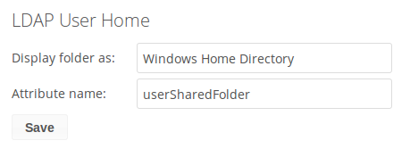
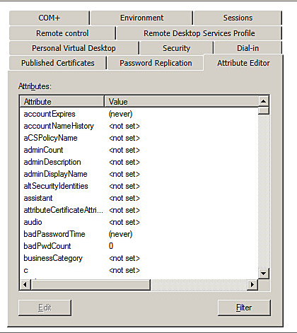

===================
LDAP Home Connector
===================

The LDAP Home Connector App enables you to configure your ownCloud server 
to display your users' Windows home directories on their Files pages, 
just like any other folder. Typically, Windows home directories are stored 
on a network server in a root folder, such as Users, which then contains 
individual folders for each user.

You must already have the LDAP app enabled and a working LDAP/Active Directory 
configuration in ownCloud.

Next, configure the root Windows home directory to be mounted on your ownCloud 
server. Then use the LDAP Home Connector and LDAP app to connect it to ownCloud.

Mount Home Directory
--------------------

Create an entry in :file:`/etc/fstab` for the remote Windows root home 
directory mount. Store the credentials to access the home directory in a 
separate file, for example :file:`/etc/credentials`, with the username and 
password on separate lines, like this::

 username=winhomeuser
 password=winhomepassword

Then add a line like this to :file:`/etc/fstab`, substituting your own server 
address and filenames::

 //192.168.1.58/share /mnt/share cifs credentials=/etc/credentials,uid=33,gid=33

Configure the LDAP Home Connector
---------------------------------

Enable the LDAP Home Connector app. Then go to the LDAP Home Connector form 
on your ownCloud admin page. In the **Display folder as:** field enter the name 
as you want it to appear on your users' File pages.

Then in the **Attribute name:** field enter the LDAP attribute name that will 
contain the home directory. Use any LDAP attribute that is not already in use, 
then save your changes.

Configure the LDAP Server
-------------------------

In Active Directory, open the user profile. Scroll to the **Extensions** 
section and open the **Attribute Editor** tab

Scroll to the attribute being used (UserSharedFolder in this instance), and 
click **Edit**.  Enter the users home directory.

.. image:: images/ldap-home-connector-3.png
   :alt: Editing the LDAP attribute.

Save your changes, and you are finished.
