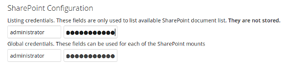
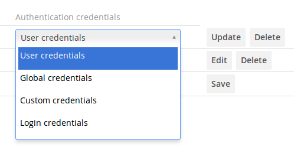
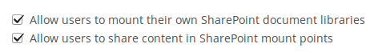

==================================
Configuring SharePoint Integration
==================================

Native SharePoint support has been added to the ownCloud Enterprise edition as a 
secondary storage location for SharePoint 2007, 2010 and 2013. When this is 
enabled, users can access and sync all of their SharePoint content via ownCloud, 
whether in the desktop sync, mobile or Web interfaces. Updated files are 
bi-directionally synced automatically. SharePoint shares are created by the 
ownCloud admin, and optionally by any users who have SharePoint credentials.

The ownCloud SharePoint plugin uses SharePoint document lists as remote storage 
folders. ownCloud respects SharePoint access control lists (ACLs), so ownCloud 
sharing is intentionally disabled for SharePoint mountpoints. This is to 
preserve SharePoint ACLs and ensure content is properly accessed as per 
SharePoint rules.

The plugin uses the Simple Object Access Protocol (SOAP) and WebDAV for the 
uploads and downloads to talk to SharePoint servers.  Your ownCloud server must 
have ``php-soap`` or ``php5-soap`` installed. Linux packages and ownCloud 
appliances will install ``php5-soap`` as a required dependency.

The supported authentication methods are:

* Basic Auth
* NTLM (Recommended)
   
Creating a Sharepoint Mount
---------------------------
   
Enable the Sharepoint app, and then enter the ``Admin`` panel to set up 
SharePoint connections in the ``SharePoint Drive Configuration`` section.

Enter your SharePoint Listing credentials. These credentials are not 
stored in the database, but are used only during plugin setup to list the 
Document Libraries available per SharePoint site.

``Global credentials`` is optional. If you fill in these fields, these 
credentials will be used on on all SharePoint mounts where you select: **Use 
global credentials** as the authentication credentials.

.. figure:: images/sharepoint-2.png
   :alt: Creating a new mountpoint.

Enter your ownCloud mountpoint in the ``Local Folder Name`` column. This is the 
name of the folder that each user will see on the ownCloud filesystem. You may 
use an existing folder, or enter a name to create a new mount point

Select who will have access to this mountpoint, by default **All users**, or a 
user or a group.

Enter your SharePoint server URL, then click the little refresh icon to the left 
of the ``Document Library`` field. If your credentials and URL are correct 
you'll get a dropdown list of available SharePoint libraries. Select the 
document library you want to mount.

Select which kind of Authentication credentials you want to use for this 
mountpoint. If you select **Custom credentials** you will have to enter the 
the credentials on this line. Otherwise, the global credentials or the user's 
own credentials will be used. Click Save, and you're done

.. Please see ``Connecting to SharePoint`` in the User Manual to learn how to 
.. use your new SharePoint connections.

Enabling Users
--------------

You may allow your users to create their own Sharepoint mounts on their 
Personal pages, and allow sharing on these mounts.

Note
----

Speed up load times by disabling file previews in ``config.php``, because the 
previews are generated by downloading the remote files to a temp file. This 
means ownCloud will spend a lot of time creating previews for all of your 
SharePoint content. To disable file previews, add the following line to the 
ownCloud config file found in ``/owncloud/config/config.php``::

  'enable_previews' => false,

Troubleshooting
---------------

SharePoint unsharing is handled in the background via Cron. If you remove the 
sharing option from a Sharepoint mount, it will take a little time for the 
share to be removed, until the Cron job runs

Turn on Sharepoint app logging by modifying the following line in 
:file:`apps/sharepoint/lib/sharepoint.php` to ``TRUE``::

 private static $enableLogs = TRUE;

Global mount points can't be accessed: You have to fill out your SharePoint 
credentials as User on the personal settings page, or in the popup menu. These 
credentials are used to mount all global mount points.

Personal mount points can't be accessed: You have to fill your SharePoint 
credentials as User on the personal settings page in case your personal mount 
point doesn't have its own credentials.

A user can't update the credentials: Verify that the correct credentials are 
configured, and the correct type, either global or custom.
