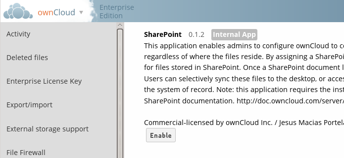

==================================
Configuring SharePoint Integration
==================================

Native SharePoint support has been added to the ownCloud Enterprise Subscription as a 
secondary storage location for SharePoint 2007, 2010 and 2013. When this is 
enabled, users can access and sync all of their SharePoint content via ownCloud, 
whether in the desktop sync, mobile or Web interfaces. Updated files are 
bi-directionally synced automatically. SharePoint shares are created by the 
ownCloud admin, and optionally by any users who have SharePoint credentials.

The ownCloud SharePoint plugin uses SharePoint document lists as remote storage 
folders. ownCloud respects SharePoint access control lists (ACLs), so ownCloud 
sharing is intentionally disabled for SharePoint mountpoints. This is to 
preserve SharePoint ACLs and ensure content is properly accessed as per 
SharePoint rules.

The plugin uses the Simple Object Access Protocol (SOAP) and WebDAV for the 
uploads and downloads to talk to SharePoint servers.  Your ownCloud server must 
have ``php-soap`` or ``php5-soap`` installed. Most Linux distributions and 
Windows call the package ``php-soap``, though there may be some 
Linux variants that call it ``php5-soap``. Starting with ownCloud 7.0.2 EE, 
Linux packages and ownCloud appliances will install ``php5-soap`` as a required 
dependency.

The supported authentication methods are:

* Basic Auth
* NTLM (Recomended)

Enabling the SharePoint Plugin
------------------------------

The SharePoint plugin is a native plugin in ownCloud 7 EE, so the first step is 
to enter the ``Apps`` administration page and enable it.

   
Next, enter the ``Admin`` panel to set up SharePoint connections in the 
``SharePoint Drive Configuration`` section. 

.. figure:: ../images/sharepoint-drive-config.png

* First, enter your SharePoint Listing credentials. These credentials are not 
  stored in the database, but are used only during plugin setup to list the 
  Document Libraries available per SharePoint site.

* ``Global credentials`` is an optional field. If you fill in this field, these 
  credentials will be used on on all SharePoint mounts where you select: “Use 
  global credentials” as the Authentication credentials

* Enter your ownCloud mount point in the ``Local Folder Name`` column. This is 
  the name of the folder that each user will see on the ownCloud filesystem. You 
  may use an existing folder, or enter a name to create a new mount point

* Select who will have access to this mountpoint, by default “All users”, or a 
  user or a group

* Enter your SharePoint server URL

* Then click the little refresh icon to the left of the ``Document Library`` 
  field. If your credentials and URL are correct you'll get a dropdown list of 
  available SharePoint libraries

* Select the document library you want to mount

* Select which kind of Authentication credentials you want to use for this 
  mountpoint. If you select ``use custom credentials``, you will have to enter the 
  the credentials on this line. Otherwise, the global credentials or the user's 
  own credentials will be used

* Click Save, and you're done

Please see ``Connecting to SharePoint`` in the User Manual to learn how to use 
your new SharePoint connections.

Note
----

Speed up load times by disabling file previews in ``config.php``, because the 
previews are generated by downloading the remote files to a temp file. This 
means ownCloud will spend a lot of time creating previews for all of your 
SharePoint content. To disable file previews, add the following line to the 
ownCloud config file found in ``/owncloud/config/config.php``::

  'enable_previews' => false,

Troubleshooting
---------------

Turn on Sharepoint app logging by modifying the following line in 
:file:`apps/sharepoint/lib/sharepoint.php` to ``TRUE``::

 private static $enableLogs = TRUE;

Global mount points can't be accessed: You have to fill out your SharePoint 
credentials as User on the personal settings page, or in the popup menu. These 
credentials are used to mount all global mount points.

Personal mount points can't be accessed: You have to fill your SharePoint 
credentials as User on the personal settings page in case your personal mount 
point doesn't have its own credentials.

A user can't update the credentials: Verify that the correct credentials are 
configured, and the correct type, either global or custom.
