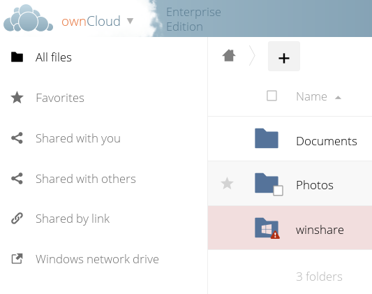
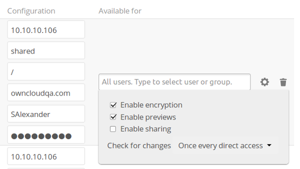
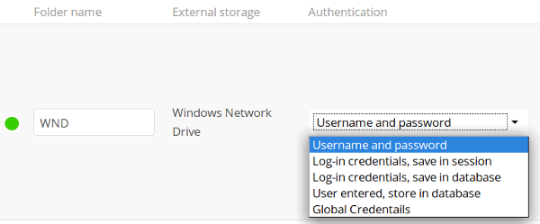

========================================================
Installing and Configuring the Windows Network Drive App
========================================================

The Windows Network Drive app creates a control panel on your Admin page for 
seamless mounting of SMB/CIFS file shares on ownCloud servers.

Any Windows file share, and Samba servers on Linux and other Unix-type operating 
systems use the SMB/CIFS file-sharing protocol. The files and directories on the 
SMB/CIFS server will be visible on your Files page just like your other ownCloud 
files and folders. They are labeled with a little four-pane Windows-style icon, 
and the left pane of your Files page includes a Windows Network Drive filter. 
Figure 1 shows a new Windows Network Drive share marked with red warnings. 
This indicates that ownCloud cannot connect to the share because it is not 
available, or there is an error in the configuration. 

   
   *Figure 1: Windows Network Drive share on your Files page.*

Files are synchronized bi-directionally, and you can create, upload, and delete 
files and folders. ownCloud server admins can create Windows Network Drive 
mounts, and optionally allow users to create their own personal Windows Network 
Drive mounts. The password for each mount is encrypted and stored in the 
ownCloud database, using a long random secret key stored in ``config.php``. This 
allows ownCloud to access the shares when the users who own the mounts are not 
logged in.

Installation
------------

Enable the Windows Network Drive app on your ownCloud Apps page. Then there are 
a few dependencies to install.

You must install the ownCloud ``php5-libsmbclient`` binary; please refer to the README in 
your `customer.owncloud.com <https://customer.owncloud.com/>`_ account for instructions 
on obtaining it.

You also need the Samba client installed on your Linux system. This is included in 
all Linux distributions; on Debian, Ubuntu, and other Debian derivatives this 
is ``smbclient``. On SUSE, Red Hat, CentOS, and other Red Hat derivatives it is 
``samba-client``.

Additional Installation Steps
-----------------------------

If your Linux distribution ships with ``libsmbclient 3.x``, which is included in the Samba 
client, you may need to set up the HOME variable in Apache to prevent a segmentation 
fault. If you have ``libsmbclient 4.1.6`` and higher it doesn't seem to be an issue, so 
you won't have to change your HOME variable.

To set up the HOME variable on Ubuntu, modify the ``/etc/apache2/envvars`` 
file::

  unset HOME
  export HOME=/var/www

In Red Hat/CentOS, modify the ``/etc/sysconfig/httpd`` file and add the 
following line to set the HOME variable in Apache::

  export HOME=/usr/share/httpd
 
By default CentOS has activated SELinux, and the ``httpd`` process can not make 
outgoing network connections. This will cause problems with the ``curl``, ``ldap`` 
and ``samba`` libraries. You'll need to get around this in order to make 
this work. First check the status::

  getsebool -a | grep httpd
  httpd_can_network_connect --> off

Then enable support for network connections::

  setsebool -P httpd_can_network_connect 1

In openSUSE, modify the ``/usr/sbin/start_apache2`` file::
 
  export HOME=/var/lib/apache2

Restart Apache, open your ownCloud Admin page and start creating SMB/CIFS mounts.

Creating a New Share
--------------------

When you create a new SMB share you need the login credentials for the share, 
the server address, the share name, and the folder you want to connect to. 

1. First enter the ownCloud mountpoint for your new SMB share. This must not be 
   an existing folder.
2. Then enter which ownCloud users or groups get access to the share. The 
   default is all users.
3. Next, enter the address of the server that contains the SMB share.
4. Then the Windows share name.
5. Then the root folder of the share. This is the folder name, or the 
   ``$user`` variable for user's home directories. Note that the LDAP 
   ``Internal Username Attribute`` must be set to the ``samaccountname`` for 
   either the share or the root to work, and the user's home directory needs 
   to match the ``samaccountname``. (See 
   :doc:`../configuration_user/user_auth_ldap`.)
6. Then your login credentials.

   *Figure 2: $user variable to automatically set user's home directories.*
   
You have four options for login credentials: 

* **User credentials**. For admin-created global mountpoints; users must 
  click on the share and then enter their personal credentials to access the 
  share.
* **Global credentials**. Uses the credentials set in the Global 
  credentials fields
* **Login credentials** is for users to connect to the mountpoint using their 
  DOMAIN/login credentials; enter the domain in the **Domain** field.
* **Custom Credentials**. On admin-created global mountpoints, the admin may 
  configure custom credentials to access the shares. For example, the admin 
  uses a single system account to mount company folders for all users. The 
  folder permissions are mapped with the system account permissions. When users 
  create a share on their Personal pages, custom credentials are only for that 
  mountpoint. For example, User A creates a mountpoint that is accessible with 
  User B's credentials.
  

   
   *Figure 3: Windows Network Drive configuration panel. (Click to enlarge.)*
  
When you're finished click the **Save** button.

.. note:: When you create a new mountpoint using Login credentials you must log out of ownCloud,     and then log back in so you can access the share. You only have to do this the first time.

Personal SMB Mounts
-------------------

Users create their own personal SMB mounts on their Personal pages. These are 
created the same way as Admin-created shares. Users have only two options for 
login credentials: 

* **Personal Credentials**.
* **Custom Credentials**
