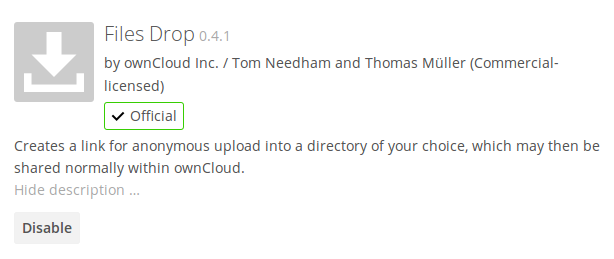
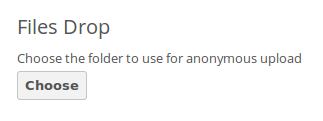
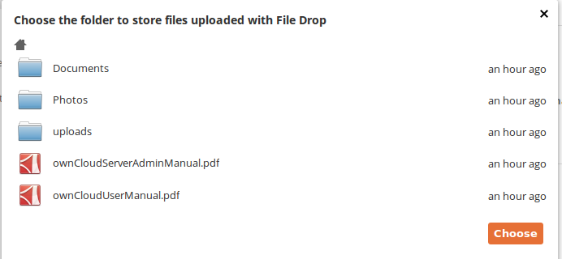
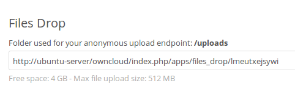
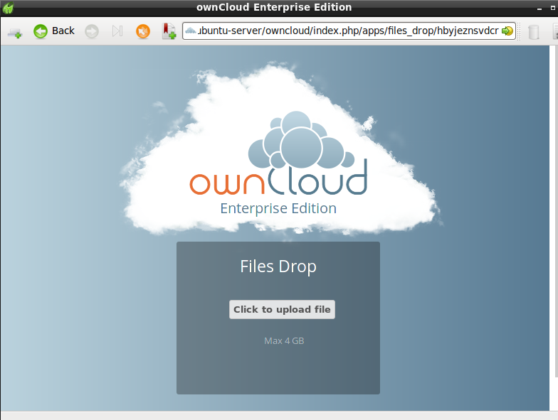

============================================================
Enabling Anonymous Uploads with Files Drop (Enterprise Only)
============================================================

The Files Drop application, introduced in ownCloud 8.0.3 Enterprise 
Subscription, allows anyone to upload files with the click of a button to the 
directory of your choosing, without needing a login, and they cannot see or 
change the contents of the directory. It is the perfect replacement for 
attaching large files to email, maintaining an FTP server, and commercial 
file-sharing services.

When files are uploaded to your Files Drop directory, you can manage them just 
like any other ownCloud share: you may share them, restrict access, edit, and 
delete them.

Setting Up the Files Drop App
-----------------------------

Setting up Files Drop is a matter of a few clicks. First go to your Apps page 
and enable it.

Now your users will see a configuration section on their Personal pages.

Click the **Choose** button to open a dialog to select your upload directory. 
You may wish to first create a special upload directory (on your Files page), 
which in the following example is name **upload**.

   
On your Personal page you should now see a URL for your upload directory. Share 
this URL with anyone you want to allow uploads to your File Drop folder. Note 
that the maximum upload size in this example is 512MB. (The default 
ownCloud upload file size limit is 512MB. See 
:doc:`../configuration_files/big_file_upload_configuration` to learn how to 
customize this.)

Using the Files Drop App
------------------------

Uploading files via the Files Drop app is simple. Open your Web browser to the 
share URL created by ownCloud:

Click the **Click to upload file** button. This opens a file picker, and you 
select the file or directory you want to upload.

.. figure:: images/files-drop-6.png
   :alt: Upload file picker.
   
When your upload is completed, you'll see a confirmation message with the 
filenames.

.. figure:: images/files-drop-7.png
   :alt: Upload confirmation.

