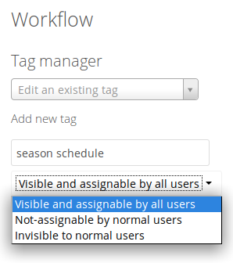
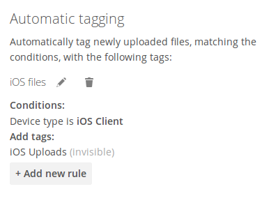
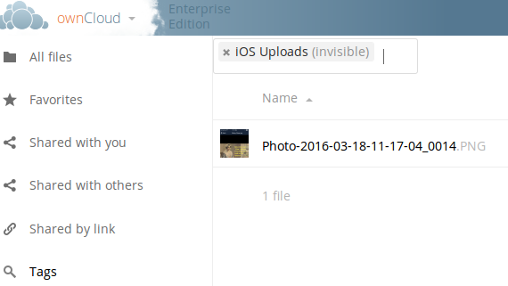
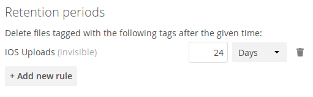

=============================================================
Advanced File Tagging With the Workflow App (Enterprise only)
=============================================================

New in ownCloud 9.0, the Workflow App provides advanced management of file 
tagging. The app has three parts: Tag Manager, Automatic Tagging, and Retention.

The Workflow App should be enabled by default (Apps page), and the three 
configuration modules visible on your ownCloud Admin page. 

See `Tagging Files 
<https://doc.owncloud.com/server/9.0/user_manual/files/access_webgui.html>`_ in 
the ownCloud User manual to learn how to apply and filter tags on files.

Tag Manager
-----------

The Tag Manager is for creating new tags, editing existing tags, and deleting 
tags. Tags may be made **Visible and assignable by all users**, 
**Not-assignable by normal users**, or **Invisible to normal users**.

**Visible and assignable all users** means that users may see, rename. and 
apply admin-created tags to files and folders.

**Not-assignable by normal users** means tags are read-only, and users cannot 
assign them to files or folders.

**Invisible to normal users** means visible only to ownCloud admins.

  
Automatic Tagging
-----------------

The Automatic Tagging module operates on newly-uploaded files. Create a set of 
conditions, and then when a file or folder matches those conditions it is 
automatically tagged. The tag must already have been created with the Tag 
Manager.

For example, you can assign the invisible tag **iOS Uploads** to all files 
uploaded from iOS devices. This tag is visible only to admins.

   
When files with this tag are shared with you, you can view them with the Tags 
filter on the Files page.

   
Automatic Tagging is especially useful with the Retention module.   
   
Retention
---------

The Retention module is your housecleaning power tool, because it automatically 
deletes files after a time period that you specify. Select which tag to 
set a time limit on, and then set your time limit. File age is calculated from 
the file mtime (modification time).

   
For best performance, retention tags should be applied high in your file 
hierarchy. If subfolders have the same tags as their parent folders, their tags 
must also be processed, so it will take a little longer.

Retention Engines
-----------------

There are two retention engines that further allow you to fine-tune your 
retention settings: **TagBasedRetention** and **UserBasedRetention**. 
**TagBasedRetention** is the default.

**TagBasedRetention**: This checks files that have a particular tag 
assigned. Then it checks (depth-first) the children of the tagged item, before 
continuing with the other tagged items. Children that have already been checked  
will not be checked a second time.

This is optimised for processing smaller numbers of files that have multiple 
retention tags.

**UserBasedRetention**: Examines files per user. It first iterates over all 
files and folders (siblings first), then examines the tags for those items and 
checks their respective retention periods. This is optimised for many files with 
few retention tags.

To select UserBasedRetention, add this line to your ee.config.php::
 
  'workflow.retention_engine' => userbased,
