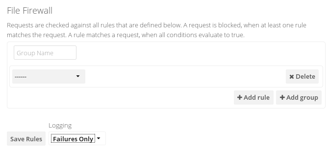

=======================
File Firewall (ES only)
=======================

The File Firewall GUI enables you to create and manage firewall rule sets from 
your ownCloud admin page. The File Firewall gives you finer-grained control of 
access and sharing, with rules for allowing or denying access, and restrictions 
per group, upload size, client devices, IP address, time of day, and many more 
criteria. For additional flexibility the File Firewall also supports regular 
expressions.

Each rule consists of one or more conditions. A request matches a rule if 
all conditions evaluate to true. If a request matches at least one of the 
defined rules, the request is blocked.

Administrators are excluded from the firewall when they 
access the instance via the WebUI, to allow admins to modify the rules. 
Otherwise they could potentially be locked out. Public share links and syncing 
via WebDAV are subject to firewall rules for all users all the time.

Figure 1 shows an empty firewall configuration panel. Set your logging level to 
**Failures Only** for debugging, and create a new ruleset by clicking the **Add 
Group** button. After setting up your rules you must click the **Save Rules** 
button.

   
   *Figure 1: Empty File Firewall configuration panel*

Figure 2 shows two rules. The first rule, **No Support outside 
office hours**, prevents members of the support group from logging into the 
ownCloud Web interface from 5pm-9am, and also blocks client syncing.

The second rule prevents members of the qa-team group from accessing the Web UI 
from IP addresses that are outside of the local network.

.. figure:: images/firewall-2.png
   :alt: Two example rules that restrict logins per user group.
   
   *Figure 2: Two example rules that restrict logins per user group*   

All other users are not affected, and can log in anytime from anywhere.

Available Conditions
--------------------

User Group
 The user (is|is not) a member of the selected group.

User Agent
 The User-Agent of the request (matches|does not match) the given string.

User Device
  A shortcut for matching all known (``android``|``ios``|``desktop``) sync clients by 
  their User Agent string.

Request Time
 The time of the request (has to|must not) be in a single range from beginning 
 time to end time.

Request URL
 The **full page URL** (has to|must not) (match|contain|begin with|end) with a 
 given string.

Request Type
 The request (is|is not) a (WebDAV|public share link|other) request.

Request IP Range (IPv4) and IP Range (IPv6)
 The request's ``REMOTE_ADDR`` header (is|is not) matching the given IP range.

Subnet (IPv4) and Subnet (IPv6)
 The request's ``SERVER_ADDR`` header (is|is not) matching the given IP range.

File Size Upload
 When a file is uploaded the size has to be (less|less or equal|greater|greater 
 or equal) to the given size.

File Mimetype Upload
 When a file is uploaded the mimetype (is|is not|begins with|does not begin 
 with|ends with|does not end with) the given string.

Regular Expression
 The File Firewall supports regular expressions, allowing you to create custom 
 rules using the following conditions:

* IP Range (IPv4)
* IP Range (IPv6)
* Subnet (IPv4)
* Subnet (IPv6)
* User agent
* User group
* Request URL

You can combine multiple rules into one rule. E.g., if a rule applies to both 
the support and the qa-team you could write your rule like this::

 Regular Expression > ^(support|qa-team)$ > is > User group

No Manual Editing
-----------------

We do not recommend modifying the configuration values directly in your
``config.php``. These use JSON encoding, so the values are difficult to read 
and a single typo will break all of your rules.

Controlling Access to Folders
-----------------------------

These examples show how to use regular expressions to control access to folders.
It is quite important to note that WebDAV and WebUI require two different URL 
matches in 8.2, and are therefore split into 2 rules.

This example blocks access to any folder with "Secure" in the name.

Block Web UI::

   Request Type: Other
   Request IP: 127.0.0.1/24
   Regex: Request URL: apps\/files\/
   Regex: Request URL: dir\=(.*)\%2FSecure(\%2F(.*)|$|&(.*))
  
Block WebDAV::

   Request Type: WebDAV
   Request IP: 127.0.0.1/24
   Regex: Request URL: remote\.php\/webdav(\/(.*))*\/Secure(\/(.*)|$)

This example blocks only the root folder named Secure.

Block Web UI::

   Request Type: Other
   Request IP: 127.0.0.1/24
   Regex: Request URL: apps\/files\/
   Regex: Request URL: dir\=(\%2F)+Secure(\%2F(.*)|$|&(.*))

Block Webdav::

   Request Type: WebDAV
   Request IP: 127.0.0.1/24
   Regex: Request URL: remote\.php\/webdav(\/)+Secure(\/(.*)|$)

Blocking multiple folders isn't much more complicated. These examples block the folders named Secure and Secret.

Block Web UI::

   Request Type: Other
   Request IP: 127.0.0.1/24
   Regex: Request URL: apps\/files\/
   Regex: Request URL: dir\=(.*)\%2F(Secure|Secret)(\%2F(.*)|$|&(.*))

Block Webdav::

   Request Type: WebDAV
   Request IP: 127.0.0.1/24
   Regex: Request URL: remote\.php\/webdav(\/(.*))*\/(Secure|Secret)(\/(.*)|$)

Custom Configuration for Branded Clients
----------------------------------------

If you are using :doc:`branded ownCloud clients <../enterprise_clients/index>`, 
you may define ``firewall.branded_clients`` in your ``config.php`` to identify 
your branded clients in the firewall **"User Device"** rule.

The configuration is a ``User-Agent`` => ``Device`` map. ``Device`` must be one 
of the following:

* android
* android_branded
* ios
* ios_branded
* desktop
* desktop_branded

The ``User-Agent`` is always compared all lowercase. By default the agent is 
compared with ``equals``. When a trailing or leading asterisk, ``*``, is found, 
the agent is compared with ``starts with`` or ``ends with``. If the agent has 
both a leading and a trailing ``*``, the string must appear anywhere. For 
technical reasons the ``User-Agent`` string must be at least 4 characters 
(including wildcards). (When you build your branded client you have the option 
to create a custom User Agent.)

In this example configuration you need to replace the example User Agent 
strings, for example ``'android_branded'``, with your own User Agent strings::

 // config.php

  'firewall.branded_clients' => array(
    'my ownbrander android user agent string' => 'android_branded',
    'my ownbrander second android user agent string' => 'android_branded',
    'my ownbrander ios user agent string' => 'ios_branded',
    'my ownbrander second ios user agent string' => 'ios_branded',
    'my ownbrander desktop user agent string' => 'desktop_branded',
    'my ownbrander second desktop user agent string' => 'desktop_branded',
  ),

The Web UI dropdown then expands to the following options:

* Android Client - always visible
* iOS Client - always visible
* Desktop Client - always visible
* Android Client (Branded) - visible when at least one ``android_branded`` is defined
* iOS Client (Branded) - visible when at least one ``ios_branded`` is defined
* Desktop Client (Branded) - visible when at least one ``desktop_branded`` is defined
* All branded clients - visible when at least one of ``android_branded``, 
  ``ios_branded`` or ``desktop_branded`` is defined
* All non-branded clients - visible when at least one of ``android_branded``, 
  ``ios_branded or ``desktop_branded`` is defined
* Others (Browsers, etc.) - always visible

Then these options operate this way:

* The ``* Client`` options only match ``android``, ``ios`` and ``desktop`` respectively.
* The ``* Client (Branded)`` options match the ``*_branded`` agents equivalent.
* ``All branded clients`` matches: ``android_branded``, ``ios_branded`` and 
  ``desktop_branded``
* ``All non-branded clients`` matches: ``android``, ``ios`` and ``desktop``
