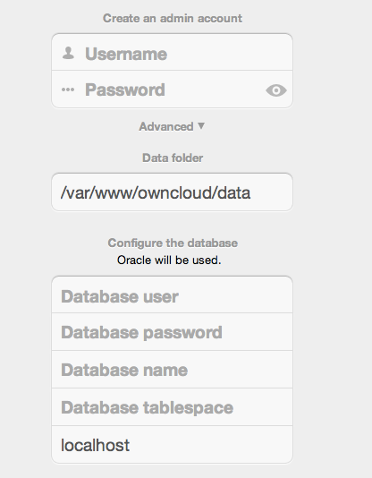

=====================
Oracle Database Setup
=====================

.. toctree::
    :maxdepth: 2
    :hidden:

This document will cover the setup and preparation of the ownCloud server to
support the use of Oracle as a backend database.  For the purposes of testing,
we are using Oracle Enterprise Linux as both the Web server that
will host ownCloud, and as a host for the Oracle Database.

Outline of Steps
================

This document will cover the following steps:

* Setup of the ownCloud user in Oracle: This involves setting up a user space
  in Oracle for setting up the ownCloud database.
* Installing the Oracle Instant Client on the Web server (facilitating the
  connection to the Oracle Database).
* Compiling and installing the Oracle PHP Plugin oci8 module
* Pointing ownCloud at the Oracle database in the initial setup process

The document assumes that you already have your Oracle instance running, and
have provisioned the needed resources. It also assumes that you have installed
ownCloud with all of the prerequisites.

Configuring Oracle
==================

Setting up the User Space for ownCloud
--------------------------------------

Step one, if it has not already been completed by your :abbr:`DBA (DataBase Administrator)`, provision a user
space on the Oracle instance for ownCloud.  This can be done by logging in as a
DBA and running the script below:

::

  CREATE USER owncloud IDENTIFIED BY password;
  ALTER USER owncloud DEFAULT TABLESPACE users TEMPORARY TABLESPACE temp QUOTA unlimited ON users;
  GRANT create session, create table, create procedure, create sequence, create trigger, create view, create synonym, alter session TO owncloud;

Substitute an actual password for ``password``.  Items like TableSpace, Quota etc. will be determined by your DBA.

Downloading and Installing the Oracle Instant Client
----------------------------------------------------

As our example system is Oracle Enterprise Linux, it is
necessary to go to the Oracle site and download the `Oracle Instant Client`_ for
your OS Distribution.

.. _Oracle Instant Client: http://www.oracle.com/technetwork/database/features/instant-client/index-097480.html

.. note:: Download the instant client and the instant client SDK and place them
   in a directory on the server, in this example they are RPM packages.

* Install the basic client from the RPM.  Use the ``rpm –ivh`` command
* Install the SDK RPM package.  Use the ``rpm –ivh`` command

At this point, the Oracle Instant client is installed on the ownCloud Host (in
the home directory).

Install the OCI8 PHP Extension:
-------------------------------

The next step is to compile and install the OCI8 PHP extension for connectivity to the Oracle Database.

* Create a folder for these bits on your server.
* Download the latest version of the extension from `http://pecl.php.net/package/oci8 <http://pecl.php.net/package/oci8>`_.
* Unpack the OCI8 PHP extension and copy it over to the server.
* There should be two things in the folder:
   * ``package.xml`` file
   *  ``oci8-*.*.*`` folder (folder will change based on version of the extension you downloaded).
* Build the OCI8 module.
   * Change (``cd``) to the folder where you have copied the downloaded and uncompressed OCI8 bits.
   * Run the following command (there will be a significant amount of output)::

      pecl build

  * Eventually the output will stop and ask for the *Oracle Home Directory*, just press enter.

* Change directory::

    cd oci8-<version number>

* Type the following command::

    ./configure –with-oci8=instantcleint,/usr/lib/oracle/<version number>/client64/lib

* Again, there will be significant output
* Enter the following command to compile: ``make``
* At this time there should be a folder called modules in the ``oci8-<version_>`` folder.
  Within this folder exists the ``oci8.so`` file.
* Copy this to the directory where the modules are stored in the PHP install. It depends on
  your distribution. This is the path for RHEL 6 and OEL 6::

    cp oci8.so /usr/lib64/php/modules

* Create an ``.ini`` file
   * Navigate to the ``php.d`` directory: ``cd /etc/php.d``
   * Edit a file called oci8.ini: ``vi oci8.ini``
   * Make the file look as follows::

      ; Oracle Instant Client Shared Object
      extension=oci8.so

   * Save the document

Configure ownCloud
==================

The next step is to configure the ownCloud instance to point to the Oracle Database, again this document assumes
that ownCloud has previously been installed.

Configuration Wizard
--------------------

Database user
~~~~~~~~~~~~~

This is the user space created in step 2.1.
In our Example this would be owncloud.

Database password
~~~~~~~~~~~~~~~~~

Again this is defined in the script from section 2.1 above, or pre-configured and provided to you by your DBA.

Database Name
~~~~~~~~~~~~~

Represents the database or the service that has been pre-configured on the TSN Listener on the Database Server.
This should also be provided by the DBA.
In this example, the default setup in the Oracle install was orcl (there is a TSN Listener entry for orcl on our database server).

This is not like setting up with MySQL or SQL Server, where a database based on the name you give is created.
The oci8 code will call this specific service and it must be active on the TSN Listener on your Oracle Database server.

Database Table Space
~~~~~~~~~~~~~~~~~~~~

Provided by the DBA.
In this example the users table space (as is seen in the user creation script above), was used.

Configuration File
------------------

Assuming all of the steps have been followed to completion, the first run wizard should complete successfully, and an operating instance of ownCloud should appear.

The configuration file should look something like this:

::

    <?php
    $CONFIG = array (
    'instanceid' => 'abcdefgh',
    'passwordsalt' => '01234567890123456789',
    'datadirectory' => '/var/data',
    'dbtype' => 'oci',
    'version' => '8.2.x.y',
    'dbname' => 'orcl',
    'dbhost' => '192.168.1.57',
    'dbtableprefix' => 'oc_',
    'dbuser' => 'owncloud1',
    'dbpassword' => '********',
    'installed' => true,
    );

Useful SQL Commands
-------------------

**Is my Database Reachable?**

On the machine where your Oracle database is installed, type::

  sqlplus username

::

  SQL> select * from v$version;

  BANNER
  --------------------------------------------------------------------------------
  Oracle Database 11g Express Edition Release 11.2.0.2.0 - 64bit Production
  PL/SQL Release 11.2.0.2.0 - Production
  CORE	11.2.0.2.0	Production
  TNS for Linux: Version 11.2.0.2.0 - Production
  NLSRTL Version 11.2.0.2.0 - Production

  SQL> exit

**Show Database Users**::

  Oracle    : SELECT * FROM all_users;

**Show available Databases**::

  Oracle    : SELECT name FROM v$database; (requires DBA privileges)

**Show ownCloud Tables in Database**::

  Oracle    : SELECT table_name FROM user_tables;

**Quit Database**::

  Oracle    : quit
