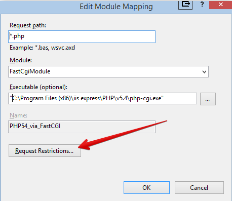
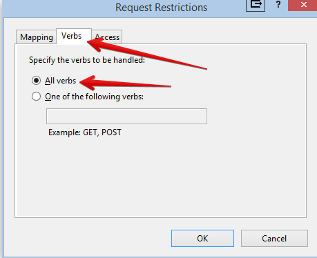

==============================================================================
Installing ownCloud Enterprise Subscription on Windows with SQL Server and IIS
==============================================================================

The most streamlined method of installing ownCloud on a Windows server is to use the 
Microsoft Web Platform Installer (WPI).  Download this free utility from 
`Microsoft Web <http://www.microsoft.com/web/downloads/platform.aspx/>`_.

.. note:: While ownCloud will run in any standard PHP environment,
          including IIS or Apache on Windows, there are known issues.
          For the basic sync and share capabilities of ownCloud, Windows
          web servers (Apache and IIS) will function properly. However,
          as apps like external storage are added, particularly SMB mounts,
          and non-English characters are used in filenames, some of the known
          Windows and IIS/Apache challenges start to appear as bugs.
          
          ownCloud is not supported on the Internet Server Application 
          Programming Interface (ISAPI).
          
          For these reasons, while ownCloud server will run on Windows and is supported, 
          it is not recommended at this time.

You also need the ownCloud package, which you can download from the ``ownCloud 8
Enterprise Edition for Windows Files`` folder in your account on 
`Customer.owncloud.com <http://customer.owncloud.com/>`_. 

.. note:: If you are upgrading an existing ownCloud installation, please refer to the 
   Customer Advisory document in the ``ownCloud 8 Enterprise Edition for Windows`` folder 
   in your account on 
   `Customer.owncloud.com <http://customer.owncloud.com/>`_. .

Installing IIS, PHP, and SQL Server
-----------------------------------
 
.. note:: Please note the last step on this page for protecting your server from data loss.
   
After downloading and installing WPI, open it. It looks like this:

.. figure:: ../images/windows-install-1.png

Navigate to the ``Products`` tab:

.. figure:: ../images/windows-install-2.png

Now install the following components by clicking the ``Add`` button next to each 
item::

 HTTP Server:
  IIS Recommended Configuration
  IIS Static Content
  IIS Default Document
  IIS Directory Browsing 
  IIS HTTP Errors
  IIS HTTP Redirection
  IIS CGI
  IIS ISAPI Extensions
  IIS ISAPI Filters
  IIS Server Side Includes
  IIS HTTP Logging
  IIS Logging Tools
  IIS Request Monitor 
  IIS Tracing
  IIS Custom Logging
  IIS Client Certificate Mapping Authentication
  IIS URL Authorization
  IIS Request Filtering
  IIS IP Domain Restrictions
  IIS Static Content Compression 
  IIS Dynamic Content Compression
  IIS Management Console
  IIS Management Scripts and Tools
  IIS Management Service
  
 PHP Frameworks
  PHP 5.4.14
  Windows Cache Extension 1.3 for PHP 5.4
  
 SQL Server Database
  Microsoft Drivers for PHP v5.4 for SQL Server IIS

 PHP Tools
  PHP Manager for IIS

After selecting all of these, click the ``Install`` button at the bottom. It will take a 
little time to install everything. When the installation is complete, the next step is to 
configure PHP.

Configuring PHP
---------------

It is important to enable all verbs in the PHP FastCGI settings in order for the sync to 
work properly. In the IIS Management application, double-click Handler Mappings.

.. figure:: ../images/windows-install-3.png

Then double-click on the PHP FastCGI Settings.

.. figure:: ../images/windows-install-4.png

If there are any spaces in the filename in the 
``Executable (optional)`` field you must enclose the filename in quotation marks.

.. figure:: ../images/windows-install-7.png

Then click the ``Request Restrictions`` button.

Now navigate to the ``Verbs`` tab and verify that ``All Verbs`` is selected, then click 
``OK``.

You will be prompted to create a FastCGI application; click ``Yes``.

.. figure:: ../images/windows-install-8.png

Then restart the IIS service to apply all changes.

Installing ownCloud
-------------------

Unzip your ownCloud archive (downloaded from your account on 
`Customer.owncloud.com <http://customer.owncloud.com/>`_), which unpacks to a single 
``owncloud`` folder containing all ownCloud files. Place this in your Web root, typically 
``C:\inetpub\wwwroot\``, so you have ``C:\inetpub\wwwroot\owncloud``. Set permissions on 
``C:\inetpub\wwwroot\owncloud`` so that your IIS user has read-write access.

Installation Wizard
-------------------

Now point a Web browser to your new ownCloud installation, for example 
``http://inetpub/wwwroot/owncloud``. This launches the Installation Wizard, which 
completes the final steps for configuring your new ownCloud server. See 
:doc:`../installation/installation_wizard` for instructions on using the Installation Wizard.

Protecting Your Server from Data Loss
-------------------------------------

Under certain circumstances, running your ownCloud server on IIS could be at risk of 
data loss. To prevent this, follow these steps.

In your ownCloud server configuration file, ``owncloud\config\config.php``, set     
``config_is_read_only`` to true.
    
Set the ``config.php`` file to read-only.
    
When you make server updates ``config.php`` must be made writeable. When your updates are 
completed re-set it to read-only.
