=================
Create Bundle IDs
=================

The next step is to create three **Bundle IDs**. These are unique identifiers 
for your branded iOS app. You must also create an **App Group** and place your 
three **Bundle IDs** in your **App Group**. You will need your base **Bundle 
ID** and **App Group** when you build your app with the ownBrander app on 
`Customer.owncloud.com <https://customer.owncloud.com/owncloud>`_.

Create App ID
-------------
   
Now you must create your App ID. Go to **Identifiers > App IDs** and click the 
plus button (top right) to open the "Register iOS App ID" screen. Fill in your 
**App ID Description**, which is anything you want, so make it helpful and 
descriptive. The **App ID Prefix** is your Apple Developer Team ID, and is 
automatically entered for you.

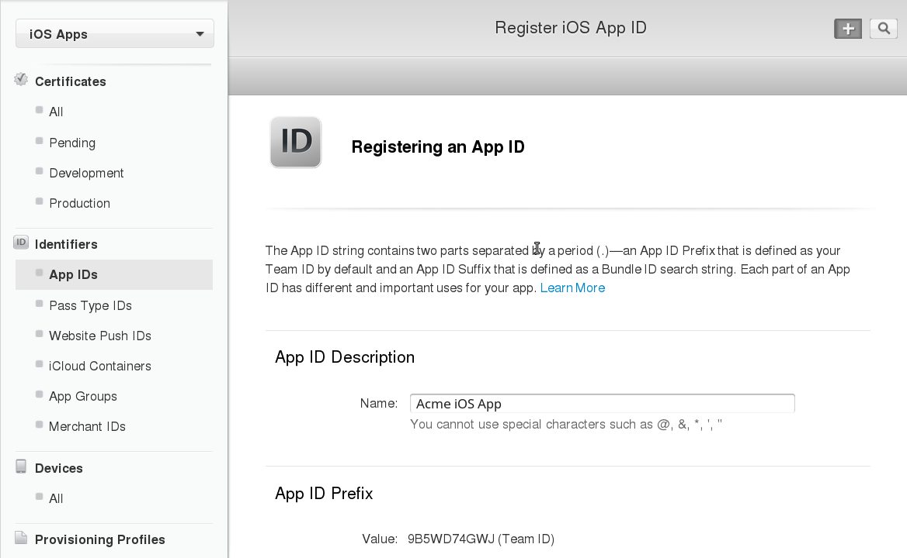

Scroll down to the **App ID Suffix** section and create your **Bundle ID**. Your 
**Bundle ID** is the unique identifier for your app. Make a note of it because 
you will need it as you continue through this process. The format for your 
**Bundle ID** is reverse-domain, e.g. *com.MyCompany.MyProductName*.

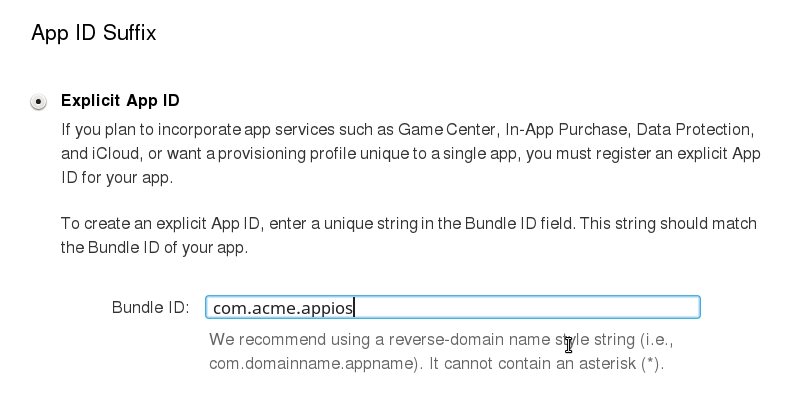
    
The next section, **App Services**, is where you select the services you want 
enabled in your app. You can edit this anytime after you finish creating your 
**App ID**. Check **App Groups**, make your other selections and then click the 
**Continue** button at the bottom. Now you can confirm all of your information. 
If everything is correct click **Submit**; if you need to make changes use the 
**Back** button. 

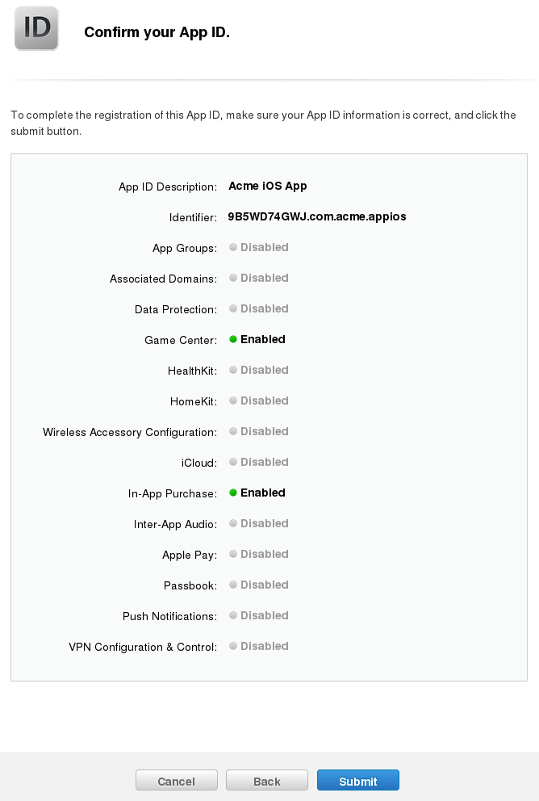

When you are finished you will see a confirmation. Click the **Done** button at 
the bottom.

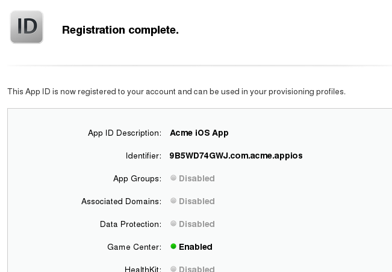

Create App Group
----------------

The next step is to create an App Group and put your App ID in it. Go to 
**Identifiers > App Groups** and click the plus button (top right).

     
Create a description for your app group, and a unique identifier in the format 
*group.com.MyCompany.MyAppGroup*. Then click **Continue**.    

.. figure:: ../images/cert-14.png
   
Review the confirmation screen, and if everything looks correct click the 
**Register** button.

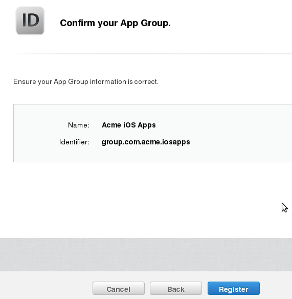

You'll see a final confirmation screen; click **Done**.

.. figure:: ../images/cert-16.png
   
When you click on **App Groups** you will see your new app group.

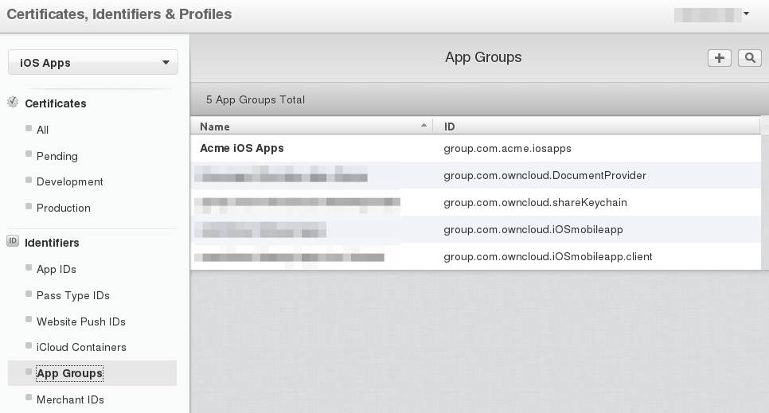

Now go back to **Identifiers > App IDs** and click on your App ID. This opens a 
screen that displays all your app information. Click the **Edit** button at the 
bottom. 

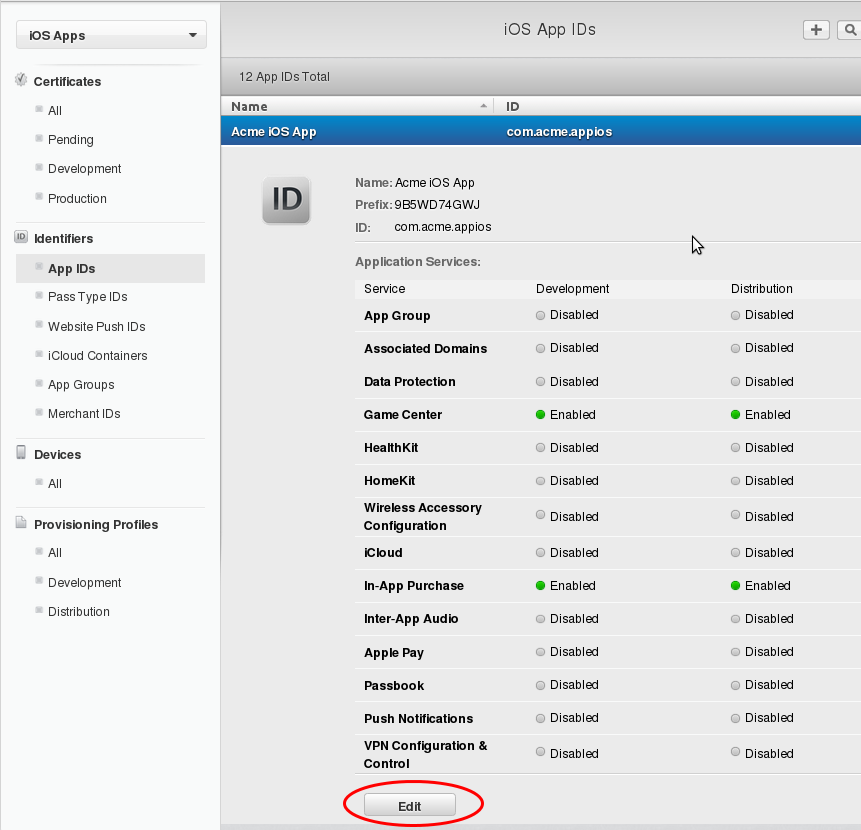
   
Click the **Edit** button next to **App Groups**.

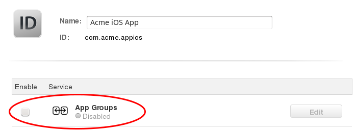

Check your app and click the **Continue** button.

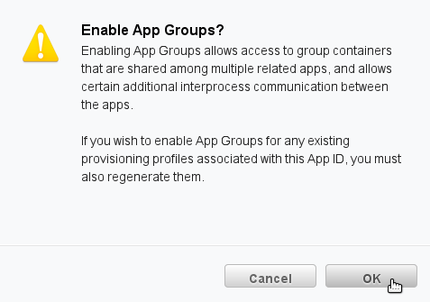
    
The next screen asks you to "Review and confirm the App Groups you have 
selected". Click the **Assign** button to confirm. The next screen announces 
"You have successfully updated the App Groups associations with your App ID", 
and you must click yet another button, the **Done** button at the bottom.  

Create a DocumentProvider Bundle ID
-----------------------------------

Now you must return to **Identifiers > App IDs** and click the plus button to 
create a DocumentProvider Bundle ID. Follow the same naming conventions as for 
your App ID, then click **Continue**.

.. figure:: ../images/cert-25.png
 
Confirm your new App ID and click **Submit**.

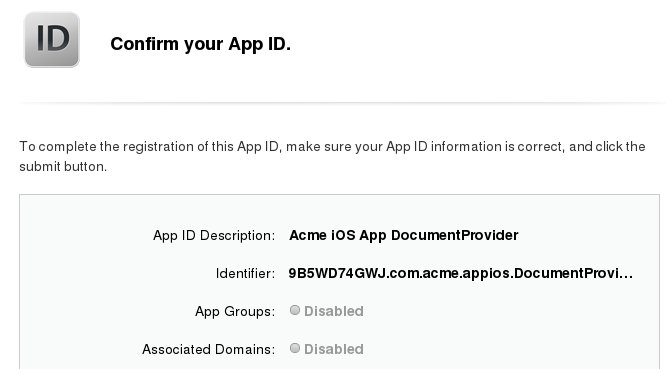
 
You will see one more confirmation: "Registration complete. This App ID is now 
registered to your account and can be used in your provisioning profiles."  
Click **Done**.

Now you need to add it to your App Group. Go to **Identifiers > App IDs** and 
click on your new DocumentProvider Bundle ID to open its configuration window, 
and then click the **Edit** button at the bottom. 

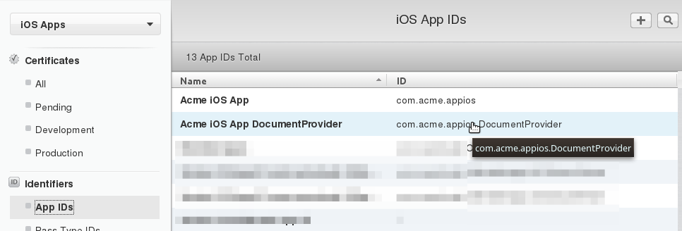
  
Select **App Groups** and click the **Edit** button.   

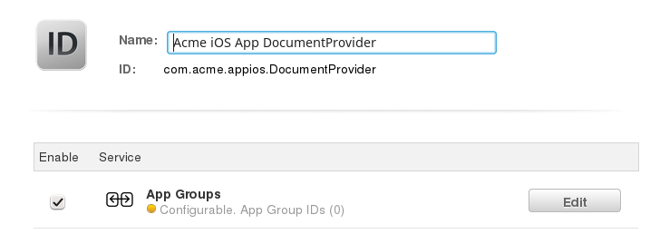

Select your group and click **Continue**.

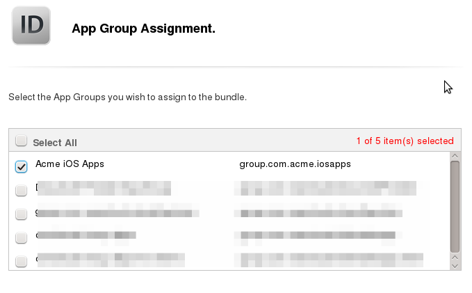
   
Once again you will asked if you really mean it. On the confirmation screen 
click **Assign**, and you'll see the message "You have successfully updated the 
App Groups associations with your App ID."

Create a DocumentProviderFileProvider Bundle ID
-----------------------------------------------

One more time, go to **Identifiers > App IDs** and click the plus button to 
create a DocumentProviderFileProvider Bundle ID. Follow the same naming 
conventions as for your App ID, then click **Continue**.

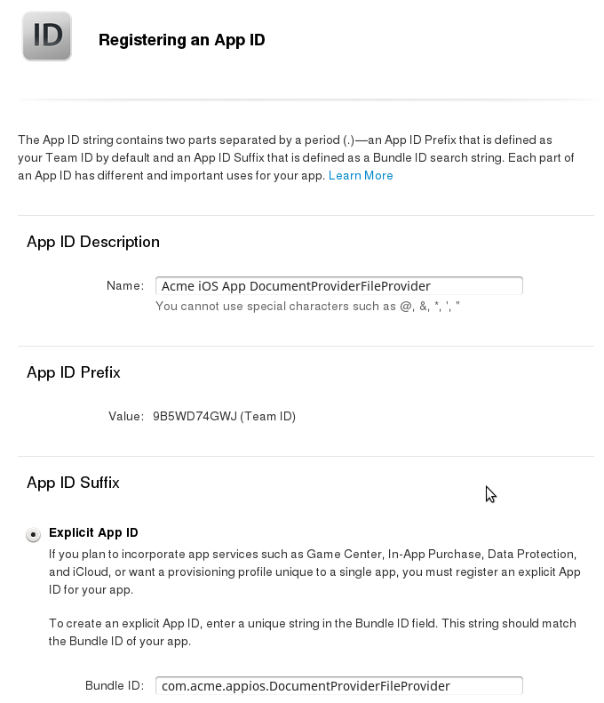
   
Confirm your new App ID and click **Submit**.

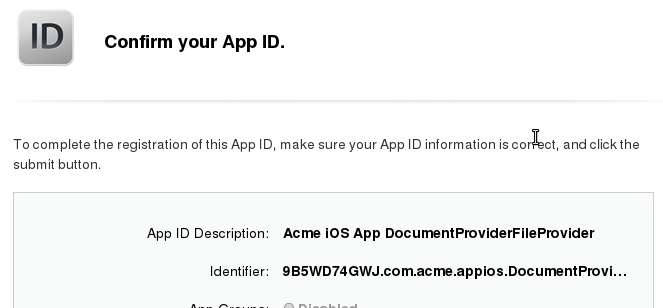

You will see one more confirmation; review it and click **Done**. Now you need 
to add it to your App Group. Go to **Identifiers > App IDs** and click on your 
new DocumentProviderFileProvider Bundle ID to open its configuration window, and 
then click the **Edit** button. 

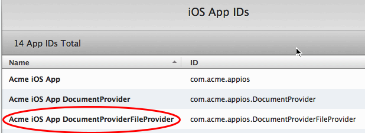
   
Select **App Groups** and click the **Edit** button.   

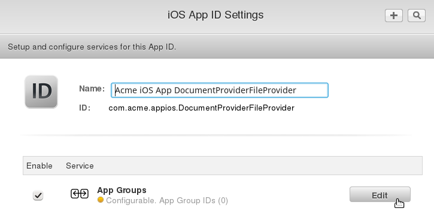

Select your group and click **Continue**.

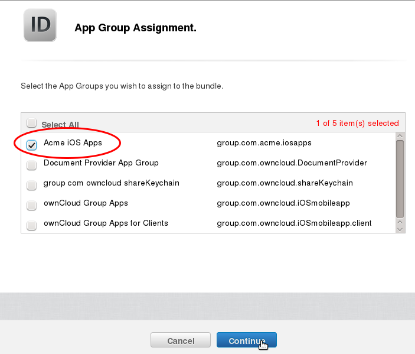
    
On the confirmation screen click **Assign**, and you'll see the message "You 
have successfully updated the App Groups associations with your App ID." 

Now you should have three new App IDs, and all three of them should belong to 
your App Group.

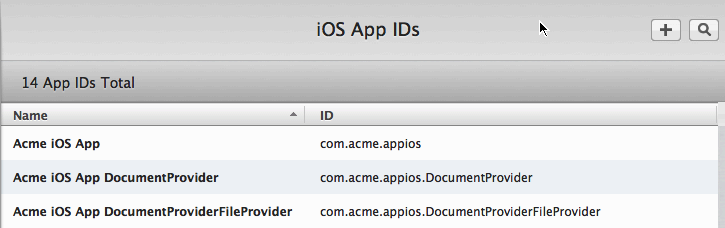
