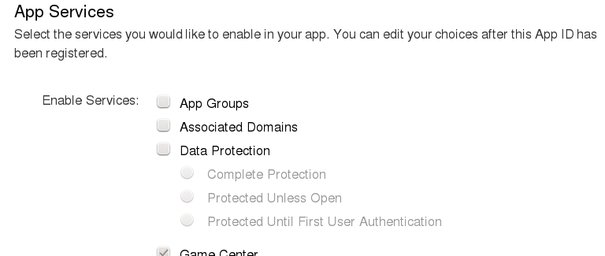
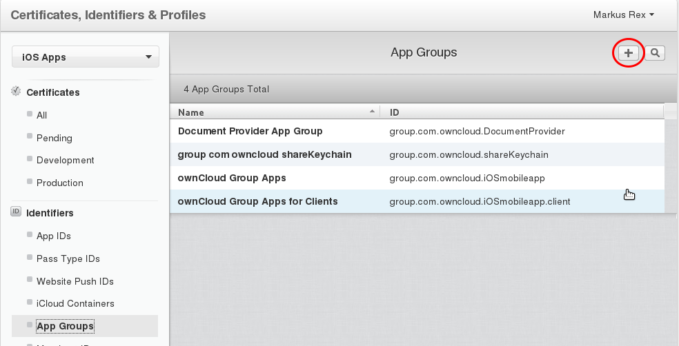
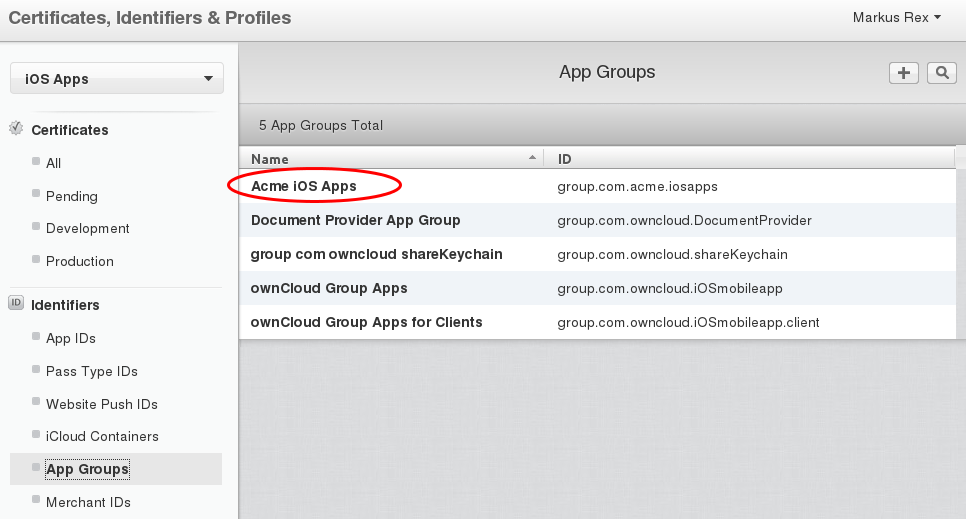
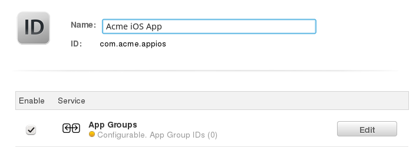
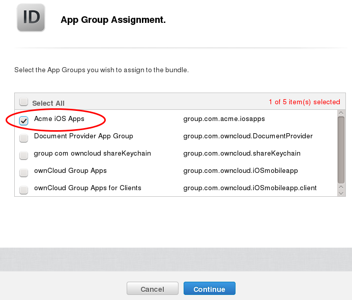
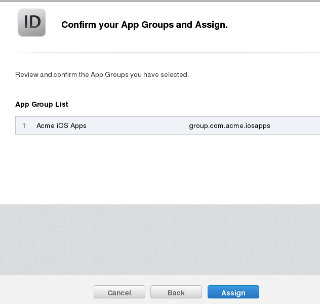
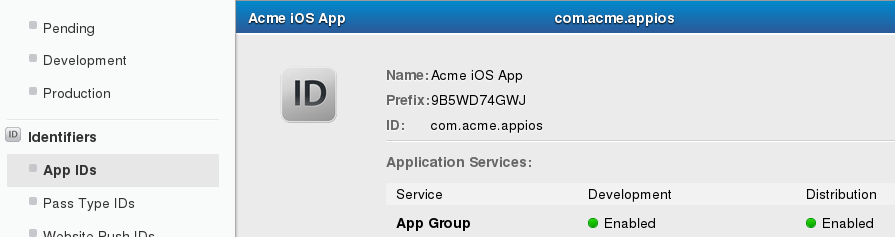
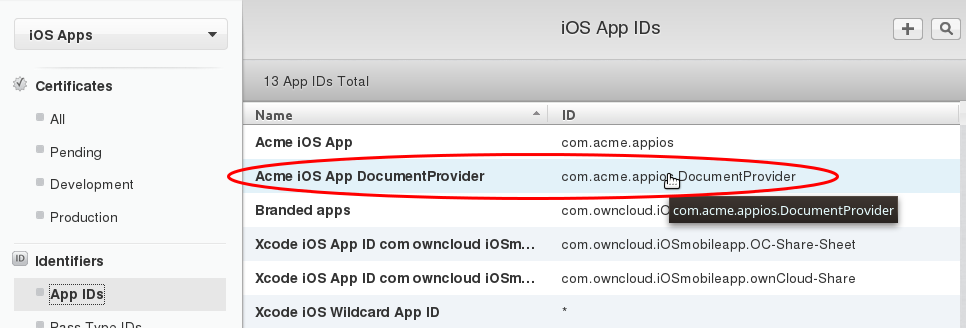
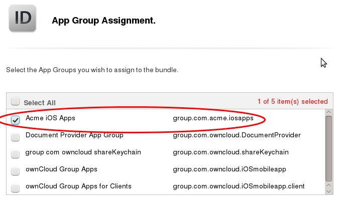

=================
Create Bundle IDs
=================

The next step is to create three **Bundle IDs**. These are unique identifiers 
for your branded iOS app. You must also create an **App Group** and place your 
three **Bundle IDs** in your **App Group**. You will need your base **Bundle 
ID** and **App Group** when you build your app with the ownBrander app on 
`Customer.owncloud.com <https://customer.owncloud.com/owncloud>`_.

Create App ID
-------------
   
Now you must create your App ID. Go to **Identifiers > App IDs** and click the 
plus button (top right) to open the "Register iOS App ID" screen. Fill in your 
**App ID Description**, which is anything you want, so make it helpful and 
descriptive. The **App ID Prefix** is your Apple Developer Team ID, and is 
automatically entered for you.

.. figure:: ../images/cert-8.png
   :scale: 60%
   
   *click to enlarge*

Scroll down to the **App ID Suffix** section and create your **Bundle ID**. 
Your 
**Bundle ID** is the unique identifier for your app. Make a note of it because 
you 
will need it as you continue through this process. The format for your **Bundle 
ID** 
is reverse-domain, e.g. *com.MyCompany.MyProductName*.

.. figure:: ../images/cert-9.png
   :scale: 80%
   
   *click to enlarge*
   
The next section, **App Services**, is where you select the services you want 
enabled in your app. You can edit this anytime after you 
finish creating your **App ID**. Make your selections and then click the 
**Continue** button at the bottom.  

   
   *click to enlarge*   

Now you can confirm all of your information. If everything is correct click 
**Submit**; if you need to make changes use the **Back** button. 

.. figure:: ../images/cert-11.png
   :scale: 60%
   
   *click to enlarge*

When you are finished you will see a confirmation.

.. figure:: ../images/cert-12.png
   :scale: 80%
   
   *click to enlarge*

Create App Group
----------------

The next step is to create an App Group and put your App ID in it. Go to 
**Identifiers > App Groups** and click the plus button (top right).

.. .. figure:: ../images/cert-13.png

   
   *click to enlarge*
   
Create a description for your app group, and a unique identifier in the format 
*groups.com.MyCompany.MyAppGroup*. Then click **Continue**.    

.. figure:: ../images/cert-14.png
   :scale: 70%
   
   *click to enlarge*

Review the confirmation screen, and if everything looks correct click the 
**Register** button.

.. figure:: ../images/cert-15.png
   :scale: 80%
   
   *click to enlarge*

You'll see a final confirmation screen; click **Done**.

.. figure:: ../images/cert-16.png
   :scale: 80%
   
   *click to enlarge*

When you click on **App Groups** you will see your new app group.

.. .. figure:: ../images/cert-17.png

   
   *click to enlarge*
   
Now go back to **Identifiers > App IDs** and click on your App ID. This opens a 
screen that displays all your app information. Click the **Edit** button at the 
bottom. 

.. figure:: ../images/cert-18.png
   :scale: 70%
   
   *click to enlarge*
   
This opens the edit screen; check **App Groups**.

.. figure:: ../images/cert-19.png
   :scale: 70%
   
   *click to enlarge*

When you check  **App Groups** you'll get a popup warning you "If you wish 
to enable App Groups for any existing provisioning profiles associated with 
this 
App ID, you must also regenerate them." If you are following this guide for the 
first time, then you have not yet created provisioning profiles, so click 
**OK**.

.. figure:: ../images/cert-20.png
   :scale: 70%
   
   *click to enlarge*
   
When you click **OK** the popup is dismissed, and you must click the **Edit** 
button.

   
   *click to enlarge*
   
Select your app and click **Continue**   
   
.. ..figure:: ../images/cert-22.png

   
   *click to enlarge*   

Review the confirmation screen, and then click **Assign**.

   
   *click to enlarge*   

You will see the message "You have successfully updated the App Groups 
associations with your App ID." Click **done**. If you go to **Identifiers > 
App IDs** and click on your app, you'll see an additional confirmation that you 
successfully assigned your app to your app group.

   
   *click to enlarge*

Create a DocumentProvider Bundle ID
-----------------------------------

Now you must return to **Identifiers > App IDs** and click the plus button to 
create a DocumentProvider Bundle ID. Follow the same naming conventions as for 
your App ID.

.. figure:: ../images/cert-25.png
   :scale: 80%
   
   *click to enlarge*

Confirm your new App ID and click **Submit**.

.. figure:: ../images/cert-26.png
   :scale: 80%
   
   *click to enlarge*
 
You will see one more confirmation; click **Done**. Now you need to add it 
to your App Group. Go to **Identifiers > App IDs** and click on your new 
DocumentProvider Bundle ID to open its configuration window, and then click the 
**Edit** button. 

.. .. figure:: ../images/cert-27.png

   
   *click to enlarge*

Select **App Groups** and click the **Edit** button.   

.. figure:: ../images/cert-28.png
   :scale: 80%
   
   *click to enlarge*
   
Select your group and click **Continue**.

.. .. figure:: ../images/cert-29.png

   
   *click to enlarge*
   
On the confirmation screen click **Assign**, and you'll see the message "You 
have successfully updated the App Groups associations with your App ID."

Create a DocumentProviderFileProvider Bundle ID
-----------------------------------------------

One more time, go to **Identifiers > App IDs** and click the plus button to 
create a DocumentProviderFileProvider Bundle ID. Follow the same naming 
conventions as for your App ID, then click **Continue**.

.. figure:: ../images/cert-30.png
   :scale: 80%
   
   *click to enlarge*
   
Confirm your new App ID and click **Submit**.

.. figure:: ../images/cert-31.png
   :scale: 80%
   
   *click to enlarge*
 
You will see one more confirmation; click **Done**. Now you need to add it to 
your App Group. Go to **Identifiers > App IDs** and click on your new 
DocumentProviderFileProvider Bundle ID to open its configuration window, and 
then click the **Edit** button. 

.. figure:: ../images/cert-32.png
   :scale: 80%
   
   *click to enlarge*

Select **App Groups** and click the **Edit** button.   

.. figure:: ../images/cert-33.png
   :scale: 80%
   
   *click to enlarge*
   
Select your group and click **Continue**.

.. figure:: ../images/cert-34.png
   :scale: 80%
   
   *click to enlarge*
   
On the confirmation screen click **Assign**, and you'll see the message "You 
have successfully updated the App Groups associations with your App ID." 

Now you should have three new App IDs, and all three of them should belong to 
your App Group. (You can verify group membership by going to the edit 
screen for each App ID and looking at the **iOS App ID Settings**.)

.. figure:: ../images/cert-37.png
