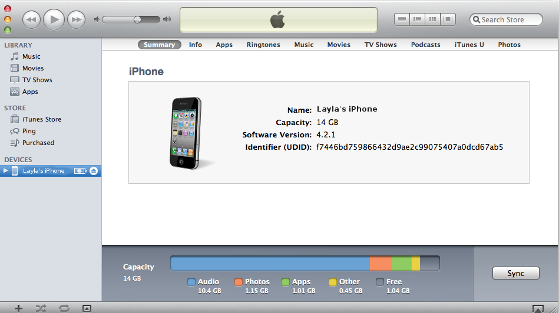
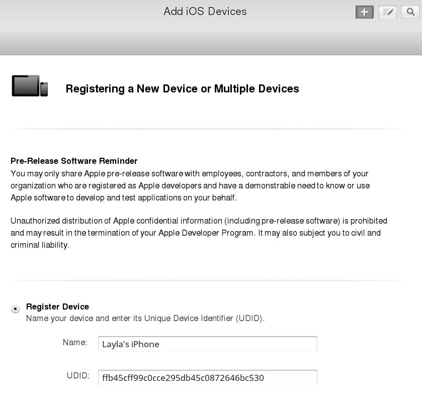
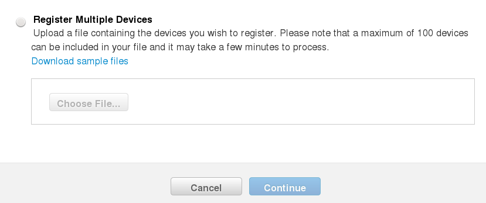

==========================
Setting up Testing Devices
==========================

The $99 Apple Developer account allows you to test your iOS apps on a maximum of 
100 devices of each type::

 Apple TV     100
 Apple Watch  100
 iPad         100
 iPhone       100 
 iPod Touch   100

And you must register the UDID of each device in your Apple developer account. 
If you have the $299 Enterprise account then you can install your app on any 
device without registering it.

The easiest way to find UDIDs is to connect to your iTunes account. Then connect 
your iOS device to your Mac computer. Your device will appear on the left 
sidebar in iTunes. Click on this to display your device information. Then click 
on the serial number, and you will see your UDID.

    
Return to your account on `Developer.apple.com 
<https://developer.apple.com>`_, go to **IOS Apps > 
Devices > All**, and click the plus button on the top right to register a new 
device. You can make the name anything you want, and the UDID must be the UDID 
copied from iTunes.

 
If you have a large number of devices to register, you may enter them in a text 
file in this format, and then upload the file::
 
 Device ID	Device Name
 A123456789012345678901234567890123456789	NAME1
 B123456789012345678901234567890123456789	NAME2
 
Click **Download sample files** to see examples of plain text and markup 
files.

When you are finished entering your device IDs click the **Continue** button. 
Verify, and then click **Done**.
