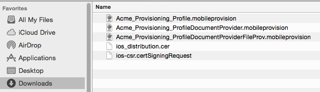
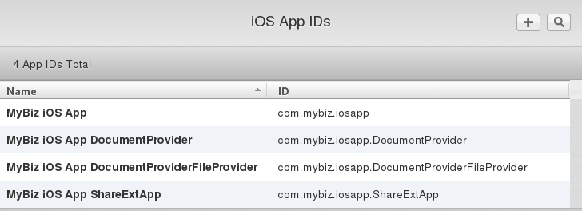

============================
Create Provisioning Profiles
============================

The next phase is to create three provisioning profiles. These are the profiles 
that you will email to branding@owncloud.com after building your branded app 
with the ownBrander app on 
`Customer.owncloud.com <https://customer.owncloud.com/owncloud>`_.

First Provisioning Profile
--------------------------

Go to **Provisioning Profiles > All**, then click the plus button (top right) 
to open the *Add iOS Provisioning Profile* screen. Select *Ad Hoc* and click 
**Continue**.

.. figure:: ../images/cert-35.png
   :scale: 70%
   
   *click to enlarge*
   
On the **Select App ID** screen select the first of the three App IDs that you 
created and click **Continue**. (The first one has the shortest name, if you 
followed the naming conventions in this manual.)

.. figure:: ../images/cert-36.png
   :scale: 70%
   
   *click to enlarge*

Select the certificate that you created at the beginning of this process and 
click **Continue**.

.. figure:: ../images/cert-38.png
   :scale: 70%
   
   *click to enlarge*
   
Select the devices that you want to install and test your app on, then click 
**Continue**.

.. figure:: ../images/cert-39.png
   :scale: 70%
   
   *click to enlarge*
   
Name your provisioning profile with a descriptive **Profile Name**, which is 
your **bundleID**, and click **Generate**. 

.. figure:: ../images/cert-40.png
   :scale: 70%
   
   *click to enlarge*
   
When it has generated, download your new profile to your Mac computer.

.. figure:: ../images/cert-50.png
   :scale: 70%
   
   *click to enlarge*
   
Find it on your Mac (usually the Download folder) and double-click to install 
it in Xcode.

.. figure:: ../images/cert-41.png

Second Provisioning Profile
---------------------------

Return to the "Your provision profile is ready" screen, scroll to the bottom 
and click **Add Another**. On the following screen select **Ad Hoc** and click 
**Continue**.

.. figure:: ../images/cert-35.png
   :scale: 70%
   
   *click to enlarge*

This time select the Select the **.DocumentProvider** app ID and click 
**Continue**.

.. figure:: ../images/cert-42.png

Select the certificate that you created at the beginning of this process and 
click **Continue**.

.. figure:: ../images/cert-43.png
   :scale: 70%
   
   *click to enlarge*

Select the devices that you want to install and test your app on, then click 
**Continue**. These must be the same devices you selected for the first 
provisioning profile, and they will be selected by default.

.. figure:: ../images/cert-39.png
   :scale: 70%
   
   *click to enlarge*
   
Give this provisioning profile the same **bundleID** as your first profile 
plus **.DocumentProvider** and click **Generate**.   

.. figure:: ../images/cert-44.png
   :scale: 70%
   
   *click to enlarge*
   
Just like the first provisioning profile, download it to your Mac computer, and 
then double-click to install it in Xcode.
 
Third Provisioning Profile
--------------------------

Return to the "Your provision profile is ready" screen, scroll to the bottom 
and click **Add Another**. On the following screen select **Ad Hoc** and click 
**Continue**.

.. figure:: ../images/cert-35.png
   :scale: 70%
   
   *click to enlarge*   

This time select the Select the **.DocumentProviderFileProvider** app ID and 
click **Continue**.

.. figure:: ../images/cert-46.png  
   
Select the certificate that you created at the beginning of this process and 
click **Continue**.

.. figure:: ../images/cert-43.png
   :scale: 70%
   
   *click to enlarge*
   
Give this provisioning profile the same **bundleID** as your first profile 
plus **.DocumentProviderFileProvider** and click **Generate**. There is a 
50-character limit, but don't worry about counting characters because it will 
be automatically truncated if you go over.  

.. figure:: ../images/cert-47.png
   :scale: 70%
      
Download it to your Mac computer, and then double-click to install it in Xcode. 
You should now see all of your provisioning profiles in your Download folder:

   
And listed in your "iOS Provisioning Profiles".

You have one more certificate to create, and that is your P12 certificate.   
   

.. https://developer.apple.com/library/ios/documentation/IDEs/Conceptual/
.. AppDistributionGuide/Introduction/Introduction.html
