============================
Create Provisioning Profiles
============================

The next phase of this glorious journey is to create eight provisioning 
profiles: 4 Ad Hoc and 4 App Store. You will email the four Ad Hoc profiles, 
and your :doc:`P12 certificate <publishing_ios_app_6>` (which you will create 
after your provisioning profiles), to branding@owncloud.com after building your 
branded app with the ownBrander app on `Customer.owncloud.com 
<https://customer.owncloud.com/owncloud>`_. Do not send us the App Store 
profiles. All eight of these profiles must be stored on your Mac PC.

First Ad Hoc Provisioning Profile
---------------------------------

Go to **Provisioning Profiles > All**, then click the plus button (top right) 
to open the *Add iOS Provisioning Profile* screen. Select **Ad Hoc** and click 
**Continue**.

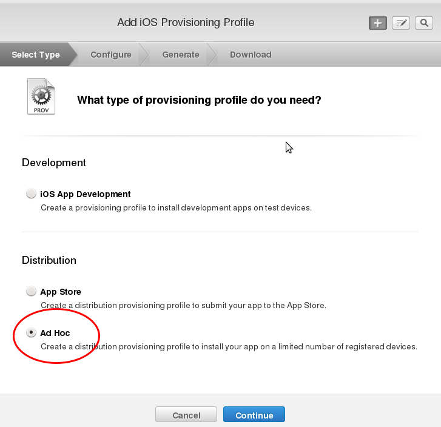
   
On the **Select App ID** screen select the first of the three App IDs that you 
created and click **Continue**. (The first one has the shortest name, if you 
followed the naming conventions in this manual.)

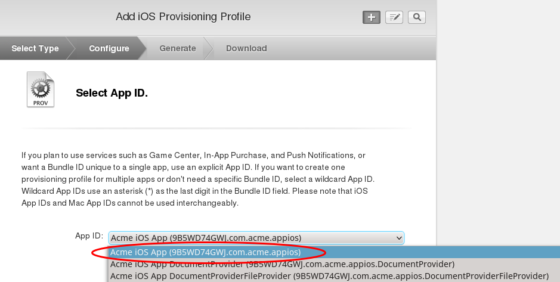

Select the certificate that you created at the beginning of this process and 
click **Continue**.

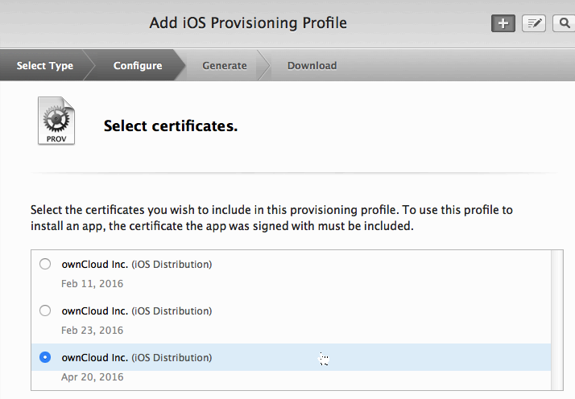
   
Select the devices that you want to install and test your app on, then click 
**Continue**.

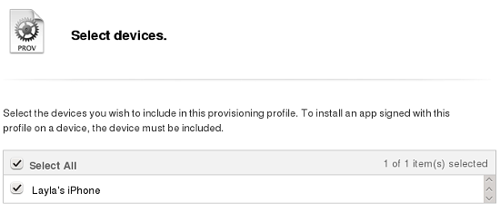
   
Name your provisioning profile with a descriptive **Profile Name** and click 
**Generate**. 

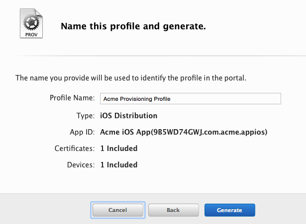
    
When it has generated, download your new profile to your Mac computer.

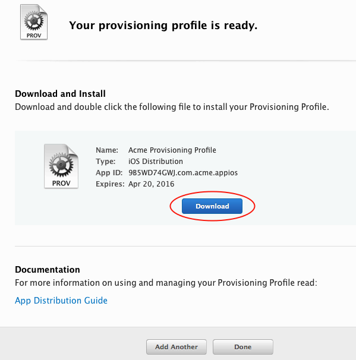
   
Find it on your Mac (usually the Download folder) and double-click to install 
it in Xcode.

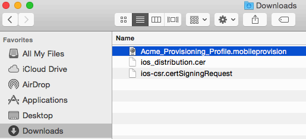

Second Ad Hoc Provisioning Profile
----------------------------------

Return to the "Your provision profile is ready" screen, scroll to the bottom 
and click **Add Another**. On the following screen select **Ad Hoc** and click 
**Continue**.

  
This time select the **.DocumentProvider** app ID and click **Continue**.

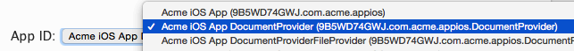

Select the certificate that you created at the beginning of this process and 
click **Continue**.

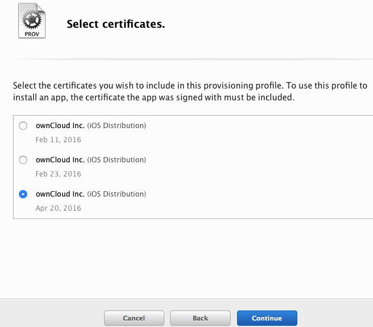
  
Select the devices that you want to install and test your app on, then click 
**Continue**. These must be the same devices you selected for the first 
provisioning profile.

   
Give this provisioning profile the same name as your first profile, 
plus **.DocumentProvider** and click **Generate**.   

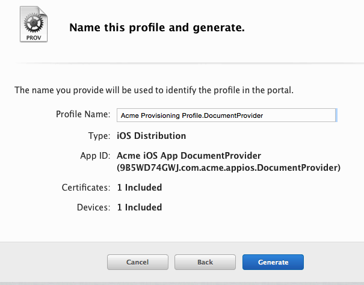
  
Just like the first provisioning profile, download it to your Mac computer, and 
then double-click to install it in Xcode.
 
Third Ad Hoc Provisioning Profile
---------------------------------

Return to the "Your provision profile is ready" screen, scroll to the bottom 
and click **Add Another**. On the following screen select **Ad Hoc** and click 
**Continue**.

This time select the **.DocumentProviderFileProvider** app ID and click 
**Continue**.

.. figure:: ../images/cert-60.png  
   
Select the certificate that you created at the beginning of this process and 
click **Continue**.

Select the devices that you want to install and test your app on, then click 
**Continue**. These must be the same devices you selected for the first 
provisioning profile.

   
Give this provisioning profile the same name as your first profile 
plus **.DocumentProviderFileProvider** and click **Generate**. There is a 
50-character limit, but don't worry about counting characters because it will 
be automatically truncated if you go over.  

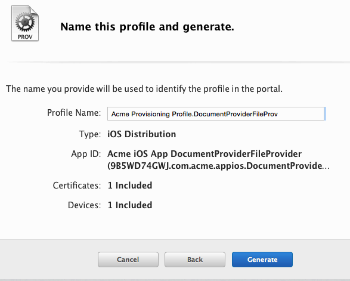
      
Download it to your Mac computer, and then double-click to install it in Xcode.

Fourth Ad Hoc Provisioning Profile
----------------------------------

Return to the "Your provision profile is ready" screen, scroll to the bottom 
and click **Add Another**. On the following screen select **Ad Hoc** and click 
**Continue**.

This time select the **.ShareExtApp** app ID and click **Continue**.

.. figure:: ../images/cert-46.png  
   
Select the certificate that you created at the beginning of this process and 
click **Continue**.

Select the devices that you want to install and test your app on, then click 
**Continue**. These must be the same devices you selected for the first 
provisioning profile.

   
Give this provisioning profile the same name as your first profile 
plus **.ShareExtApp** and click **Generate**. There is a 
50-character limit, but don't worry about counting characters because it will 
be automatically truncated if you go over.  

.. figure:: ../images/cert-58.png
      
Download it to your Mac computer, and then double-click to install it in Xcode. 
You should now see all of your Ad Hoc provisioning profiles listed in your "iOS 
Provisioning Profiles".

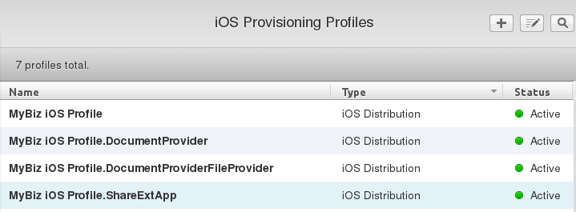

Create Four App Store Profiles
------------------------------

Creating your four App Store profiles is the same as creating your Ad Hoc 
profiles, except that when you start you check the App Store checkbox, and you 
won't select testing devices.

.. figure:: ../images/cert-62.png

When you're finished, you'll have eight new provisioning profiles. Remember, 
when you build your app on ownBuilder you only send in the four Ad Hoc 
profiles, plus your P12 certificate.

.. figure:: ../images/cert-61.png

Go to the next page to learn how to create your :doc:`P12 certificate 
<publishing_ios_app_6>`.   
  