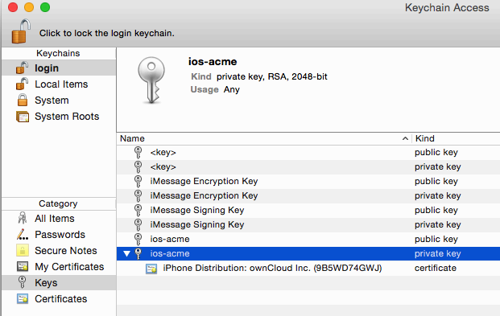
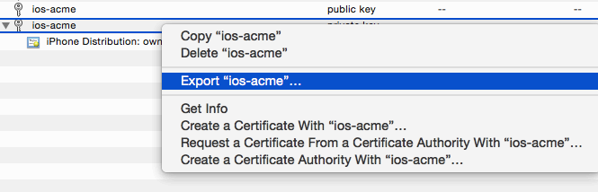
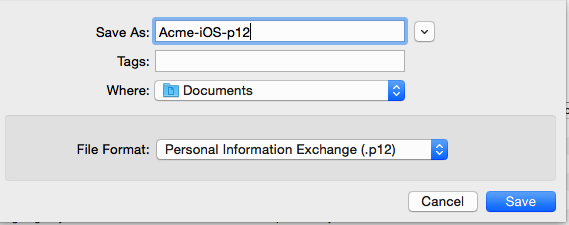
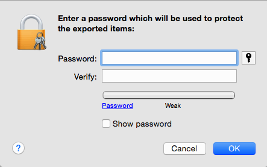
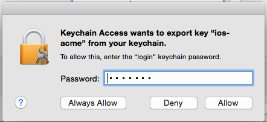

==========================
Creating a P12 Certificate
==========================

In addition to emailing your three provisioning profiles to 
branding@owncloud.com, you must also include your P12 certificate. To create 
this, return to Keychain Access on your Mac computer and find your private key 
that you created at the beginning (see 
:doc:`../enterprise_ios_app/publishing_ios_app_2`). 

    
Right-click on your private key and left-click **Export [your key name]**.   

   
Enter any name you want, the location you want to save it to, and click 
**Save**.    
  

   
In the next screen you have the option to enter a password. If you put a 
password on your P12 certificate you will have to include it when you send your 
certificate and provisioning profiles to branding@owncloud.com. Click OK.

On the next screen you must enter your login keychain password, which is your 
Mac login password.

You have now completed all the necessary steps for signing your branded iOS 
app. The next step is to build your app with the ownBrander app on 
`<https://customer.owncloud.com>`_.  
