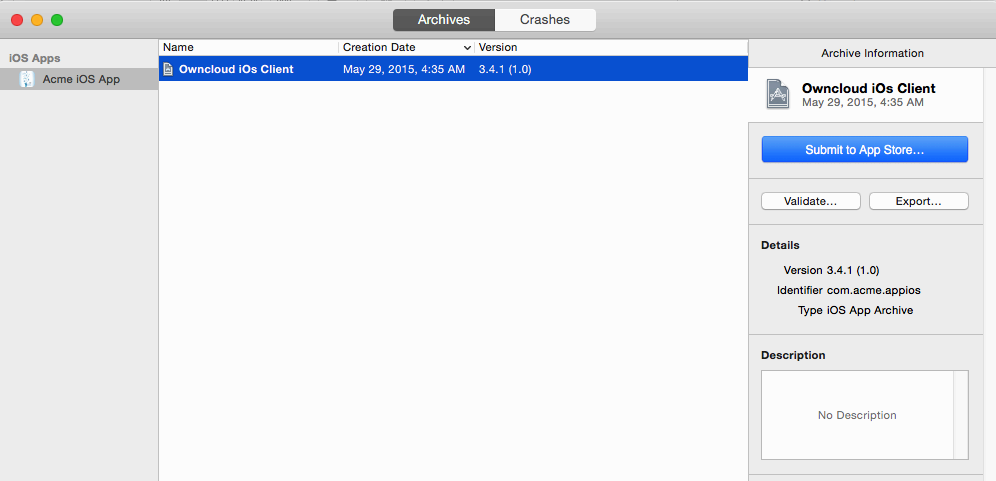
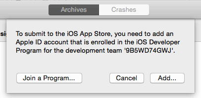
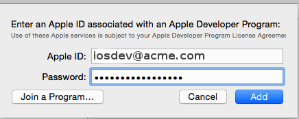
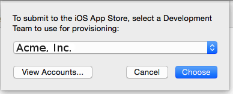
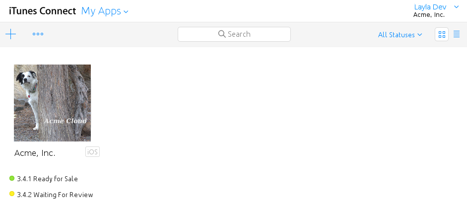
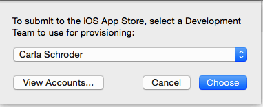
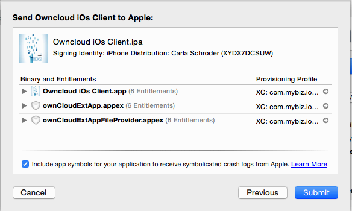
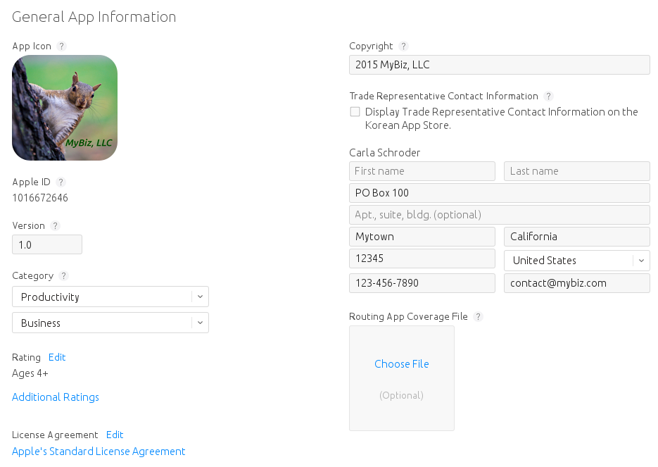
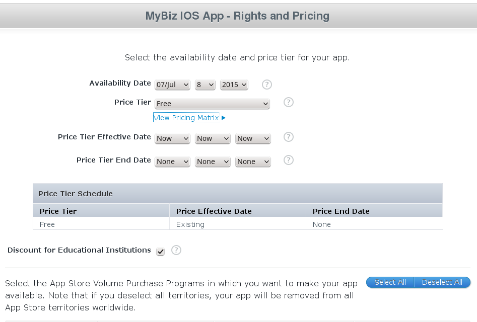

===================================
Publishing Your New Branded iOS App
===================================

At last, after following all the previous steps and passing beta testing, your 
branded iOS app is ready to publish for general distribution on iTunes. You need 
a Mac computer with Xcode installed (Xcode is a free download), and you need 
the three provisioning profiles and p12 file that you created copied to the 
same computer that you are using to upload your app to iTunes. You will also 
need a number of screenshots of your app in specific sizes and resolutions, 
which are detailed in your iTunes Connect setup screen.

.. Note:: Apple must review and approve your app, and the approval process can 
   take several days to several weeks. 

Download your :file:`xcarchive.zip` file from your account on 
`<https://customer.owncloud.com/owncloud>`_. Your friendly Mac computer will 
automatically unpack it and change the name to something like :file:`Owncloud 
iOs Client 02-07-15 10.30.xcarchive`. Double-click on this file to automatically 
install it into Xcode. Go to Xcode and you will see it in the Archives listing 
under **Window > Organizer**.

   
   *figure 1*

Next, go back to the `Apple Developer Member Center 
<https://developer.apple.com/membercenter/index.action>`_ to log into iTunes 
Connect to set up your app storefront.

   *figure 2*

After logging in click the blue **My Apps** button. This takes you to the main 
screen for managing your apps on iTunes. 

.. figure:: ../images/ios-publish.png

   *figure 3*

Click the plus button on the top left to setup your new branded iOS app. 

   *figure 4*

This opens a screen where you will enter your app information. Make sure you 
get it right the first time, because it is difficult to delete apps, and Apple 
will not let you re-use your app name or SKU.

* Enter any name you want for your app. This is the name that will appear in 
  your App Store listing.
* Choose your primary language.
* Select the bundle ID from the drop-down selector.
* Enter your app version number, which should match the version number as it 
  appears in your Xcode organizer.
* The SKU is a unique ID for your app, and is anything you want.

Then click the **Create** button.

   *figure 5*

Now go back to your Xcode organizer to upload your app; click the blue **Submit 
to App Store** button. 

   *figure 6*

This takes a few minutes as it verifies your bundle ID and certificates, and 
then you will see an upload status.

.. figure:: ../images/ios-publish-7.png

   *figure 7*
   
At long last, after working through this long complex process, you are almost 
ready to publish your app on iTunes.

Setting up Your iTunes Storefront
---------------------------------

There are just a few steps remaining. Now that you have uploaded your branded 
iOS app, you need to upload some screenshots, an optional demo video, and fill 
in some information for your app listing on your iTunes storefront. You should 
see something like this on your main screen (figure 8). You should click the 
**Save** button at the top right periodically to preserve your changes.

   *figure 8*
   
This screen displays all of your apps and their submission status. Click 
**Prepare for Submission** to get started on the submission process. The first 
screen is for entering screenshots of your app for various devices, and 
optionally a demonstration video. Click the little question marks to learn the 
required image specifications.

   *figure 9*
   
Then you must enter your app name, a description, some keywords for iTunes 
searches, and some optional URLs.   

.. figure:: ../images/ios-publish-10.png

   *figure 10*   

The next section is for Apple Watch. If you don't support Apple Watch you can 
skip this.

The **General App Information** section requires a 1024x1024 logo, version, 
rating, category, license, copyright, and contact information.

   *figure 11*
   
In the **Build** section, click the plus button and select your app.   
   
.. figure:: ../images/ios-publish-14.png

   *figure 12*     

The **App Review Information** requires contact information, and some 
information about your app to guide reviewers. Remember, everyone on iTunes can 
review your app, so it's in your best interest to be helpful. You may 
optionally provide a login for a demo account.

.. figure:: ../images/ios-publish-12.png

   *figure 13*

The **Version Release** section allows you to choose between automatic release, 
which means your app will be published upon approval, or manual release, where 
you must release your app after it is approved.

Pricing
-------

Next, you must go to the **Pricing** page to set your price, and to select the 
terroritories you want your app to be available in.

   *figure 14*

Submit For Review
-----------------

When you have filled in all the required forms and provided the required 
screenshots, click **Save** and then **Submit for Review**. If anything needs 
to be corrected you will see messages telling you exactly what must be fixed.

The next screen is legalese; click the appropriate Yes or No boxes, and then 
click the **Submit** button.

You are now finished. No really, you are. When you return to your **My Apps** 
page you'll see that the status of your app has changed to "Waiting for 
review". In a few days, or perhaps many days, your app will either be approved 
or rejected. If it is rejected Apple will tell you what you need to do to get 
it approved.

.. figure:: ../images/ios-publish-15.png

   *figure 15*

When, at last, it is published on iTunes you may distribute the URL so that 
your users may install and use your app.
