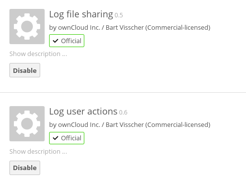
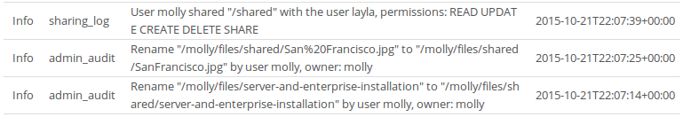

=======================
Enterprise Logging Apps
=======================

There are two enterprise logging apps available to ownCloud Enterprise 
Subscription customers: **Log file sharing** and **Log user actions**. The **Log 
file sharing** app records the file sharing activity of your users, and **Log 
user actions** records user logins and logouts.

   
These two apps work together, and should be enabled together. Your logging 
level must be set to at least **Info, warnings, errors, and fatal issues** on 
your ownCloud admin page, or ``'loglevel' => 1`` in ``config.php``.  

View your logfiles on your admin page. This shows which logging app recorded 
the entries, timestamps, usernames, and their activities:

   
Click the **Download logfile** button to dump the plain text log, or open the 
logfile directly in a text editor. The default location is 
``owncloud/data/owncloud.log``. This is what the raw log looks like::

 {"reqId":"uaG6sHiutvgzVUCUXM3W","remoteAddr":"::1","app":"admin_audit",
 "message":"Rename \"\/molly\/files\/server-and-enterprise-installation\" to 
 \"\/molly\/files\/shared\/server-and-enterprise-installation\" by user molly, 
 owner: molly","level":1,"time":"2015-10-21T22:07:14+00:00"}
 {"reqId":"Krsnp8BgtLCtuT4zLTWs","remoteAddr":"::1","app":"admin_audit",
 "message":"Rename \"\/molly\/files\/shared\/San%20Francisco.jpg\" to 
 \"\/molly\/files\/shared\/SanFrancisco.jpg\" by user molly, owner: 
 molly","level":1,"time":"2015-10-21T22:07:25+00:00"}
 
See :doc:`../configuration_server/logging_configuration` for more information 
on logging.
