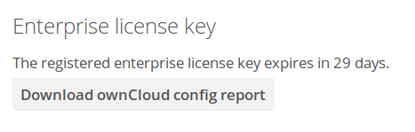

==========================
Enterprise Troubleshooting
==========================

When you have problems with your ownCloud Enterprise installation, refer to 
:doc:`../issues/general_troubleshooting` to see if you can resolve your issue 
without opening a support ticket. If you need to open a support ticket, use the 
Open Ticket button in your account on 
`<https://customer.owncloud.com/owncloud/>`_.

Bug reports and trouble tickets usually need a copy of your ownCloud server 
configuration report. You have two ways to generate a configuration report.

#. Use the :ref:`occ config command <config_commands_label>`.
#. Use the **Enterprise license key** app on your ownCloud Admin page to 
   generate the report with the click of a button.
   

Both methods automatically obscure passwords and secrets.
