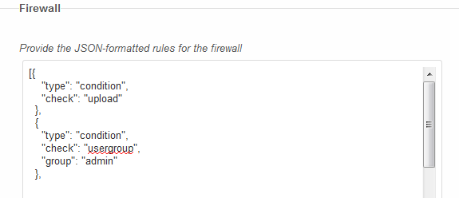
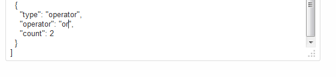
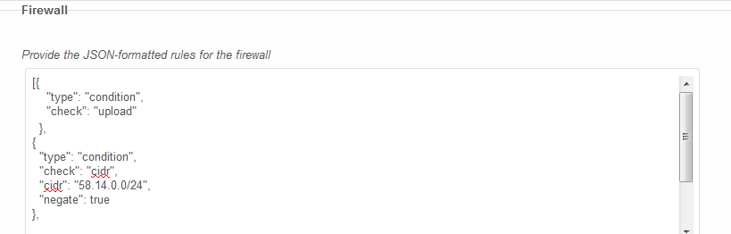
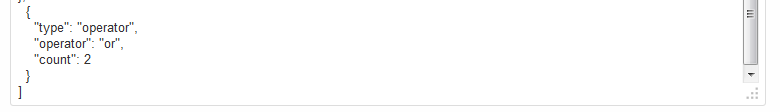

=============
File Firewall
=============

.. toctree::
    :maxdepth: 2
    :hidden:

The purpose of the ownCloud Firewall is to prevent execution of ownCloud
internal code for requests that violate a set of admin-defined rules. This
allows administrators to exclude user behaviors based on many criteria,
including geographic location, size of request, app accessed, etc.

Configuration
=============

The configuration of the ownCloud Enterprise Firewall is supplied by a JSON-formatted string within the ownCloud
configuration file. This string can be written to the config.php file using the admin interface within ownCloud.

The configuration consists of a single JSON string representing an array of objects. Each object in the array
represents a condition that must be true for the firewall to allow the request to complete.

When ownCloud receives a new request, the conditions in the rule set are evaluated against the criteria - such as
the user's IP address, user agent, login credentials, etc. - generated by the request. Only if all of the conditions
are met will ownCloud's execution be allowed to continue to fulfill the request. Otherwise, the user will receive an
HTTP 403 status error, meaning "Request forbidden".

Rule sets can be constructed using multiple conditions, including Boolean operators. This can allow a request to
pass through the firewall, for example, if it meets either of two specific conditions.

Order of Operations
-------------------

The order of operations during the evaluation of a rule set is important for efficiency. Properly ordering the
conditions can improve performance of the firewall.

When ownCloud evaluates conditions, it sequentially adds them to a stack until it reaches an operator, such as an
OR
or
AND
. Upon reaching an operator, the firewall pops the required number of conditions from the stack to evaluate the
operator. The result of the evaluation is pushed back onto the stack.

Any conditions that remain in the stack after all conditions and operations are added from the rule set are then
evaluated. All of these conditions must pass (as if the
AND
operator was used between each of them) for the firewall to allow the request to proceed.

In addition to
AND
and
OR
operations, the firewall also supports
NOT
both as an operator and a parameter to invert the result of any condition.

Condition Parameters
--------------------

Within each condition definition in a rule set, it is possible to define parameters that limit the condition. For
example, the "subnet" condition has a parameter that allows an admin to specify the range of the subnet in bits.
Other conditions have similar parameters, and conditions may have none or multiple parameters.

*API Note:*
In the current revision of the firewall, the parameters and description of a condition are defined within the
Rule
class that implements that condition. In future revisions of the firewall, the types of the parameter values that are defined within the
Rule
classes may be enforced via the admin interface.

Rule Definitions
================

Every defined rule must include a type. There are two types of rules that are applicable to firewalls: Conditions
and Operators. Conditions compare request criteria to specific pre-set values. Their results determine whether the
firewall allows the pass-through of a request. Operators combine the results of conditions, and allow a rule set to
accommodate different types of requests under different circumstances.

Conditions
----------

The type of a condition is "condition". Conditions must have a "check" value that describes the type of check that
will be performed if the condition is evaluated. The "check" value must be provided in the rule set as all lowercase.

Any condition may have a "negate" value. If the "negate" value is true, then the result of the condition will
be negated. For example, to block a subnet of IP addresses, use the CIDR rule to select that subnet, then negate
the rule so that requests from that subnet fail. It is also possible to follow any condition with a
NOT
operator to perform this same function.

Any condition may also have a "failmessage" or "passmessage" parameter. The value of these parameters is saved to
the ownCloud log in the case that the condition is executed and fails or passes, respectively. Note that adding t
hese parameters to a condition can have a
*significant*
impact on performance, as such, these parameters should only be used while debugging firewall rule sets.

The following is a list of checks that are supported in the firewall, along with the parameters they require.

CIDR
~~~~

A CIDR condition allows only those requests that originate from an IP address that matches a CIDR mask.

*Parameters*
*:*

cidr

The CIDR address mask, in a format similar to
192.168.1.0/24

*Example:*

This condition uses the "negate" parameter to ensure that the request does not come from a specific subnet:

.. code-block:: json

    {
    "type": "condition",
    "check": "cidr",
    "cidr": "117.22.0.0/15",
    "negate": true
    }

Regex
~~~~~

A Regex condition allows only those requests that successfully match a regular expression to a specific request criteria.

*Parameters:*

regex

The regular expression to use in the comparison. This regular expression must be delimited. For example:
#p#

criteria

The name of the criteria to match to the regular expression.

*Example:*

This condition checks to ensure that the request criteria contains the letter "p":

.. code-block:: json

    {
    "type": "condition",
    "check": "regex",
    "regex": "#p#",
    "criteria": "request"
    }

subnet
~~~~~~

A Subnet condition allows a request only if the request originates from within a certain number of significant bits of the server's IP address. For example, to allow requests from the subnet 192.168.1.0 through 192.168.1.255, the "bits" parameter should be set to 24, which includes the first three octets of the IP address.

*Parameters:*

bits

The number of significant bits that are required to match the server's IP address for a request to be passed.

*Example:*

This condition checks to ensure that the request originates on the same subnet as the server:

.. code-block:: json

    {
    "type": "condition",
    "check": "subnet",
    "bits": 24
    }

upload
~~~~~~

An Upload condition allows a request only if it is attempting an upload. Note that this condition can be useful in two ways:

#.  Require a request to be an upload before requiring another condition, such as a size restriction.

#.  Require a request
    *not*
    to be an upload (by adding the
    negate
    parameter) as an alternative in an
    OR
    operation.

*Parameters: None.*

*Example:*

This condition uses the "negate" parameter to ensure that the request is not an upload:

.. code-block:: json

    {
    "type": "condition",
    "check": "upload",
    "negate": true
    }

Verb
~~~~

A Verb condition allows a request only if the request uses a specific HTTP verb.

*Parameters:*

verb

A comma-separated list of verbs that will pass this condition. Note that HTTP verbs are case-sensitive and are usually required to be in upper case.

*Example:*

This condition checks to ensure that the request method was either a
GET
or
PUT
:

.. code-block:: json

    {
    "type": "condition",
    "check": "verb",
    "verb": "GET,POST"
    }

Loggedin
~~~~~~~~

A LoggedIn condition allows a request only if the user is logged in.

*No parameters.*

*Example:*

This condition uses the negate parameter to require that the user is
*not*
logged in:

.. code-block:: json

    {
    "type": "condition",
    "check": "loggedin",
    "negate": true
    }

Usergroup
~~~~~~~~~

A UserGroup condition allows a request only if the user is a member of the specified group or groups.

*Parameters:*

group

A comma-separated list of groups, of which the user must be a member of at least one.

*Example:*

This condition requires a user to be in the "admin" group:

.. code-block:: json

    {
    "type": "condition",
    "check": "usergroup",
    "group": "admin"
    }

Time
~~~~

A Time condition allows a request only if the request is made within a specific time range. The check is performed against GMT. If the end time is before the begin time, then the range spans overnight.

*Parameters:*

begin

The beginning of the time range, in the format HH:MM. PM times are expressed in numbers greater than 12.

end

The end of the time range, in the format HH:MM. PM times are expressed in numbers greater than 12.

*Example:*

This condition requires a request to occur between 9am and 5pm GMT:

.. code-block:: json

    {
    "type": "condition",
    "check": "time",
    "begin": "9:00",
    "end": "17:00"
    }

Sizeup
~~~~~~

A SizeUp condition allows a request only if the size of the request is under a specific limit. This limits the amount of data that can be transferred to the server, and can prevent unwanted large files from being uploaded. This rule is not guaranteed to prevent a client from transferring (and the server from receiving) the data prior to the rule taking effect, but under some circumstances (particularly PUT
requests like those initiated via WebDAV with a properly configured server) the transfer of data may be prevented.

*Parameters:*

limit

The maximum number of bytes that are allowed to be transferred in the request.

*Example:*

This condition requires all transfers to the server to be less than about 100kb.

.. code-block:: json

    {
    "type": "condition",
    "check": "sizeup",
    "limit": 100000
    }

Operators
---------

The
type of an operator is "operator". Operators must also have an "operator" value that describes the type of operation that will be performed on the conditions currently in the stack. The "operator" value must be provided in the rule set as all lowercase.

Operators may also include the "count" parameter, which defines an alternate number of conditions to pop from the stack. This can be useful for efficiently combining multiple operations in a more complicated rule set.

The following is a list of operators that are supported in the firewall.

and
~~~

The
AND
operator pops two conditions (unless a count parameter is supplied) from the stack. Each condition is evaluated until one evaluates to
false
or there are no more conditions to evaluate (which results in a
true
response). The result of the operator is pushed onto the stack.

The
AND
operator short-circuits if any of the conditions it pops evaluates to
false
. The conditions pushed onto the stack before the
AND
operator should be optimized so that the most likely to return
*false*
is the first in the order executed. This will prevent the others from being executed, thus saving execution time.

Or
~~

The
OR
operator pops two conditions (unless a count parameter is supplied) from the stack. Each condition is evaluated until one evaluates to
true
or there are no more conditions to evaluate (which results in a
false
response). The result of the operator is pushed onto the stack.

The
OR
operator short-circuits if any of the conditions it pops evaluates to
true
. The conditions pushed onto the stack before the
OR
operator should be optimized so that the most likely to return
true
is the first in the order executed. This will prevent the others from being executed, thus saving execution time.

Not
~~~

The
NOT
operator pops one condition from the stack. The "negate" property of this condition is toggled, then the condition is pushed back onto the stack. The
NOT
operator does not force the condition it modifies to be evaluated.

log
~~~

The
LOG
operator pops one condition from the stack and evaluates it. The result of the evaluated condition is output to the ownCloud log along with the "message" parameter of the operator.

The
LOG
operator does not affect the outcome of the rule set evaluation, but it may execute conditions that would not otherwise be executed due to operator short-circuiting, which will affect performance. Saving log entries to a file on every request can have a
*significant*
impact on performance, as such, this operator should only be used while debugging firewall rule sets.

Available Criteria
==================

There are some conditions that allow the administrator to set specific criteria on which they act. The following is a list of criteria that is collected by the firewall to pass into the conditions for evaluation.

User-agent
----------

The literal user-agent string supplied by the client

agent
-----

A translated user-agent string that may include:

desktop
~~~~~~~

Indicating a desktop sync client.

ios
~~~

Indicating the ownCloud IOS client.

android
~~~~~~~

Indicating the ownCloud Android client.

webdav
~~~~~~

Indicating a webdav request.

Public
~~~~~~

Indicating a shared public URL.

Request-url
-----------

The requested URI.

request
-------

Same as request-uri

Remote-addr
-----------

The remote IP address of the user.

IP
--

Same as remote-addr

time
----

UTC timestamp.

Server-time
-----------

Server time zone timestamp

User-time
---------

User time zone timestamp

user
----

The ownCloud OC_User object representing the logged-in user

groups
------

The ownCloud group ids that the current user belongs to

app
---

The name of the app that the request pertains to

appfile
-------

The file of the app that was requested

method
------

The HTTP verb used for the request

Example Rule sets
=================

Here is a sample rule set that allows requests to be uploads only if they are within the server's subnet or using the iOS client:

.. code-block:: json

    [{
        "type": "condition",
        "check": "upload",
        "negate": true
      },
      {
        "type": "condition",
        "check": "subnet",
        "bits": 24
      },
      {
        "type": "condition",
        "check": "regex",
        "regex": "#^ios$#",
        "criteria": "agent"
      },
      {
        "type": "operator",
        "operator": "or",
        "count": 3
      }
    ]

The following example shows a rule set that allows only users in the “admin” group to upload files to ownCloud:

The following rule set may be used to block uploads from a specific IP range (58.14.0.0/24 in this case).
This can be useful to block uploads from less desirable countries:

