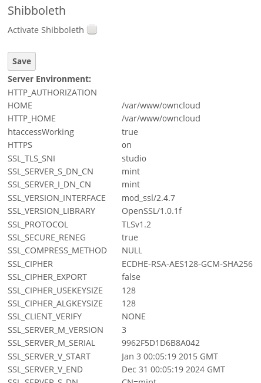
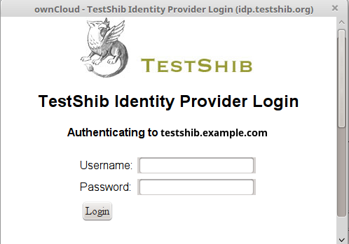
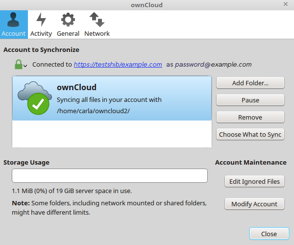

========================================
Shibboleth Integration (Enterprise only)
========================================

Introduction
------------

The ownCloud Shibboleth user backend application integrates ownCloud with a
Shibboleth Service Provider (SP) and allows operations in federated and
single-sign-on (SSO) infrastructures. Setting up Shibboleth has two big steps:

1. Enable and configure the Apache Shibboleth module.
2. Enable and configure the ownCloud Shibboleth app.

The Apache Shibboleth module
----------------------------

Currently supported installations are based on the `native Apache integration`_.
The individual configuration of the service provider is highly dependent on
the operating system, as well as on the integration with the Identity
Providers (IdP), and require case-by-case analysis and installation.

A good starting point for the service provider installation can be found in
`the official Shibboleth Wiki`_.

A successful installation and configuration will populate Apache environment
variables with at least a unique user id which is then used by the ownCloud
Shibboleth app to login a user.

See the `documentation Wiki <https://github.com/owncloud/documentation/wiki/Shibboleth-example-configurations>`_ for more configuration examples.

Apache Configuration
^^^^^^^^^^^^^^^^^^^^

This is an example configuration as installed and operated on a Linux server
running the Apache 2.4 Web server. These configurations are highly operating system
specific and require a high degree of customization.

The ownCloud instance itself is installed in ``/var/www/owncloud/``.  The
following aliases are defined in an Apache virtual host directive:

::

	# non-Shibboleth access
	Alias /owncloud /var/www/owncloud/
	# for Shibboleth access
	Alias /oc-shib /var/www/owncloud/

Further Shibboleth specific configuration as defined in
``/etc/apache2/conf.d/shib.conf``::

	#
	# Load the Shibboleth module.
	#
	LoadModule mod_shib /usr/lib64/shibboleth/mod_shib_24.so
	
	#
	# Ensures handler will be accessible.
	#
	<Location /Shibboleth.sso>
	  AuthType None
	  Require all granted
	</Location>
	
	#
	# Configure the module for content.
	#
	
	#
	# Besides the exceptions below, this location is now under control of
	# Shibboleth
	#
	<Location /oc-shib>
	  AuthType shibboleth
	  ShibRequireSession On
	  ShibUseHeaders Off
	  ShibExportAssertion On
	  require valid-user
	</Location>
	
	#
	# Shibboleth is disabled for the following location to allow non
	# shibboleth webdav access
	#
	<Location ~ "/oc-shib/remote.php/nonshib-webdav">
	  AuthType None
	  Require all granted
	</Location>
	
	#
	# Shibboleth is disabled for the following location to allow public link
	# sharing
	#
	<Location ~ \
	"/oc-shib/(status.php$\
	|index.php/s/\
	|public.php$\
	|cron.php$\
	|core/img/\
	|index.php/apps/files_sharing/ajax/publicpreview.php$\
	|index.php/apps/files/ajax/upload.php$\
	|apps/files/templates/fileexists.html$\
	|index.php/apps/files/ajax/mimeicon.php$\
	|index.php/apps/files_sharing/ajax/list.php$\
	|themes/\
	|index.php/apps/files_pdfviewer/\
	|apps/files_pdfviewer/)">
	  AuthType None
	  Require all granted
	</Location>
	
	#
	# Shibboleth is disabled for the following location to allow public gallery
	# sharing
	#
	<Location ~ \
	"/oc-shib/(index.php/apps/gallery/s/\
	|index.php/apps/gallery/slideshow$\
	|index.php/apps/gallery/.*\.public)">
	  AuthType None
	  Require all granted
	</Location>
	
	#
	# Shibboleth is disabled for the following location to allow public link
	# sharing
	#
	<Location ~ "/oc-shib/.*\.css">
	  AuthType None
	  Require all granted
	</Location>
	
	#
	# Shibboleth is disabled for the following location to allow public link
	# sharing
	#
	<Location ~ "/oc-shib/.*\.js">
	  AuthType None
	  Require all granted
	</Location>
	
	#
	# Shibboleth is disabled for the following location to allow public link
	# sharing
	#
	<Location ~ "/oc-shib/.*\.woff">
	  AuthType None
	  Require all granted
	</Location>

Depending on the ownCloud Shibboleth app mode, you may need to revisit this
configuration.

The ownCloud Shibboleth App
---------------------------

After enabling the Shibboleth app on your Apps page, you need to choose the app
mode and map the necessary Shibboleth environment variables to ownCloud user
attributes on your Admin page.

   *figure 1: Enabling Shibboleth on the ownCloud Admin page*

Choosing the App Mode
^^^^^^^^^^^^^^^^^^^^^

After enabling the app it will be in **Not active** mode, which ignores a 
Shibboleth session and allows you to login as an administrator and inspect the 
currently available Apache environment variables. Use this mode to set up the 
environment mapping for the other modes, and in case you locked yourself out of 
the system. You can also change the app mode and environment mappings by using 
the ``occ`` command, like this example on Ubuntu Linux::

 $ sudo -u www-data php occ shibboleth:mode notactive
 $ sudo -u www-data php occ shibboleth:mapping --uid login

In **Single sign-on only** mode the app checks if the environment variable for 
the Shibboleth session, by default **Shib-Session-Id**, is set. If that is the 
case it will take the value of the environment variable as the ``uid``, by 
default ``eppn``, and check if a user is known by that ``uid``. In effect, this 
allows another user backend, eg. the LDAP app, to provide the ``displayname``, 
``email`` and ``avatar``.

 .. note:: As an example the IdP can send the **sAMAccountName** which the
    Apache Shibboleth module writes to a custom Apache environment variable
    called ``login``. The ownCloud Shibboleth app reads that ``login``
    environment variable and tries to find an LDAP user with that ``uid``. For 
    this to work the LDAP backend also needs to be configured to use the
    **sAMAccountName** as the **Internal Username Attribute** in the
    :doc:`LDAP expert settings <../configuration_user/user_auth_ldap>`.

 .. note:: In many scenarios Shibboleth is not intended to hide the user's
    password from the service provider, but only to implement SSO. If that is
    the case it is sufficient to protect the ownCloud base url with Shibboleth.
    This will send Web users to the IdP but allow desktop and mobile clients to
    continue using username and password, preventing popups due to an expired
    Shibboleth session lifetime.

In **Autoprovision Users** mode the app will not ask another user backend, but
instead provision users on the fly by reading the two additional environment
variables for display name and email address.

.. figure:: ../images/shib-gui6.png
   :alt: Dropdowns for mapping Shibboleth environment configuration variables to ownCloud user attributes.

   *figure 2: Mapping Shibboleth environment configuration variables to ownCloud 
   user attributes*

In ownCloud 8.1 the Shibboleth environment variable mapping was stored in
``apps/user_shibboleth/config.php``. This file was overwritten on upgrades,
preventing a seamless upgrade procedure. In ownCloud 8.2+ the variables are
stored in the ownCloud database, making Shibboleth automatically upgradeable.

Shibboleth with Desktop and Mobile Clients
------------------------------------------

The ownCloud Desktop Client can interact with an
ownCloud instance running inside a Shibboleth Service Provider by using built-in
browser components for authentication against the IdP.

The regular ownCloud Android and iOS mobile apps do not work with Shibboleth.
However, customers who create
:doc:`branded mobile apps with ownBrander
<../enterprise_clients/creating_branded_apps>`
have the option to enable SAML authentication in ownBrander.

Enterprise customers also have the option to request a regular ownCloud
mobile client built to use Shibboleth from their ownCloud account
representatives.

The ownCloud desktop sync client and mobile apps store users' logins, so
your users only need to enter their logins the first time they set up their
accounts.

.. note:: The ownCloud clients may use only a single Shibboleth login per
   ownCloud server; multi-account is not supported with Shibboleth.

These screenshots show what the user sees at account setup. Figure 1
shows a test Shibboleth login screen from
`Testshib.org <https://www.testshib.org/index.html>`_ on the ownCloud desktop
sync client.

   *figure 3: First login screen*

Then after going through the setup wizard, the desktop sync client displays the
server and login information just like it does for any other ownCloud server
connections.

   *figure 4: ownCloud client displays server information*

To your users, it doesn't look or behave differently on the desktop sync
client, Android app, or iOS app from an ordinary ownCloud account setup. The
only difference is the initial setup screen where they enter their account
login.

WebDAV Support
--------------

Users of standard WebDAV clients can use an alternative
WebDAV Url, for example ``https://cloud.example.com/remote.php/nonshib-webdav/``
to log in with their username and password. The password is generated on the
Personal settings page.

.. image:: ../images/shibboleth-personal.png

.. note:: In **Single sign-on only** mode the alternative WebDAV Url feature 
   will not work, as we have no way to store the WebDAV password. Instead the 
   normal WebDAV endpoint can be omittet from the Shibboleth authentication, 
   allowing WebDAV clients to use normal username and password based 
   authentication. That includes the desktop and mobile clients.

For provisioning purpose an OCS API has been added to revoke a generated
password for a user:

Syntax: ``/v1/cloud/users/{userid}/non_shib_password``

* HTTP method: DELETE

Status codes:

* 100 - successful
* 998 - user unknown

Example:

::

	$ curl -X DELETE "https://cloud.example.com/ocs/v1.php/cloud/users/myself@testshib.org/non_shib_password" -u admin:admin
	<?xml version="1.0"?>
	<ocs>
	 <meta>
	  <status>ok</status>
	  <statuscode>100</statuscode>
	  <message/>
	 </meta>
	 <data/>
	</ocs>

Known Limitations
-----------------

Encryption
^^^^^^^^^^

File encryption can only be used together with Shibboleth when the 
:ref:`master key-based encryption <occ_encryption_label>` is used because the 
per- user encryption requires the user's password to unlock the private 
encryption key. Due to the nature of Shibboleth the user's password is not known 
to the service provider.

Other Login Mechanisms
^^^^^^^^^^^^^^^^^^^^^^

You can allow other login mechanisms (e.g. LDAP or ownCloud native) by creating
a second Apache virtual host configuration. This second location is not
protected by Shibboleth, and you can use your other ownCloud login mechanisms.

Session Timeout
^^^^^^^^^^^^^^^

Session timeout on Shibboleth is controlled by the IdP. It is not possible to
have a session length longer than the length controlled by the IdP. In extreme
cases this could result in re-login on mobile clients and desktop clients every
hour.

The session timeout can be overridden in the service provider, but this
requires a source code change of the Apache Shibboleth module. A patch can be
provided by the ownCloud support team.

UID Considerations and Windows Network Drive compatability
^^^^^^^^^^^^^^^^^^^^^^^^^^^^^^^^^^^^^^^^^^^^^^^^^^^^^^^^^^

When using ``user_shibboleth`` in **Single sign-on only** mode, together with
``user_ldap``, both apps need to resolve to the same ``uid``.
``user_shibboleth`` will do the authentication, and ``user_ldap`` will provide
user details such as ``email`` and ``displayname``. In the case of Active
Directory, multiple attributes can be used as the ``uid``. But they all have
different implications to take into account:

**sAMAccountName**

* *Example:* jfd
* *Uniqueness:* Domain local, might change e.g. marriage
* *Other implications:* Works with ``windows_network_drive`` app

**userPrincipalName**

* *Example:* jfd@owncloud.com
* *Uniqueness:* Forest local, might change on eg. marriage
* *Other implications:* TODO check WND compatability

**objectSid**

* *Example:* S-1-5-21-2611707862-2219215769-354220275-1137
* *Uniqueness:* Domain local, changes when the user is moved to a new domain
* *Other implications:* Incompatible with ``windows_network_drive`` app

**sIDHistory**

* *Example:* Multi-value
* *Uniqueness:* Contains previous objectSIDs
* *Other implications:* Incompatible with ``windows_network_drive`` app

**objectGUID**

* *Example:* 47AB881D-0655-414D-982F-02998C905A28
* *Uniqueness:* Globally unique
* *Other implications:* Incompatible with ``windows_network_drive`` app

Keep in mind that ownCloud will derive the home folder from the ``uid``, unless
a home folder naming rule is in place. The only truly stable attribute is the
``objectGUID``, so that should be used. If not for the ``uid`` then at least as
the home folder naming rule. The tradeoff here is that if you want to use
``windows_network_drive`` you are bound to the ``sAMAccountName``, as that is
used as the login.

Also be aware that using ``user_shibboleth`` in **Autoprovision Users** mode
will not allow you to use SSO for additional ``user_ldap`` users,
because ``uid`` collisions will be detected by ``user_ldap``.

.. _the official Shibboleth wiki:
    https://wiki.shibboleth.net/confluence/display/SHIB2/NativeSPLinuxInstall
.. _native Apache integration:
    https://wiki.shibboleth.net/confluence/display/SHIB2/NativeSPApacheConfig
.. _WebDAV and Shibboleth:
    https://wiki.shibboleth.net/confluence/display/SHIB2/WebDAV

    
.. Github references
.. update shibboleth doc, restructure some sections, add occ commands 
.. https://github.com/owncloud/documentation/pull/2116/
.. Shibboleth configuration in 8.2.1
.. https://github.com/owncloud/enterprise/issues/981
