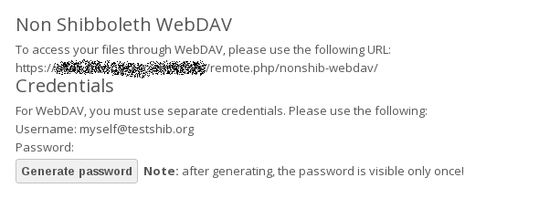

=====================================================
Shibboleth Integration (Enterprise Subscription only)
=====================================================

Introduction
------------

The ownCloud Shibboleth user backend application integrates ownCloud with a 
Shibboleth Service Provider (SP) and allows operations in federated and 
single-sign-on infrastructures.

Currently supported installations are based on the `native Apache integration`_ 
. The individual configuration of the service provider is highly dependent on 
the operating system, as well as on the integration with the Identity 
Providers (IdP), and deserve case-by-case analysis and installation.

The ownCloud Desktop Client and mobile clients can interact with an 
ownCloud instance running inside a Shibboleth Service Provider by using built-in 
browser components for authentication against the IdP.

Apache Configuration
--------------------

This is an example configuration as installed and operated on a Linux server 
running the Apache Web server. These configurations are highly operating system 
specific and require a high degree of customization.

The ownCloud instance itself is installed in ``/var/www/owncloud/``.  The 
following aliases are defined in an Apache virtual host directive:

.. code-block:: apache

	# non-Shibboleth access
	Alias /owncloud /var/www/owncloud/
	# for Shibboleth access
	Alias /oc-shib /var/www/owncloud/

Further Shibboleth specific configuration as defined in 
``/etc/apache2/conf.d/shib.conf``:

.. code-block:: apache

	#
	# Load the Shibboleth module.
	#
	LoadModule mod_shib /usr/lib64/shibboleth/mod_shib_22.so

	#
	# Ensures handler will be accessible.
	#
	<Location /Shibboleth.sso>
	  Satisfy Any
	  Allow from all
	</Location>

	#
	# Configure the module for content.
	#
	# Shibboleth is disabled for the following location to allow non 
	  shibboleth webdav access
	<Location ~ "/oc-shib/remote.php/nonshib-webdav">
	  Satisfy Any
	  Allow from all
	  AuthType None
	  Require all granted
	</Location>

	# Shibboleth is disabled for the following location to allow public link 
	  sharing
	<Location ~ 
	  "/oc-shib/(status.php$
	  |public.php$
	  |cron.php$
	  |core/img/
	  |index.php/apps/files_sharing/publicpreview.png$
	  |index.php/apps/files/ajax/upload.php$
	  |index.php/core/ajax/translations.php$
	  |apps/files/templates/fileexists.html$
	  |index.php/apps/files/ajax/mimeicon.php$)">
	  Satisfy Any
	  Allow from all
	  AuthType None
	  Require all granted
	</Location>

	# Shibboleth is disabled for the following location to allow public gallery 
          sharing
	<Location ~ 
         "/oc-shib/(apps/gallery/templates/slideshow.html$
         |index.php/apps/gallery/ajax/getimages.php	
         |index.php/apps/gallery/ajax/thumbnail.php
         |index.php/apps/gallery/ajax/image.php)">
	  Satisfy Any
	  Allow from all
	  AuthType None
	  Require all granted
	</Location>

	# Shibboleth is disabled for the following location to allow public link 
	  sharing
	<Location ~ "/oc-shib/.*\.css">
	  Satisfy Any
	  Allow from all
	  AuthType None
	  Require all granted
	</Location>

	# Shibboleth is disabled for the following location to allow public link 
	  sharing
	<Location ~ "/oc-shib/.*\.js">
	  Satisfy Any
	  Allow from all
	  AuthType None
	  Require all granted
	</Location>

	# Besides the exceptions above this location is now under control of 
	  Shibboleth
	<Location /oc-shib>
	  AuthType shibboleth
	  ShibRequireSession On
	  ShibUseHeaders Off
	  ShibExportAssertion On
	  require valid-user
	</Location>

Application Configuration
-------------------------

After installing and enabling the Shibboleth application there are three 
configuration variables to set up, depending on the data sent back by the 
IdP. The configuration is stored in ``config.php``:

.. code-block:: php

	namespace OCA\user_shibboleth {
	        const SHIB_SESSION_ID = 'Shib-Session-ID';
	        const SHIB_EPPN = 'eppn';
	        const SHIB_EMAIL = 'eppn';
	        const SHIB_DISPLAY_NAME = 'eppn';
	}

+---------------------+--------------------------------------------------------+
| Parameter           | Description                                            |
+---------------------+--------------------------------------------------------+
| SHIB_SESSION_ID     | This constant defines the name of the environment      |
|                     | variable holding the Shibboleth session id.            |
+---------------------+--------------------------------------------------------+
| SHIB_EPPN           | This constant defines the name of the environment      |
|                     | variable which holds the EPPN (eduPersonPrincipalName).| 
|                     | This is the unique user identifier.                    | 
+---------------------+--------------------------------------------------------+
| SHIB_EMAIL          | The environment variable with this given name holds the|
|                     | email address of the logged-in user.                   |
+---------------------+--------------------------------------------------------+
| SHIB_DISPLAY_NAME   | This constant defines the name of the environment      |
|                     | variable holding the user's display name.              |
+---------------------+--------------------------------------------------------+

WebDAV Support
--------------

Users of standard WebDAV clients can use an alternative 
WebDAV Url, for example ``https://cloud.example.com/remote.php/nonshib-webdav/``
to log in with their username and password. The password is generated on the 
Personal settings page.

For provisioning purpose an OCS API has been added to revoke a generated 
password for a user:

Syntax: ``/v1/cloud/users/{userid}/non_shib_password``

* HTTP method: DELETE

Status codes:

* 100 - successful
* 998 - user unknown

Known Limitations
-----------------

Encryption
----------

File encryption can not be used together with Shibboleth because the encryption 
requires the user's password to unlock the private encryption key. Due to the 
nature of Shibboleth the user's password is not known to the service provider. 
Currently, we have no solution to this limitation.

Other Login Mechanisms
----------------------

Shibboleth is not compatible with any other ownCloud user backend because the 
login process is handled outside of ownCloud.

You can allow other login mechanisms (e.g. LDAP or ownCloud native) by creating 
a second Apache virtual host configuration. This second location is not 
protected by Shibboleth, and you can use your other ownCloud login mechanisms.

Session Timeout
---------------

Session timeout on Shibboleth is controlled by the IdP. It is not possible to 
have a session length longer than the length controlled by the IdP. In extreme 
cases this could result in re-login on mobile clients and desktop clients every 
hour.

The session timeout can be overridden in the service provider, but this 
requires a source code change of the Apache Shibboleth module. A patch can be 
provided by the ownCloud support team.

.. _native Apache integration: 
    https://wiki.shibboleth.net/confluence/display/SHIB2/NativeSPApacheConfig
.. _WebDAV and Shibboleth: 
    https://wiki.shibboleth.net/confluence/display/SHIB2/WebDAV
    