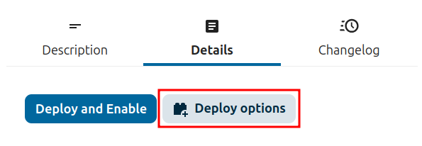
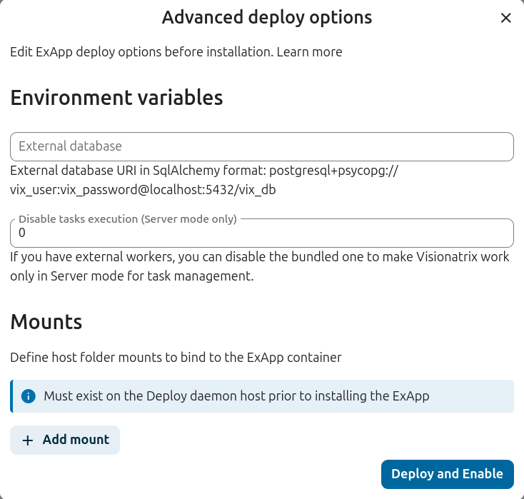
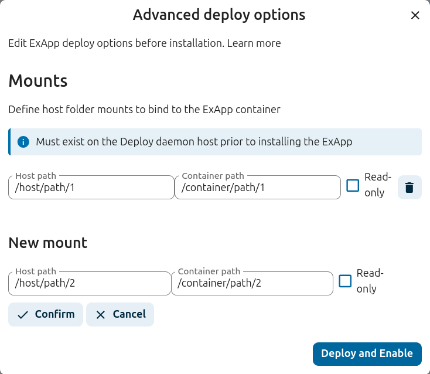

=======================
Advanced Deploy Options
=======================

AppAPI allows optionally to configure environment variables and mounts for the ExApp container.

It is available via "Deploy options" modal next to "Deploy and Enable" button in the sidebar of the ExApp page on the Apps management page:

Or via CLI (:ref:`advanced_deploy_options_cli`).

Environment Variables
---------------------

Environment variables enable more precise configuration of the ExApp.
ExApp developers can define the list of supported environment variables with descriptions,
only these variables will be available for configuration.

By default there are only mounts available for configuration.

When ExApp installed the list of set environment variables will be displayed.

Mounts
------

Mounts can be used to provide additional data to the ExApp container from the host.
For example, it will be useful for some apps to provide a folder with SSL certs of your cloud,
so the app can handle HTTPS correctly without any additional re-installation of the ExApp.

