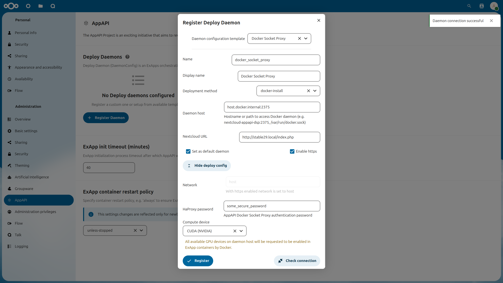
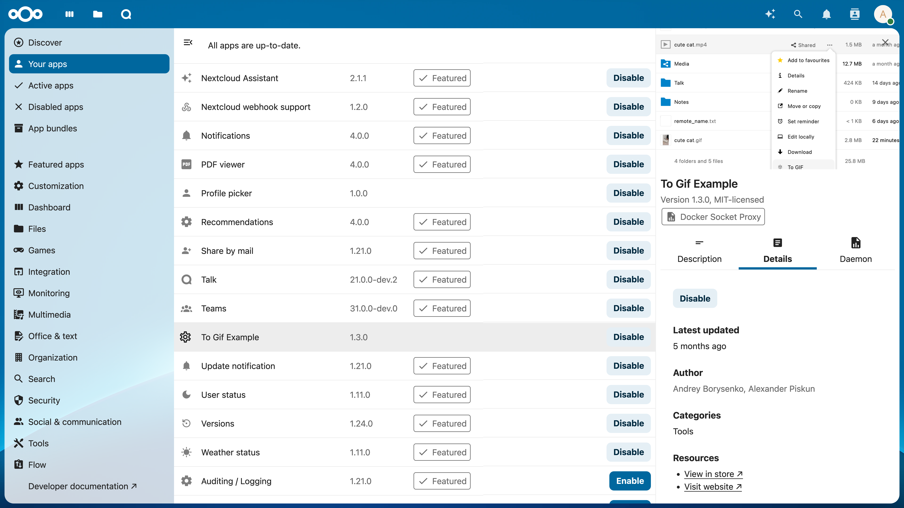

========================
AppAPI and External Apps
========================

.. _ai-app_api:

Previously, Nextcloud only supported applications written in the PHP programming language.
In order to support a wider range of use cases,
an ecosystem for **ExApps** (short for "External Apps") was introduced, allowing for the installation of apps as Docker containers.

Most of our :doc:`Artificial Intelligence <../ai/index>` (AI) apps are developed as ExApps and thus may require some preparation of your Nextcloud instance before you can install them.

Installing AppAPI
-----------------

All ExApps require the `AppAPI <https://apps.nextcloud.com/apps/app_api>`_ Nextcloud app as a dependency.
As of Nextcloud version 30.0.1, AppAPI is automatically installed by default.
If AppAPI is not installed, you can still install it by simply navigating to the Apps management page in your Nextcloud instance and search for AppAPI from the Tools category.

Setup deploy daemon
-------------------

A Deploy Daemon is a way for Nextcloud to install, communicate with, and control ExApps.

.. note::
	If you are using Nextcloud AIO with the "Docker Socket Proxy" container enabled, a Deploy Daemon will be automatically created and configured to work out-of-the-box.
	Otherwise, follow the steps below to set up a Deploy Daemon from the AppAPI admin settings.

1. Setup a Docker container called `docker-socket-proxy <https://github.com/nextcloud/docker-socket-proxy#readme>`_ that proxies access to Docker for your Nextcloud instance.
2. Go to the AppAPI admin settings.
3. Click on the "Register Daemon" button.
4. Fill in the required fields:
	- ``Name``: unique name of the Deploy daemon
	- ``Display name``: the name that will be displayed in the UI
	- ``Deployment method``: by default, you will need to choose ``docker_install`` (``manual_install`` is for development or custom use case of manual ExApp installation)
	- ``Daemon Host``: hostname/IP address + port of the Deploy daemon
	- ``Nextcloud URL``: autofilled with current domain, you might need to change the protocol to http/https depending on your setup
	- ``Set as default daemon``: check if you want set new Deploy daemon as default
	- ``Enable https``: check if your Deploy daemon (Docker Socket Proxy) is configured with TLS
	- Deploy Config:
		- ``Network``: Docker network name, depends on your networking setup, enforces to "host" if "Enable https" is checked
		- ``HaProxy password``: password for Docker Socket Proxy, if it is configured with TLS
		- ``Compute Device``: CPU, CUDA or ROCm, depending on your hardware config on Deploy daemon host machine
		- ``Add additional option`` (see :ref:`additional_options_list`): setup additional KEY + VALUE deploy config options
5. Click "Check connection" to verify that the configuration is correct.
6. Click "Register" to save the Deploy Daemon configuration.

.. note::
	For remote DSP setup, it should expose the ports on the host.

Deployment configuration examples can be found :doc:`here <./DeployConfigurations>`.

Installing ExApps
-----------------

You can now install ExApps from the Nextcloud App Store by clicking "Install" on the respective app in the Apps page.
If successful, the ExApp will be displayed under the "Your apps" list.

FAQ
---

* I have two graphics cards XXX with 6/8/Y GB of ram each. How can I run something which does not fit into one graphics card?
    * Distributing models across multiple GPUs is currently not supported. You will need a GPU that fits all of the model you are trying to use.
* I have YYY graphics card that does not supports CUDA - can I use it and how?
    * No, our AI apps require GPUs with CUDA support to function at this time.
* What is the minimum VRAM size requirement for the GPU if I want to install multiple apps?
    * When running multiple ExApps on the same GPU, the GPU must hold the largest model amongst the apps you install.
* Is it possible to add more graphics cards for my instance to enable parallel requests or to speed up one request?
    * Parallel processing of AI workloads for the same app with multiple GPUs is currently not supported.
* Can I use the CPU and GPU in parallel for AI processing?
    * No, you can only process AI workloads on either the CPU or GPU for one app. For different apps, you can decide whether to run them on CPU or GPU.
