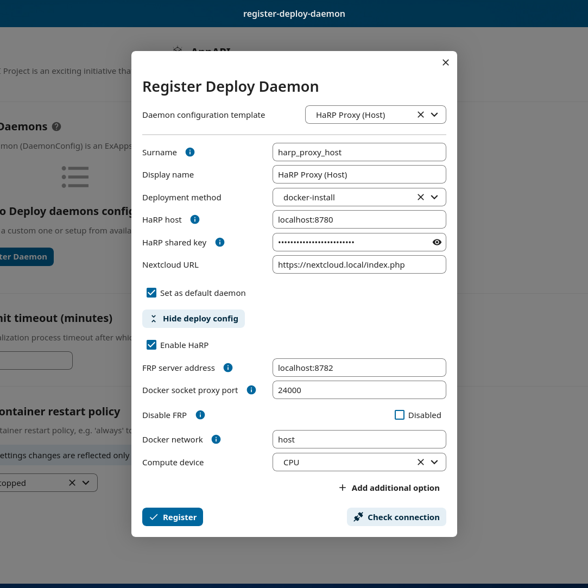
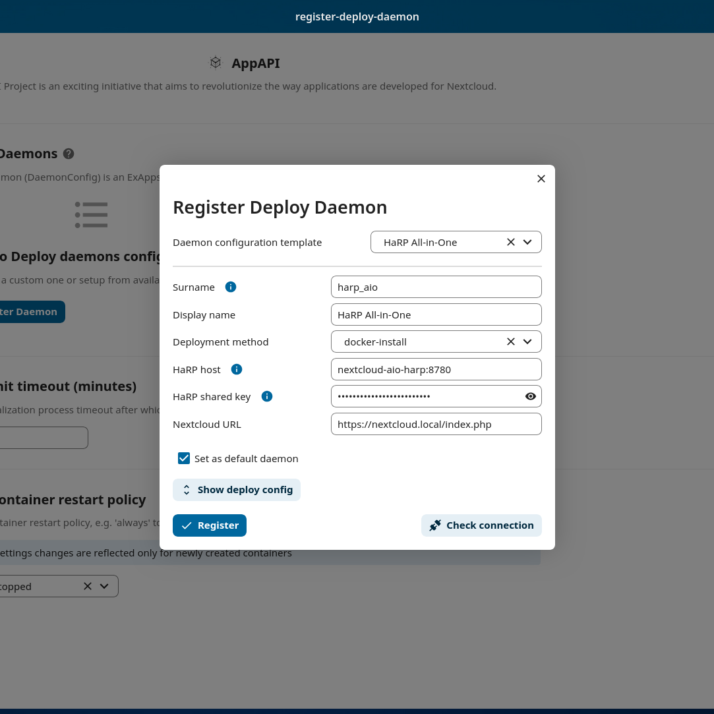

.. _deploy-configs:

Deployment configurations
=========================

Currently, two kinds of application deployments are supported:
	* :ref:`Docker Deploy Daemon (Docker Socket Proxy) <ai-app_api_ddd-dsp>`
	* :ref:`Docker Deploy Daemon (HaRP) <ai-app_api_ddd-harp>`

Docker Deploy Daemon
--------------------

Orchestrates the deployment of applications as Docker containers.

.. warning::

	| The administrator is responsible for the security actions taken to configure the Docker daemon connected to the Nextcloud instance.
	| These schemes are only examples of possible configurations.

	| For Docker Deploy Daemon (HaRP), `AppAPI HaRP <https://github.com/nextcloud/harp>`_ is required or `AIO HaRP <#nextcloud-in-aio-and-docker-on-the-same-host>`_ for Nextcloud AIO.
	| For Docker Deploy Daemon (Docker Socket Proxy), we recommend that you use the `AppAPI Docker Socket Proxy <https://github.com/nextcloud/docker-socket-proxy>`_ or `AIO Docker Socket Proxy <#nextcloud-in-docker-aio-all-in-one>`_ container for Nextcloud AIO.

There are several Docker Daemon Deploy configurations (example schemes):

	* Nextcloud and Docker on the **same host** (via socket, DockerSocketProxy, or HaRP)
	* Nextcloud on the host and Docker on a **remote** host (via DockerSocketProxy with HTTPS, or HaRP)
	* Nextcloud and **ExApps** in the **same Docker network** (via DockerSocketProxy, or HaRP)
	* Nextcloud in AIO Docker and **ExApps** in the **same Docker network** (via AIO DockerSocketProxy or HaRP)

.. _ai-app_api_ddd-harp:

Docker Deploy Daemon (HaRP)
---------------------------

| With HaRP, the ExApps initiate the connection for tunneling to the Nextcloud instance and the HaRP container so there is no need to expose any ports or open any firewall rules.
| See the diagrams of the respective configurations in the :ref:`Docker Deploy Daemon (Docker Socket Proxy) <ai-app_api_ddd-dsp>` section below.

A little introduction to the default ports of the HaRP container is given below. More about it can be found in the `HaRP's readme <https://github.com/nextcloud/harp?tab=readme-ov-file#environment-variables>`_.

* Port ``8780`` is the HTTP communication port used where Nextcloud connects to the HaRP container.
* Port ``8781`` is the HTTPS communication port when setup.
* Port ``8782`` is the FRP tunnel port used by ExApps to connect to the HaRP container.

In any of the cases, the following connections should succeed:

* Nextcloud -> HaRP container (on port 8780/8781)
* HaRP container -> Nextcloud (through proxy or directly as the NC_INSTANCE_URL env var dictates)
* ExApp -> HaRP container (on port 8782)
* ExApp -> Nextcloud (through proxy or directly as the ``Nextcloud URL`` in the daemon config dictates)

.. _ai-app_api_nc-harp-baremetal:

Nextcloud and Docker on the same host - with Nextcloud bare metal
^^^^^^^^^^^^^^^^^^^^^^^^^^^^^^^^^^^^^^^^^^^^^^^^^^^^^^^^^^^^^^^^^

The simplest configuration is when Nextcloud is installed on the host and docker is on the same host and applications are deployed to it.

Create a HaRP container with either ``--network host`` option or expose the ports ``8780`` and ``8782`` to the host.

.. code-block:: bash

  docker run \
    -e HP_SHARED_KEY="some_very_secure_password" \
    -e NC_INSTANCE_URL="https://127.0.0.1:8080" \
    -v /var/run/docker.sock:/var/run/docker.sock \
    -v `pwd`/certs:/certs \
    --name appapi-harp -h appapi-harp \
    --restart unless-stopped \
    -p 8780:8780 \
    -p 8782:8782 \
    -d ghcr.io/nextcloud/nextcloud-appapi-harp:release

Go to AppAPI admin settings and register a ``HaRP Proxy (Host)`` daemon.

Finally, test the whole setup with "Test deploy" in the 3-dots menu of the deploy daemon.

Nextcloud and Docker on the same host - with Nextcloud in Docker
^^^^^^^^^^^^^^^^^^^^^^^^^^^^^^^^^^^^^^^^^^^^^^^^^^^^^^^^^^^^^^^^

When Nextcloud is installed in Docker, the HaRP container can be created in the same docker network as the Nextcloud instance.

Create a HaRP container with ``--network <nextcloud_docker_network_name>`` option, where ``<nextcloud_docker_network_name>`` is the name of the Docker network in which Nextcloud is accessible.

.. code-block:: bash

  docker run \
    -e HP_SHARED_KEY="some_very_secure_password" \
    -e NC_INSTANCE_URL="https://nextcloud.tld" \
    -v /var/run/docker.sock:/var/run/docker.sock \
    -v `pwd`/certs:/certs \
    --name appapi-harp -h appapi-harp \
    --restart unless-stopped \
    --net <nextcloud_docker_network_name> \
    -d ghcr.io/nextcloud/nextcloud-appapi-harp:release

Go to AppAPI admin settings and register a ``HaRP Proxy (Docker)`` daemon. Take note of the ``<nextcloud_docker_network_name>`` value in the ``Docker network`` field.

Finally, test the whole setup with "Test deploy" in the 3-dots menu of the deploy daemon.

Docker on a remote host - with HaRP container on the local host
^^^^^^^^^^^^^^^^^^^^^^^^^^^^^^^^^^^^^^^^^^^^^^^^^^^^^^^^^^^^^^^

This configuration is suited for deployments that want to offload the heavy lifting of the ExApps to a remote host, especially when using GPUs as compute devices. There can be multiple deploy daemons that can be used to deploy ExApps on different remote hosts for different compute capabilities.
Here the HaRP container is deployed on the local host and the remote host tunnels the remote host's docker socket to the local host over the `FRP <https://github.com/fatedier/frp>`_ secure tunnel. The ExApps are deployed on the remote host.
A setup with the HaRP container itself on the remote is not supported.

1. Create a HaRP container in the local host following :ref:`the above examples <ai-app_api_nc-harp-baremetal>` but without the docker socket mount.

  .. code-block:: bash

    docker run \
      -e HP_SHARED_KEY="some_very_secure_password" \
      -e NC_INSTANCE_URL="https://127.0.0.1:8080" \
      -v `pwd`/certs:/certs \
      --name appapi-harp -h appapi-harp \
      --restart unless-stopped \
      -p 8780:8780 \
      -p 8782:8782 \
      -d ghcr.io/nextcloud/nextcloud-appapi-harp:release

2. Create a matching deploy daemon with ``Docker socket proxy port`` set to ``24001``.

  .. image:: ./img/harp_remote_24001.png

3. The FRP generated client certificates should be present in the ``certs`` folder locally. Copy the files ``client.crt``, ``client.key`` and ``ca.crt`` inside the ``certs`` folder to the remote host.
4. Create a folder structure on the remote host: ``mkdir -p certs/frp`` and copy the files ``client.crt``, ``client.key`` and ``ca.crt`` to the ``certs/frp`` folder.
5. Create a new file ``frpc.toml`` with the following contents. 

	.. code-block:: toml

		# frpc.toml
		serverAddr = "your.harp.server.address"          # Replace with your HP_FRP_ADDRESS host
		serverPort = 8782                                # Default port for FRP or the port your reverse proxy listens on
		loginFailExit = false                            # If the FRP (HaRP) server is unavailable, continue trying to log in.

		transport.tls.certFile = "certs/frp/client.crt"
		transport.tls.keyFile = "certs/frp/client.key"
		transport.tls.trustedCaFile = "certs/frp/ca.crt"
		transport.tls.serverName = "harp.nc"             # DO NOT CHANGE THIS VALUE

		metadatas.token = "some_very_secure_password"    # HP_SHARED_KEY in quotes

		[[proxies]]
		remotePort = 24001                               # Unique remotePort for each Docker Engine (range: 24001-24099)
		name = "deploy-daemon-1"                         # Unique name for each Docker Engine
		type = "tcp"
		[proxies.plugin]
		type = "unix_domain_socket"
		unixPath = "/var/run/docker.sock"

   | Make sure to replace the ``your.harp.server.address`` with the actual address of the local host where the HaRP container is running.
   | You might want to open the port ``8782`` on the local host firewall to allow the remote host to connect to it,
   | or use a reverse proxy to forward the requests to the HaRP container. An example with nginx is given below. Feel free to adjust the port you want to listen on. The FRP client will connect to this port exposed port.
   | With the reverse proxy config below, the whole setup would only need the main Nextcloud proxy to be exposed and reachable from the outside world, simplifying the network setup.

	.. code-block:: nginx

		stream {
		    server {
		        listen 8782;  # Replace with the port you want to listen on
		        proxy_pass 127.0.0.1:8782;
		        proxy_protocol off;
		        proxy_connect_timeout 10s;
		        proxy_timeout 300s;
		    }
		}

6. Download a release of the FRP client from `the official releases <https://github.com/fatedier/frp/releases/latest>`_ or `our snapshot from here <https://github.com/nextcloud/HaRP/tree/main/exapps_dev>`_.
7. Extract and copy the ``frpc`` binary to an appropriate location on the remote host, e.g. ``/usr/local/bin``.
8. Make it executable: ``chmod +x /usr/local/bin/frpc``.
9. Start the FRP client with the command: ``frpc -c /path/to/frpc.toml``.
10. Finally, test the whole setup with "Test deploy" in the 3-dots menu of the deploy daemon.

Nextcloud in AIO and Docker on the same host
^^^^^^^^^^^^^^^^^^^^^^^^^^^^^^^^^^^^^^^^^^^^

Nextcloud AIO (All-in-One) comes with a built-in HaRP container that can be used to deploy ExApps on the same host.
Enabling the "HaRP" container should automatically create a Deploy Daemon and configure it to work out-of-the-box.

Just go to AppAPI admin settings and register a ``HaRP All-in-One`` daemon.

Finally, test the whole setup with "Test deploy" in the 3-dots menu of the deploy daemon.

.. _ai-app_api_ddd-dsp:

Docker Deploy Daemon (Docker Socket Proxy)
------------------------------------------

NC & Docker on the Same-Host
^^^^^^^^^^^^^^^^^^^^^^^^^^^^

The simplest configuration is when Nextcloud is installed on the host and Docker is on the same host and applications are deployed to it.

.. mermaid::

	stateDiagram-v2
		classDef docker fill: #1f97ee, color: white, font-size: 34px, stroke: #364c53, stroke-width: 1px, background: url(https://raw.githubusercontent.com/nextcloud/documentation/master/admin_manual/exapps_management/img/docker.png) no-repeat center center / contain
		classDef nextcloud fill: #006aa3, color: white, font-size: 34px, stroke: #045987, stroke-width: 1px, background: url(https://raw.githubusercontent.com/nextcloud/documentation/master/admin_manual/exapps_management/img/nextcloud.svg) no-repeat center center / contain
		classDef python fill: #1e415f, color: white, stroke: #364c53, stroke-width: 1px

		Host

		state Host {
			Nextcloud --> Daemon : /var/run/docker.sock
			Daemon --> Containers

			state Containers {
				ExApp1
				--
				ExApp2
				--
				ExApp3
			}
		}

		class Nextcloud nextcloud
		class Daemon docker
		class ExApp1 python
		class ExApp2 python
		class ExApp3 python

Suggested config values(template *Custom default*):
	1. Daemon host: ``/var/run/docker.sock``
	2. HTTPS checkbox: *not supported using docker socket*
	3. Network: ``host``
	4. HaProxy password: **not supported using raw docker socket, should be empty**

---

Suggested way to communicate with Docker via `Docker Socket Proxy container <https://github.com/nextcloud/docker-socket-proxy>`_.

.. mermaid::

	stateDiagram-v2
		classDef docker fill: #1f97ee, color: white, font-size: 34px, stroke: #364c53, stroke-width: 1px, background: url(https://raw.githubusercontent.com/nextcloud/documentation/master/admin_manual/exapps_management/img/docker.png) no-repeat center center / contain
		classDef nextcloud fill: #006aa3, color: white, font-size: 34px, stroke: #045987, stroke-width: 1px, background: url(https://raw.githubusercontent.com/nextcloud/documentation/master/admin_manual/exapps_management/img/nextcloud.svg) no-repeat center center / contain
		classDef python fill: #1e415f, color: white, stroke: #364c53, stroke-width: 1px

		Host

		state Host {
			Nextcloud --> DockerSocketProxy: by port
			Docker --> Containers
			Docker --> DockerSocketProxy : /var/run/docker.sock

			state Containers {
				DockerSocketProxy --> ExApp1
				DockerSocketProxy --> ExApp2
				DockerSocketProxy --> ExApp3
			}
		}

		class Nextcloud nextcloud
		class Docker docker
		class ExApp1 python
		class ExApp2 python
		class ExApp3 python

Suggested config values(template *Docker Socket Proxy*):
	1. Daemon host: ``localhost:2375``
		Choose **A** or **B** option:
			A. Docker Socket Proxy should be deployed with ``network=host`` and ``BIND_ADDRESS=127.0.0.1``
			B. Docker Socket Proxy should be deployed with ``network=bridge`` and it's port should be published to host's 127.0.0.1(e.g. **-p 127.0.0.1:2375:2375**)
	2. HTTPS checkbox: **disabled**
	3. Network: ``host``
	4. HaProxy password: **should not be empty**

.. warning::

	Be careful with option ``A``, by default **Docker Socket Proxy** binds to ``*`` if ``BIND_ADDRESS`` is not specified during container creation.
	Check opened ports after finishing configuration.

Docker on a remote host
^^^^^^^^^^^^^^^^^^^^^^^

Distributed configuration occurs when Nextcloud is installed on one host and Docker is located on a remote host, resulting in the deployment of applications on the remote host.

Benefit: no performance impact on Nextcloud host.

In this case, the AppAPI uses a Docker Socket Proxy deployed on remote host to access docker socket and ExApps.

.. mermaid::

	stateDiagram-v2
		classDef docker fill: #1f97ee, color: white, font-size: 34px, stroke: #364c53, stroke-width: 1px, background: url(https://raw.githubusercontent.com/nextcloud/documentation/master/admin_manual/exapps_management/img/docker.png) no-repeat center center / contain
		classDef nextcloud fill: #006aa3, color: white, font-size: 34px, stroke: #045987, stroke-width: 1px, background: url(https://raw.githubusercontent.com/nextcloud/documentation/master/admin_manual/exapps_management/img/nextcloud.svg) no-repeat center center / contain
		classDef python fill: #1e415f, color: white, stroke: #364c53, stroke-width: 1px

		Direction LR

			Host1 --> Host2 : by port

		state Host1 {
			Nextcloud
		}

		state Host2 {
			[*] --> DockerSocketProxy : by port
			Daemon --> Containers

			state Containers {
				[*] --> DockerSocketProxy : /var/run/docker.sock
				DockerSocketProxy --> ExApp1
				DockerSocketProxy --> ExApp2
				DockerSocketProxy --> ExApp3
			}
		}

		class Nextcloud nextcloud
		class Daemon docker
		class ExApp1 python
		class ExApp2 python
		class ExApp3 python

Suggested config values(template *Docker Socket Proxy*):
	1. Daemon host: ADDRESS_OF_REMOTE_MACHINE (e.g. **server_name.com:2375**)
	2. HTTPS checkbox: ``enabled``
	3. Network: ``host``
	4. HaProxy password: **should not be empty**

NC & ExApps in the same Docker
^^^^^^^^^^^^^^^^^^^^^^^^^^^^^^

Applications are deployed in the same Docker where Nextcloud resides.

Suggested way to communicate with Docker: via ``docker-socket-proxy``.

.. mermaid::

	stateDiagram-v2
		classDef docker fill: #1f97ee, color: white, font-size: 34px, stroke: #364c53, stroke-width: 1px, background: url(https://raw.githubusercontent.com/nextcloud/documentation/master/admin_manual/exapps_management/img/docker.png) no-repeat center center / contain
		classDef nextcloud fill: #006aa3, color: white, font-size: 34px, stroke: #045987, stroke-width: 1px, background: url(https://raw.githubusercontent.com/nextcloud/documentation/master/admin_manual/exapps_management/img/nextcloud.svg) no-repeat center center / contain
		classDef python fill: #1e415f, color: white, stroke: #364c53, stroke-width: 1px

		Host

		state Host {
			Daemon --> Containers

			state Containers {
				[*] --> DockerSocketProxy : /var/run/docker.sock
				Nextcloud --> DockerSocketProxy: by port
				--
				DockerSocketProxy --> ExApp1
				DockerSocketProxy --> ExApp2
			}
		}

		class Nextcloud nextcloud
		class Daemon docker
		class ExApp1 python
		class ExApp2 python
		class ExApp3 python

Suggested config values(template *Docker Socket Proxy*):
	1. Daemon host: nextcloud-appapi-dsp:2375
	2. HTTPS checkbox: ``disabled``
	3. Network: `user defined network <https://docs.docker.com/network/#user-defined-networks>`_
	4. HaProxy password: **should not be empty**

.. note::
	Network **should not be the default docker's bridge** as it does not support DNS resolving by container names.

	This means that **Docker Socket Proxy**, **Nextcloud** and **ExApps** containers should all be in the same docker network, different from the default **bridge**.

.. _nextcloud-in-docker-aio-all-in-one:

Nextcloud in Docker AIO (all-in-one)
^^^^^^^^^^^^^^^^^^^^^^^^^^^^^^^^^^^^

In the case of AppAPI in Docker AIO setup (installed in Nextcloud container).

.. note::

	AIO Docker Socket Proxy container must be enabled.

.. mermaid::

	stateDiagram-v2
		classDef docker fill: #1f97ee, color: white, font-size: 34px, stroke: #364c53, stroke-width: 1px, background: url(https://raw.githubusercontent.com/nextcloud/documentation/master/admin_manual/exapps_management/img/docker.png) no-repeat center center / contain
		classDef docker2 fill: #1f97ee, color: white, font-size: 20px, stroke: #364c53, stroke-width: 1px, background: url(https://raw.githubusercontent.com/nextcloud/documentation/master/admin_manual/exapps_management/img/docker.png) no-repeat center center / contain
		classDef nextcloud fill: #006aa3, color: white, font-size: 34px, stroke: #045987, stroke-width: 1px, background: url(https://raw.githubusercontent.com/nextcloud/documentation/master/admin_manual/exapps_management/img/nextcloud.svg) no-repeat center center / contain
		classDef python fill: #1e415f, color: white, stroke: #364c53, stroke-width: 1px

		Host

		state Host {
			Daemon --> Containers

			state Containers {
				[*] --> NextcloudAIOMasterContainer : /var/run/docker.sock
				[*] --> DockerSocketProxy : /var/run/docker.sock
				NextcloudAIOMasterContainer --> Nextcloud
				AppAPI --> Nextcloud : installed in
				Nextcloud --> DockerSocketProxy
				DockerSocketProxy --> ExApp1
				DockerSocketProxy --> ExApp2
				DockerSocketProxy --> ExApp3
			}
		}

		class Nextcloud nextcloud
		class Daemon docker
		class Daemon2 docker2
		class ExApp1 python
		class ExApp2 python
		class ExApp3 python

AppAPI will automatically create the default DaemonConfig for AIO Docker Socket Proxy in order to use it as an orchestrator to create ExApp containers.

.. note::

	Default DaemonConfig will be created only if the default DaemonConfig is not already registered.

Default AIO Deploy Daemon (Docker Socket Proxy)
***********************************************

Nextcloud AIO has a specifically created Docker Socket Proxy container to be used as the Deploy Daemon in AppAPI.
It has `fixed parameters <https://github.com/nextcloud/app_api/blob/main/lib/DeployActions/AIODockerActions.php#L52-L74)>`_:

* Name: ``docker_aio``
* Display name: ``AIO Docker Socket Proxy``
* Accepts Deploy ID: ``docker-install``
* Protocol: ``http``
* Host: ``nextcloud-aio-docker-socket-proxy:2375``
* Compute device: ``CPU``
* Network: ``nextcloud-aio``
* Nextcloud URL (passed to ExApps): ``https://$NC_DOMAIN``

Docker Socket Proxy security
****************************

AIO Docker Socket Proxy has strictly limited access to the Docker APIs described in `HAProxy configuration <https://github.com/nextcloud/all-in-one/blob/main/Containers/docker-socket-proxy/haproxy.cfg>`_.

NC to ExApp Communication
-------------------------

Communications between Nextcloud and ExApps are done via the AppAPI.
With Docker Socket Proxy, the requests are sent to the ExApp container directly.
For HaRP, the communication goes through the main Nextcloud proxy and the HaRP container.

Each type of DeployDaemon necessarily implements the ``resolveExAppUrl`` function.

It has the prototype:

.. code-block:: php

	public function resolveExAppUrl(
		string $appId, string $protocol, string $host, array $deployConfig, int $port, array &$auth
	) {}

where:

* **protocol** is daemon protocol value
* **host** is daemon host value, *can be DNS:port or IP:PORT or even path to docker socket*.
* **port** is an integer with ExApp port
* **deployConfig** can be custom for each Daemon type
* **auth** is an optional array, with *Basic Authentication* data if needed to access ExApp

.. note::

	Applies only to Docker Socket Proxy.

	The optional additional parameter *OVERRIDE_APP_HOST* can be used to
	override the host that will be used for ExApp binding.

	It can be ``0.0.0.0`` in some specific configurations, when VPN is used
	or both Nextcloud instance and ExApps are one the same physical machine but different virtual environments.

	Also you can specify something like ``10.10.2.5`` and in this case ``ExApp`` will try to bind to that address and
	AppAPI will try to send request s directly to this address assuming that ExApp itself bound on it.

The simplest implementation is in the **Manual-Install** deploy type:

.. code-block:: php

	public function resolveExAppUrl(
		string $appId, string $protocol, string $host, array $deployConfig, int $port, array &$auth
	): string {
		if (boolval($deployConfig['harp'] ?? false)) {
			$url = rtrim($deployConfig['nextcloud_url'], '/');
			if (str_ends_with($url, '/index.php')) {
				$url = substr($url, 0, -10);
			}
			return sprintf('%s/exapps/%s', $url, $appId);
		}

		$auth = [];
		if (isset($deployConfig['additional_options']['OVERRIDE_APP_HOST']) &&
			$deployConfig['additional_options']['OVERRIDE_APP_HOST'] !== ''
		) {
			$wideNetworkAddresses = ['0.0.0.0', '127.0.0.1', '::', '::1'];
			if (!in_array($deployConfig['additional_options']['OVERRIDE_APP_HOST'], $wideNetworkAddresses)) {
				$host = $deployConfig['additional_options']['OVERRIDE_APP_HOST'];
			}
		}
		return sprintf('%s://%s:%s', $protocol, $host, $port);
	}

| Here we see that AppAPI sends requests to the **host**:**port** specified during daemon creation for manual-install without HaRP.
| But it exclusively uses the ``http(s)://nextcloud.example.tld/exapps/`` route for manual deployments using the HaRP proxy. ``http(s)://nextcloud.example.tld`` is the Nextcloud URL specified in the daemon config. Take care to configure the ``/exapps/`` route in your reverse proxy accordingly if your Nextcloud instance is on a subpath ``https://nextcloud.example.tld/nextcloud``. See `Configuring Your Reverse Proxy <https://github.com/nextcloud/harp?tab=readme-ov-file#configuring-your-reverse-proxy>`_ in the HaRP readme for examples.

Now, let's take a look at the Docker Daemon implementation of ``resolveExAppUrl``:

.. code-block:: php

	public function resolveExAppUrl(
		string $appId, string $protocol, string $host, array $deployConfig, int $port, array &$auth
	): string {
		if (boolval($deployConfig['harp'] ?? false)) {
			$url = rtrim($deployConfig['nextcloud_url'], '/');
			if (str_ends_with($url, '/index.php')) {
				$url = substr($url, 0, -10);
			}
			return sprintf('%s/exapps/%s', $url, $appId);
		}

		$auth = [];
		if (isset($deployConfig['additional_options']['OVERRIDE_APP_HOST']) &&
			$deployConfig['additional_options']['OVERRIDE_APP_HOST'] !== ''
		) {
			$wideNetworkAddresses = ['0.0.0.0', '127.0.0.1', '::', '::1'];
			if (!in_array($deployConfig['additional_options']['OVERRIDE_APP_HOST'], $wideNetworkAddresses)) {
				return sprintf(
					'%s://%s:%s', $protocol, $deployConfig['additional_options']['OVERRIDE_APP_HOST'], $port
				);
			}
		}
		$host = explode(':', $host)[0];
		if ($protocol == 'https') {
			$exAppHost = $host;
		} elseif (isset($deployConfig['net']) && $deployConfig['net'] === 'host') {
			$exAppHost = 'localhost';
		} else {
			$exAppHost = $appId;
		}
		if ($protocol == 'https' && isset($deployConfig['haproxy_password']) && $deployConfig['haproxy_password'] !== '') {
			// we only set haproxy auth for remote installations, when all requests come through HaProxy.
			$haproxyPass = $this->crypto->decrypt($deployConfig['haproxy_password']);
			$auth = [self::APP_API_HAPROXY_USER, $haproxyPass];
		}
		return sprintf('%s://%s:%s', $protocol, $exAppHost, $port);
	}

The route for HaRP setups remain the same here as in the previous example. All the requests are sent to the Nextcloud URL with the ``/exapps/`` route.

For Docker Socket Proxy, however, we have much more complex algorithm of detecting to where requests should be send.

First of all, if the protocol is set to ``https``, AppAPI always sends requests to the daemon host,
and in this case, it is a HaProxy that will forward requests to ExApps that will be listening on ``localhost``.

Briefly, it will look like this (*haproxy_host==daemon host value*):

NC --> *https* --> ``haproxy_host:ex_app_port`` --> *http* --> ``localhost:ex_app_port``

When the protocol is not ``https`` but ``http``, then what will be the endpoint where to send requests is determined by ``$deployConfig['net']`` value.

If ``net`` is defined and equal to ``host``, then AppAPI assumes that ExApp is installed somewhere in the current host network and will be available on ``localhost`` loop-back adapter.

NC --> *http* --> ``localhost:ex_app_port``

In all other cases, the ExApp should be available by it's name: e.g. when using docker **custom bridge** network all containers available by DNS.

NC --> *http* --> ``app_container_name:ex_app_port``

These three different types of communication cover most popular configurations.
