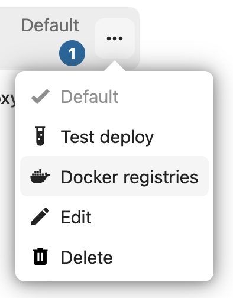
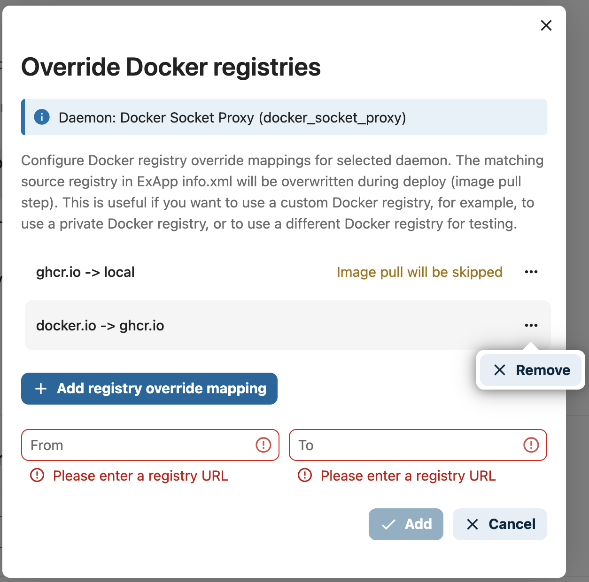

 .. _managing-deploy-daemons:

Managing Deploy Daemons
=======================

OCC CLI
^^^^^^^

There are a few OCC CLI commands to manage Deploy Daemons:

1. Register ``occ app_api:daemon:register``
2. Unregister ``occ app_api:daemon:unregister``
3. List registered daemons ``occ app_api:daemon:list``
4. Add a Docker registry mapping ``occ app_api:daemon:registry:add``
5. Remove a Docker registry mapping ``occ app_api:daemon:registry:remove``
6. List Docker registry mappings ``occ app_api:daemon:registry:list``

Register
--------

Register Deploy Daemon (DaemonConfig).

Command: ``app_api:daemon:register [--net NET] [--haproxy_password HAPROXY_PASSWORD] [--compute_device COMPUTE_DEVICE] [--set-default] [--harp] [--harp_frp_address HARP_FRP_ADDRESS] [--harp_shared_key HARP_SHARED_KEY] [--harp_docker_socket_port HARP_DOCKER_SOCKET_PORT] [--harp_exapp_direct] [--] <name> <display-name> <accepts-deploy-id> <protocol> <host> <nextcloud_url>``

Arguments
*********

* ``name`` - unique name of the daemon (e.g. ``docker_local_sock``)
* ``display-name`` - name of the daemon (e.g. ``My Local Docker``, will be displayed in the UI)
* ``accepts-deploy-id`` - type of deployment (``docker-install`` or ``manual-install``)
* ``host`` - **path to docker-socket**  or the Docker Socket Proxy: ``address:port``
* ``protocol`` - protocol used to communicate with the Daemon/ExApps (``http`` or ``https``)
* ``nextcloud_url`` - Nextcloud URL, Daemon config required option (e.g. ``https://nextcloud.local``)

Options
*******

* ``--net [network-name]``  - ``[required]`` network name to bind docker container to (default: ``host``)
* ``--haproxy_password HAPROXY_PASSWORD`` - ``[optional]`` password for AppAPI Docker Socket Proxy
* ``--compute_device GPU`` - ``[optional]`` GPU device to expose to the daemon (e.g. ``cpu|cuda|rocm``, default: ``cpu``)
* ``--set-default`` - ``[optional]`` set created daemon as default for ExApps installation
* ``--harp`` - ``[optional]`` Flag to set daemon to use HaRP for all docker and exapp communication
* ``--harp_frp_address`` - ``[optional]`` [host]:[port] of the HaRP FRP server, default host is same as HaRP host and port is 8782
* ``--harp_shared_key`` - ``[optional]`` HaRP shared key for secure communication between HaRP and AppAPI
* ``--harp_docker_socket_port`` - ``[optional]`` 'remotePort' of the FRP client of the remote docker socket proxy. There is one included in the harp container so this can be skipped for default setups. (default: "24000")
* ``--harp_exapp_direct`` - ``[optional]`` Flag for the advanced setups only. Disables the FRP tunnel between ExApps and HaRP.

Usage Examples
**************

* Register a HaRP deploy daemon within the ``nextcloud`` docker network, with the ``appapi-harp`` container as the host and the ``appapi-harp:8782`` as the FRP server address. This can be paired with a HaRP container running in the same network.

    .. code-block:: bash

        occ app_api:daemon:register harp_proxy_docker "Harp Proxy (Docker)" "docker-install" "http" "appapi-harp:8780" "http://nextcloud.local" --net nextcloud --harp --harp_frp_address "appapi-harp:8782" --harp_shared_key "some_very_secure_password" --set-default --compute_device=cuda

* Register a HaRP deploy daemon with the ``localhost`` as the host and the ``localhost:8782`` as the FRP server address. This can be paired with a HaRP container running in the host network mode or that has exposed the ports ``8780`` and ``8782`` to the host.

    .. code-block:: bash

        app_api:daemon:register harp_proxy_host "Harp Proxy (Host)" "docker-install" "http" "localhost:8780" "http://nextcloud.local" --harp --harp_frp_address "localhost:8782" --harp_shared_key "some_very_secure_password" --set-default --compute_device=cuda

* Register a manual install deploy daemon with HaRP support. This can be paired with a HaRP container running in the same network. The HaRP container need not have access to a docker socket or any other ports exposed to the host. It will not create docker containers of the ExApps but will only proxy the requests to the ExApp process manually launched by the user.

    .. note::
        | The ExApp process should have a FRP Client (frpc) running in the same network as the HaRP container or should be able to connect to the ports exposed by the HaRP container.
        | If the communication has to go without the FRP client, the ``--harp_exapp_direct`` flag should be provided. The localhost IP address is always used as the host in this case for manual deployments and ``OVERRIDE_APP_HOST`` or the ``<app_id>`` is used for ExApp deployments. Take care not to use the host network mode or the default bridge network for this.

    .. code-block:: bash

        app_api:daemon:register manual_install_harp "Harp Manual Install" "manual-install" "http" "appapi-harp:8780" "http://nextcloud.local" --net nextcloud --harp --harp_frp_address "appapi-harp:8782" --harp_shared_key "some_very_secure_password"

* Register a Docker Socket Proxy deploy daemon with the ``nextcloud-appapi-dsp:2375`` as the host and the ``nextcloud`` docker network. This can be paired with a Docker Socket Proxy container running in the same network with the default port ``2375``.

    .. code-block:: bash

        app_api:daemon:register docker_install "Docker Socket Proxy" "docker-install" "http" "nextcloud-appapi-dsp:2375" "http://nextcloud.local" --net=nextcloud --set-default --compute_device=cuda

* Register a manual deploy daemon with ``host.docker.internal`` as the host used to connect to the ExApps.

    .. code-block:: bash

        app_api:daemon:register manual_install "Manual Install" "manual-install" "http" null "http://nextcloud.local"

* Register a local docker deploy daemon with the ``/var/run/docker.sock`` as the socket and the host, and the ``nextcloud`` docker network. This does not need a Docker Socket Proxy container. The compute device used by this daemon is ``CPU``.

    .. code-block:: bash

        app_api:daemon:register local_docker "Docker Local" "docker-install" "http" "/var/run/docker.sock" "http://nextcloud.local" --net=nextcloud

* Register a local docker deploy daemon with the ``/var/run/docker.sock`` as the socket and the host, and the ``nextcloud`` docker network. This does not need a Docker Socket Proxy container. The compute device used by this daemon is ``CUDA`` (NVIDIA).

    .. code-block:: bash

        app_api:daemon:register local_docker "Docker Local" "docker-install" "http" "/var/run/docker.sock" "http://nextcloud.local" --net=nextcloud --set-default --compute_device=cuda

.. _deploy_config:

DeployConfig
************

DeployConfig is a set of additional options in Daemon config, which are used in deployment algorithms to configure
ExApp container.

.. code-block:: json

    {
        "net": "host",
        "nextcloud_url": "https://nextcloud.local",
        "haproxy_password": "some_secure_password",
        "computeDevice": {
            "id": "cuda",
            "name": "CUDA (NVIDIA)",
        },
        "harp": {
            "frp_address": "localhost:8782",
            "docker_socket_port": "24000",
            "exapp_direct": false
        },
        "resourceLimits": {
            "memory": 2147483648,
            "nanoCPUs": 2000000000
        },
        "registries": [
            {"from": "ghcr.io", "to": "registry.example.com"}
        ]
    }

DeployConfig options
********************

    * ``net`` **[required]** - network name to bind docker container to (default: ``host``)
    * ``nextcloud_url`` **[required]** - Nextcloud URL (e.g. ``https://nextcloud.local``)
    * ``haproxy_password`` *[optional]* - password for AppAPI Docker Socket Proxy
    * ``computeDevice`` *[optional]* - Compute device to attach to the daemon (e.g. ``{ "id": "cuda", "label": "CUDA (NVIDIA)" }``)
    * ``harp`` *[optional]* - HaRP options, can be ``null`` in case of non-HaRP setups
        * ``frp_address`` *[optional]* - [host]:[port] of the HaRP FRP server, default host is same as HaRP host and port is 8782
        * ``docker_socket_port`` *[optional]* - 'remotePort' of the FRP client of the remote docker socket proxy. There is one included in the harp container so this can be skipped for default setups. [default: "24000"]
        * ``exapp_direct`` *[optional]* - Flag for the advanced setups only. Disables the FRP tunnel between ExApps and HaRP.
    * ``resourceLimits`` *[optional]* - limits applied to each ExApp container deployed by this daemon. Empty (``[]``) when no limits are set, and absent for daemons registered over the CLI, both of which mean unlimited. Each limit is only present when it is set
        * ``memory`` *[optional]* - memory limit **in bytes** (e.g. ``2147483648`` for 2 GiB). In the admin settings this is entered in MiB
        * ``nanoCPUs`` *[optional]* - CPU limit **in nanoCPUs**, where ``1000000000`` equals one CPU core (e.g. ``2000000000`` for 2 cores). In the admin settings this is entered in cores
    * ``registries`` *[optional]* - list of :ref:`Docker registry mappings <docker_registry_mappings>`, each entry being a ``{"from": ..., "to": ...}`` pair

Unregister
----------

Unregister Deploy Daemon (DaemonConfig).

Command: ``app_api:daemon:unregister <daemon-config-name>``

List registered daemons
-----------------------

List registered Deploy Daemons (DaemonConfigs).

Command: ``app_api:daemon:list``

.. _docker_registry_mappings:

Docker registry mappings
^^^^^^^^^^^^^^^^^^^^^^^^

.. versionadded:: 32.0.0

Every ExApp declares in its ``info.xml`` the registry its image is pulled from, usually ``ghcr.io`` or ``docker.io``.
A Deploy Daemon can override those registries so that images are pulled from somewhere else, without any change to the
ExApp itself. This is useful when your servers have no access to the public registries, when you mirror the ExApp
images into a private registry, or when you want to test locally built images.

.. note::
    Registry mappings only apply to daemons of the ``docker-install`` type. They have no effect on ``manual-install``
    daemons, because those do not pull images.

Finding the registry of an ExApp
--------------------------------

The registry to map is the one in the ``<registry>`` element of the ``<docker-install>`` section of the ExApp's
``info.xml``, which is part of the ExApp source:

.. code-block:: xml

    <info>
        ...
        <external-app>
            <docker-install>
                <registry>ghcr.io</registry>
                <image>example-org/exapp_name</image>
                <image-tag>1.0.0</image-tag>
            </docker-install>
            ...
        </external-app>
    </info>

Together these three elements form the image that is pulled, ``ghcr.io/example-org/exapp_name:1.0.0``. To redirect this
ExApp, add a mapping with ``ghcr.io`` as the source registry.

.. important::
    Only the registry is replaced. The ``<image>`` and ``<image-tag>`` values are used unchanged, so the image must be
    available in your custom registry under exactly the same repository path and tag, in this example
    ``example-org/exapp_name:1.0.0``. Mirror the image with its original name, for instance:

    .. code-block:: bash

        docker pull ghcr.io/example-org/exapp_name:1.0.0
        docker tag ghcr.io/example-org/exapp_name:1.0.0 registry.example.com/example-org/exapp_name:1.0.0
        docker push registry.example.com/example-org/exapp_name:1.0.0

How mappings are applied
------------------------

A mapping is a pair of registry domains: ``from`` is the registry declared by the ExApp, and ``to`` is the registry
that should be used instead. During deployment, at the image pull step, AppAPI compares the ExApp registry with the
``from`` value of each mapping. On the first match, the registry part of the image name is replaced with ``to``, while
the image name and tag stay untouched:

.. code-block:: text

    mapping:  ghcr.io -> registry.example.com

    declared: ghcr.io/example-org/exapp_name:1.0.0
    pulled:   registry.example.com/example-org/exapp_name:1.0.0

The special target ``local`` does not rewrite the image name. Instead it skips the image pull entirely, and the image is
expected to already be present on the Docker host under its original name, either pulled manually beforehand or built
locally:

.. code-block:: text

    mapping:  ghcr.io -> local

    declared: ghcr.io/example-org/exapp_name:1.0.0
    pulled:   nothing, the image already present on the host is used

.. warning::
    With a ``local`` target, AppAPI cannot pull a missing image. If the image is absent from the Docker host,
    deployment of the ExApp fails at the container creation step.

Mappings are stored per daemon in the ``registries`` key of its :ref:`DeployConfig <deploy_config>`, and are
applied to every ExApp deployed through that daemon. Only one mapping per ``from`` registry is allowed, and existing
ExApp containers are not affected: a mapping takes effect the next time an ExApp is deployed or updated.

.. important::
    AppAPI does not send registry credentials when pulling images. If your registry requires authentication, log the
    Docker daemon into it beforehand with ``docker login``, so the pull can succeed with the stored credentials.

Web interface
-------------

Open the AppAPI admin settings, click the three-dots menu of a Deploy Daemon and select **Docker registries**:

In the **Override Docker registries** dialog, the configured mappings are listed, and mappings with the ``local``
target are marked with *Image pull will be skipped*. Click **Add registry override mapping**, fill in the **From** and
**To** fields, and confirm with the **Add** button. To delete a mapping, use **Remove** in the three-dots menu of the
respective list entry:

Add a registry mapping
----------------------

Add a Docker registry mapping to a Deploy Daemon.

Command: ``app_api:daemon:registry:add [--registry-from REGISTRY-FROM] [--registry-to REGISTRY-TO] [--] <name>``

* ``name`` - name of the Deploy Daemon the mapping is added to (e.g. ``docker_install``)
* ``--registry-from`` - ``[required]`` registry declared by the ExApp (e.g. ``ghcr.io``)
* ``--registry-to`` - ``[required]`` registry to use instead, or ``local`` to skip the image pull

The command fails if the daemon does not exist, if a mapping for the same ``from`` registry is already configured, or
if both registries are the same.

* Pull images that ExApps declare on ``ghcr.io`` from a private registry instead:

    .. code-block:: bash

        sudo -E -u www-data php occ app_api:daemon:registry:add docker_install --registry-from "ghcr.io" --registry-to "registry.example.com"

* Use images that are already present on the Docker host instead of pulling them from ``ghcr.io``:

    .. code-block:: bash

        sudo -E -u www-data php occ app_api:daemon:registry:add docker_install --registry-from "ghcr.io" --registry-to "local"

Remove a registry mapping
-------------------------

Remove a Docker registry mapping from a Deploy Daemon. Both registries of the mapping must be given, so that the exact
pair is removed.

Command: ``app_api:daemon:registry:remove [--registry-from REGISTRY-FROM] [--registry-to REGISTRY-TO] [--] <name>``

* ``name`` - name of the Deploy Daemon the mapping is removed from (e.g. ``docker_install``)
* ``--registry-from`` - ``[required]`` source registry of the mapping to remove
* ``--registry-to`` - ``[required]`` target registry of the mapping to remove

    .. code-block:: bash

        sudo -E -u www-data php occ app_api:daemon:registry:remove docker_install --registry-from "ghcr.io" --registry-to "registry.example.com"

List registry mappings
----------------------

List the Docker registry mappings configured for a Deploy Daemon.

Command: ``app_api:daemon:registry:list <name>``

* ``name`` - name of the Deploy Daemon to list the mappings of (e.g. ``docker_install``)

    .. code-block:: bash

        sudo -E -u www-data php occ app_api:daemon:registry:list docker_install

The mappings are printed as ``from -> to`` pairs:

.. code-block:: text

    Configured registries for daemon "docker_install":
     - ghcr.io -> registry.example.com
     - docker.io -> local

Nextcloud AIO
^^^^^^^^^^^^^

In the case of AppAPI installed in AIO, a default Deploy Daemon is registered automatically.
It is possible to register additional Deploy Daemons using the same methods as described above.

.. _additional_options_list:

Additional options
^^^^^^^^^^^^^^^^^^

| There is a possibility to add additional options to the Deploy Daemon configuration, which are key-value pairs.
| This should not be used for HaRP.

Currently, the following options are available:

    - ``OVERRIDE_APP_HOST`` - can be used to override the host that will be used for ExApp binding (not passed to ExApp container envs)
