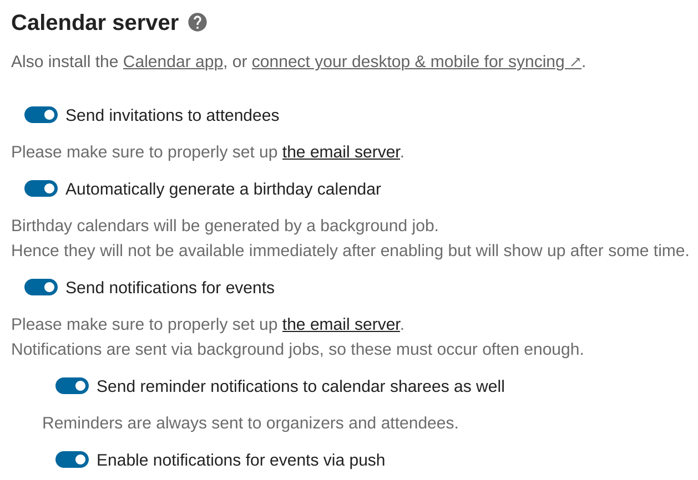

=================
Calendar / CalDAV
=================

Calendar server settings
------------------------

The calendar server can be configured on the Groupware admin settings page.
You can globally disable sending invitation emails for events, generating the built-in birthday
calendar, and sending email notifications about upcoming events.

.. versionadded:: 30 The section will be hidden if no app makes use of the CalDAV backend.

Starting from Nextcloud 30, the calendar server settings section will be hidden if no app uses the
CalDAV backend.
Install and enable an appropriate app to show the section again, e.g.
`Calendar <https://apps.nextcloud.com/apps/calendar>`_ or
`Tasks <https://apps.nextcloud.com/apps/tasks>`_.

Events
------

You can customize the events user interface.

Hide export buttons
~~~~~~~~~~~~~~~~~~~

By default users can export their calendar data from the event editor. Admins can disable this feature::

 sudo -E -u www-data php occ config:app:set calendar hideEventExport --value=yes

Invitations
-----------
Nextcloud can send invitations for event attendees if this option is activated.
Be sure to have configured the email server first so that the invitations go through.
See :doc:`../configuration_server/email_configuration`.

You must also make sure the "Send invitations to attendees" setting is activated in the admin setting groupware section for the emails to be sent.

Birthday calendar
-----------------
Contacts that have a birthday date filled are automatically added as events to a special Birthday calendar.
If you deactivate this option, all users will no longer have this calendar.

When activating this option, users birthday calendars won't be available right away because they need to be generated
by a background task. See :doc:`../occ_command` section DAV commands.

Reminder notifications
----------------------
Nextcloud handles sending notifications for events.

Nextcloud currently handles two types of reminder notifications: Built-in Nextcloud notifications and
email notifications. For the emails to be send, you'll need a configured email server.
See :doc:`../configuration_server/email_configuration`.

Make sure the "Send notifications for events" and the "Enable notifications for events via push" are activated in the admin setting groupware section for this feature to work.

Background jobs
~~~~~~~~~~~~~~~
Running background jobs can be an expensive task when there are a large number of events, reminders, event sharees and attendees. However, this needs to happen
often enough so that the notifications are sent on time. To accomplish this you should use a dedicated ``occ`` command that runs
more often than the standard ``cron`` system::

 # crontab -u www-data -e
 */5 * * * * php -f /var/www/nextcloud/occ dav:send-event-reminders

See :doc:`../occ_command` section Dav commands.

You'll also need to change the sending mode from ``background-job`` to ``occ``::

 sudo -E -u www-data php occ config:app:set dav sendEventRemindersMode --value occ

If you don't use this dedicated command, the reminders will just be sent as soon as possible when the background jobs run.

Event alarm types
-----------------

Nextcloud allows users to set notification and email reminders for events. Admins can enforce one of the two options::

 occ config:app:set calendar forceEventAlarmType --value=EMAIL

Allowed values are ``EMAIL`` (email) and ``DISPLAY`` (notification).

.. note:: This only enforces alarm types for events created with the Nextcloud Calendar. This setting has no influence for other connected applications.

FreeBusy
--------

When logged-in, Nextcloud can return FreeBusy information for all users of the instance, to know when they are available so that you can schedule an event at the right time.
If you don't wish for users to have this capability, you can disable FreeBusy for the whole instance with the following setting::

 sudo -E -u www-data php occ config:app:set dav disableFreeBusy --value yes

Subscriptions
-------------

Custom public calendars
~~~~~~~~~~~~~~~~~~~~~~~

In addition to the public holiday calendars, it is possible to define your own calendar.
They act in the same way as the holiday calendars and can be configured with the following command::

 sudo -E -u www-data php occ config:app:set calendar publicCalendars --value '[{"name":"My custom calendar","source":"http://example.com/example.ics"}]'

The setting is specified as a JSON array of objects with the following options:

* ``name`` - name of the calendar in the listing
* ``source`` - URL of the calendar's ICS file
* ``displayName`` - optional, to overwrite the name of the subscribed calendar
* ``description`` - optional, description in the listing
* ``authors`` - optional, copyrights and so on

Refresh rate
~~~~~~~~~~~~

Calendar subscriptions are cached on server and refreshed periodically.
If the calendar server provides a `refresh interval <https://icalendar.org/New-Properties-for-iCalendar-RFC-7986/5-7-refresh-interval-property.html>`_, it is respected.
Otherwise the default refresh rate is one day.

To set up a different default refresh rate for calendars without server side refresh rates, change the ``calendarSubscriptionRefreshRate`` option::

 sudo -E -u www-data php occ config:app:set dav calendarSubscriptionRefreshRate --value "PT6H"

Where the value is a `DateInterval <https://www.php.net/manual/dateinterval.construct.php>`_, for instance with the above command all of the Nextcloud instance's calendars would be refreshed every 6 hours.

Allow subscriptions on local network
~~~~~~~~~~~~~~~~~~~~~~~~~~~~~~~~~~~~

Because of security issues, Nextcloud forbids subscriptions from local network hosts.
If you need to allow this, change the following parameter to::

 sudo -E -u www-data php occ config:app:set dav webcalAllowLocalAccess --value yes

Federated calendar shares
-------------------------

.. versionadded:: 32.0.0

Nextcloud supports creating read-only federated calendar shares.
A user is able to share a calendar with a remote user on a federated instance.
For now, the shares are read-only and remote users are not able to change the events inside the
shared calendar.

The feature can be optionally disabled through an app config.
Run the following command to disable creating new federated calendar shares for all users::

  sudo -E -u www-data php occ config:app:set dav enableCalendarFederation --type=bool --value=false

Note that existing shares will be deleted when the feature is disabled as they will fail to sync.

Trash bin
---------

Nextcloud supports a calendar, events and tasks trash bin.

The default delay before objects are purged from the trash bin is 30 days. A background job runs every 6 hours to clean up expired objects.

To set up a different retention period, change the ``calendarRetentionObligation`` option::

 sudo -E -u www-data php occ config:app:set dav calendarRetentionObligation --value=2592000

Where the value is the number of seconds for the period. Setting the value to ``0`` disables the trash bin.

Resources and rooms
-------------------

The Nextcloud CalDAV backend supports resources and rooms. Resources and rooms can be booked for appointments, and the system will schedule them so they can only be used once at a time. Those resources and rooms have to be provided by an app that provides a backend for this.

Once a backend app is installed, the app typically allows admins, or even users, to define the resources, but this is subject of the specific implementation.

Nextcloud periodically queries all registered backends, therefore new/updated resources and rooms will show with a delay.

Known backends
~~~~~~~~~~~~~~

* `Calendar Resource Management <https://github.com/nextcloud/calendar_resource_management>`_: database backend with CLI configuration for admins

Rate limits
-----------

Nextcloud rate limits the creation of calendars and subscriptions if too many items are created within a short time frame. The default is 10 calendars or subscriptions per hour. This can be customized as follows::

  # Set limit to 15 items per 30 minutes
  sudo -E -u www-data php occ config:app:set dav rateLimitCalendarCreation --type=integer --value=15
  sudo -E -u www-data php occ config:app:set dav rateLimitPeriodCalendarCreation --type=integer --value=1800

Additionally, the maximum number of calendars and subscriptions a user may create is limited to 30 items. This can be customized too::

  # Allow users to create 50 calendars/subscriptions
  sudo -E -u www-data php occ config:app:set dav maximumCalendarsSubscriptions --type=integer --value=50

or::

  # Allow users to create calendars/subscriptions without restriction
  sudo -E -u www-data php occ config:app:set dav maximumCalendarsSubscriptions --type=integer --value=-1

Example event
-------------

.. versionadded:: 32.0.0

When a user logs in for the first time an example event is created in their personal calendar.
As an admin, you can disable the creation of the example event.
It is also possible to replace the default event with a custom one.

To disable the creation of the example event for new users:

1. Navigate to the Groupware settings in the admin settings.
2. Scroll down to the "Example content" section.
3. Disable the "Add example event ..." setting with the checkbox

To replace the built-in default event with a custom one:

1. Navigate to the Groupware settings in the admin settings.
2. Press the "Import calendar event" button.
3. Choose an ICS file to be imported.

.. note:: The start and end date will be overwritten with dates in the future when a custom event
   is supplied to ensure that the user sees the event.

It is also possible to revert to the default built-in event by pressing the "Reset to default"
button next to the import button.

.. _caldav-data-retention:

Data retention
--------------

.. versionadded:: 26.0.0

You can configure how long Nextcloud keeps some of the calendar sync tokens.

Sync tokens
~~~~~~~~~~~

The CalDAV backend keeps track of any modifications of calendars. That is anything added, modified or removed. The data is used for differential synchronization of offline clients like Thunderbird. At a certain point in time, the data can be considered outdated assuming there will be no more client needing it. This can help keep the database table `calendarchanges` small::

  sudo -E -u www-data php occ config:app:set totalNumberOfSyncTokensToKeep --value=30000

The default is keeping 10,000 entries. This option should be set adequate to the number of users. E.g. on an installation with 5000 active synced calendars the system would only keep an average of 10 changes per calendar. This will lead to premature data deletion and synchronization problems.

.. warning:: This setting will also influence :ref:`CardDAV data retention<carddav-data-retention>`.
