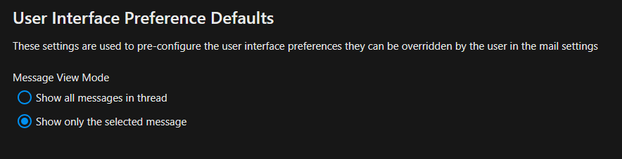

====
Mail
====

Configuration
-------------

Local IMAP and SMTP servers
^^^^^^^^^^^^^^^^^^^^^^^^^^^

By default, Nextcloud does not allow local hostnames and IP addresses as remote servers. This includes IMAP, SMTP and Sieve servers
like ``localhost``, ``mx.local`` and ``10.0.0.3``. This check can be disabled with via ``config/config.php``.

::

    'allow_local_remote_servers' => true,

Attachment size limit
^^^^^^^^^^^^^^^^^^^^^

Admins can prevent users from attaching large attachments to their emails. Users will be asked to use link shares instead.

::

    'app.mail.attachment-size-limit' => 3*1024*1024,

The unit is bytes. The example about with limit to 3MB attachments. The default is 0 bytes which means no upload limit.

Timeouts
^^^^^^^^

Depending on your mail host, it may be necessary to increase your IMAP and/or SMTP timeout threshold.
Currently IMAP defaults to 5 seconds and SMTP defaults to 20 seconds. They can be changed as follows:

IMAP timeout
~~~~~~~~~~~~

::

    'app.mail.imap.timeout' => 5

SMTP timeout
~~~~~~~~~~~~

::

    'app.mail.smtp.timeout' => 20

Sieve timeout
~~~~~~~~~~~~~

::

    'app.mail.sieve.timeout' => 5

Background sync interval
^^^^^^^^^^^^^^^^^^^^^^^^

Configure how often Mail keeps users' mailboxes updated in the background in seconds. Defaults to 3600, minimum 300.

::

    'app.mail.background-sync-interval' => 7200,

Use php-mail for sending mail
^^^^^^^^^^^^^^^^^^^^^^^^^^^^^

.. warning:: Support for using php-mail was removed in version 4.4 of the mail app!

You can use the php-mail function to send mails. This is needed for some web hosters (1&1 (1und1)).

::

    'app.mail.transport' => 'php-mail'

Disable TLS verification for IMAP/SMTP
^^^^^^^^^^^^^^^^^^^^^^^^^^^^^^^^^^^^^^

Turn off TLS verification for IMAP/SMTP. This happens globally for all accounts and is only needed in edge cases like with email servers that have a self-signed certificate.

::

    'app.mail.verify-tls-peer' => false

Anti-abuse alerts
^^^^^^^^^^^^^^^^^

The app can write alerts to the logs when users send messages to a high number of recipients or sends a high number of messages for a short period of time. These events might indicate that the account is abused for sending spam messages.

To enable anti-abuse alerts, you'll have to set a few configuration options :doc:`via occ  <../occ_command>` .

::

    # Turn alerts on
    occ config:app:set mail abuse_detection --value=on
    # Turn alerts off
    occ config:app:set mail abuse_detection --value=off

    # Alert when 50 or more recipients are used for one single message
    occ config:app:set mail abuse_number_of_recipients_per_message_threshold --value=50

    # Alerts can be configured for three intervals: 15m, 1h and 1d
    # Alert when more than 10 messages are sent in 15 minutes
    occ config:app:set mail abuse_number_of_messages_per_15m --value=10
    # Alert when more than 30 messages are sent in one hour
    occ config:app:set mail abuse_number_of_messages_per_1h --value=30
    # Alert when more than 100 messages are sent in one day
    occ config:app:set mail abuse_number_of_messages_per_1d --value=100

Google OAuth
^^^^^^^^^^^^

This app can allow users to connect their Google accounts with OAuth. This makes it possible to use accounts without 2FA or app password.

1. `Create authorization credentials <https://developers.google.com/identity/protocols/oauth2/web-server#prerequisites>`_. You will receive a client ID and a client secret.
2. Open the Nextcloud settings page. Navigate to *Groupware* and scroll down to *Gmail integration*. Enter and save the client ID and client secret.

Account delegation
------------------

The Mail app supports account delegation if the delegation is handled by the mail server. That means the mail server has to accept emails sent from an alias address.

In mailcow, for example, the setting is called *Also allowed to send as user*.

.. warning:: Unless paired with shared *Sent* mailboxes or handled otherwise by the mail server, sent messages will be stored in the sender's personal *Sent* mailbox.

Snooze and scheduled sending
----------------------------

.. note:: If AJAX is selected for cron job execution in the admin settings, the snooze feature and scheduled sending are deactivated because of unreliable execution.

XOAUTH2 Authentication with Microsoft Azure AD
----------------------------------------------

.. versionadded:: 3.0.0

The Mail app supports XOAUTH2 authentication with hosted Microsoft Outlook accounts. An app has to be registered in the Microsoft Azure web interface and its credentials have to be supplied to the Nextcloud instance. You can find relevant settings in the Groupware section of the admin settings.

**Step 1: Open the Azure AD Dashboard**

Visit the `Azure portal <https://portal.azure.com>`_ and navigate to the Azure AD dashboard.

.. figure:: images/azure_xoauth2/1.png

**Step 2: Create a new app registration**

.. figure:: images/azure_xoauth2/2.png

Chose a name, allow organizational and personal Microsoft accounts. Configure a web app and copy the redirect URI from the groupware settings of your Nextcloud instance. Have a look at step 8 on where to find the redirect URI. Finally, click on register to proceed.

.. figure:: images/azure_xoauth2/3.png

**Step 3: Copy the client ID**

This ID will be needed later for the Nextcloud settings.

.. figure:: images/azure_xoauth2/4.png

**Step 4: Create a new client secret**

.. figure:: images/azure_xoauth2/5.png

Chose a descriptive name for the secret and set the an appropriate expiration date. Click on add to create the secret.

.. figure:: images/azure_xoauth2/6.png

**Step 5: Copy the client secret**

Copy the client secret manually or by clicking on the copy button. You can find it in the value column. The secret will also be needed later for the Nextcloud settings.

.. figure:: images/azure_xoauth2/7.png

**Step 6: Configure Nextcloud**

Open the groupware settings in the Nextcloud admin settings and fill in the client ID and client secret. Leave the tenant ID as is (common). You can also find the redirect URI here. Click on save to proceed.

.. warning:: Using a custom tenant ID is not covered by this guide. Only configure it if you are an expert and changed the supported account types in step 2.

.. figure:: images/azure_xoauth2/8.png

**Step 7: Connect Microsoft Outlook accounts**

Congratulations! You are now able to use hosted Microsoft Outlook accounts in the Mail app. Use your Microsoft account email and any password when adding your account. The password will be discarded and you will be prompted with a Microsoft consent popup to log in to your account.

.. figure:: images/azure_xoauth2/9.png

.. figure:: images/azure_xoauth2/10.png

Mailbox Share
-------------
Users can share mailboxes with each other. So far, there is no UI for users to change the ACL in the Mail app, but if you want to use it, you need to enable it on the IMAP sever and configure the shares there.

.. _mail_ui_defaults:

User Interface Preference Defaults
----------------------------------

.. versionadded:: 5.2

The Mail app allows administrators to set default user interface preferences for all users, these preferences can be changed by the user afterwards. This can be useful to ensure a consistent experience across the application.

.. _mail_llm_processing:

LLM Processing
--------------

The Mail app can optionally use large language models to process emails and offer assistance features like thread summaries, smart replies, event agendas and follow-up reminders.

.. note:: The supported languages depend on the used large language model.

.. note:: A fast text processing integration like `<https://apps.nextcloud.com/apps/integration_openai>`_ is required for best results.

The feature can be enabled in the Mail administration settings.

Administration settings > Groupware > Mail app > Enable text processing through LLMs

.. _mail_thread_summary:

Thread Summary
--------------

.. versionchanged:: 3.6.0
    This configuration option was merged into :ref:`mail_llm_processing`

The mail app supports summarizing message threads that contain 3 or more messages.

.. warning:: `A text generation AI integration <https://apps.nextcloud.com/apps/integration_openai>`_ should be already in place to enable this feature.

The feature is opt-in, it is disabled by default and can be enabled in mail administration settings.

Administration settings > Groupware > Mail app > Enable thread summary

Follow-up reminders
-------------------

.. versionadded:: 4.0

The Mail app will automatically remind users when their outgoing emails remain unanswered for
multiple days.
Each sent email will be analyzed by an AI to check whether a reply is expected.

The feature can be enabled through the global :ref:`mail_llm_processing` setting.

Translation
-----------

.. versionadded:: 4.2

The mail app can optionally provide translations for messages if the :ref:`translation API <machine_translation>` is enabled.
