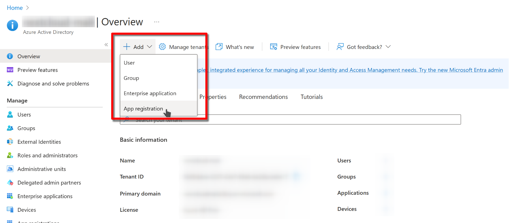
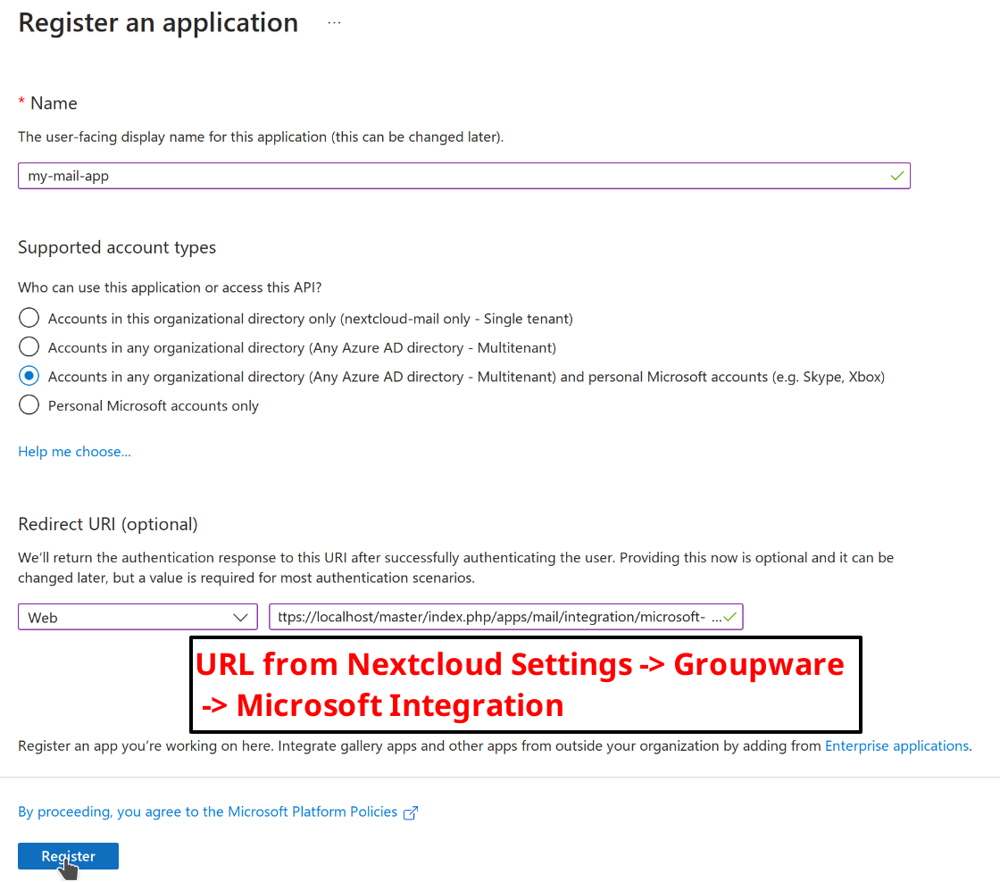
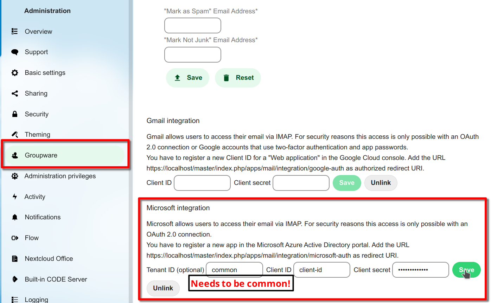
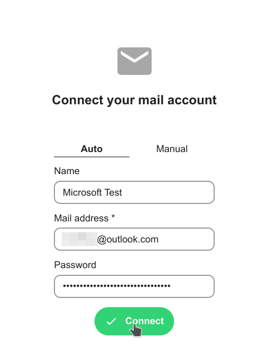
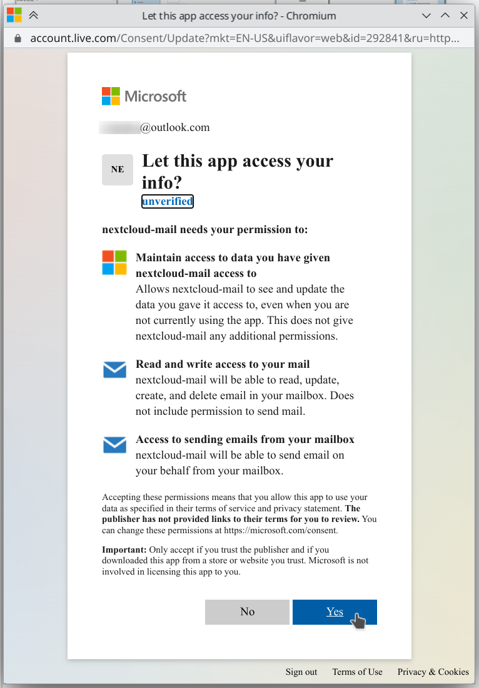

====
Mail
====

Account delegation
------------------

The Mail app supports account delegation if the delegation is handled by the mail server. That means the mail server has to accept emails sent from an alias address.

In mailcow, for example, the setting is called *Also allowed to send as user*.

.. warning:: Unless paired with shared *Sent* mailboxes or handled otherwise by the mail server, sent messages will be stored in the sender's personal *Sent* mailbox.

XOAUTH2 Authentication with Microsoft Azure AD
----------------------------------------------

.. versionadded:: 3.0.0

The Mail app supports XOAUTH2 authentication with hosted Microsoft Outlook accounts. An app has to be registered in the Microsoft Azure web interface and its credentials have to be supplied to the Nextcloud instance. You can find relevant settings in the Groupware section of the admin settings.

Step 1: Open the Azure AD Dashboard
~~~~~~~~~~~~~~~~~~~~~~~~~~~~~~~~~~~

Visit the `Azure portal <https://portal.azure.com>`_ and navigate to the Azure AD dashboard.

.. figure:: images/azure_xoauth2/1.png

Step 2: Create a new app registration
~~~~~~~~~~~~~~~~~~~~~~~~~~~~~~~~~~~~~

Chose a name, allow organizational and personal Microsoft accounts. Configure a web app and copy the redirect URI from the groupware settings of your Nextcloud instance. Have a look at step 8 on where to find the redirect URI. Finally, click on register to proceed.

Step 3: Copy the client ID
~~~~~~~~~~~~~~~~~~~~~~~~~~

This ID will be needed later for the Nextcloud settings.

.. figure:: images/azure_xoauth2/4.png

Step 4: Create a new client secret
~~~~~~~~~~~~~~~~~~~~~~~~~~~~~~~~~~

.. figure:: images/azure_xoauth2/5.png

Chose a descriptive name for the secret and set the an appropriate expiration date. Click on add to create the secret.

.. figure:: images/azure_xoauth2/6.png

Step 5: Copy the client secret
~~~~~~~~~~~~~~~~~~~~~~~~~~~~~~

Copy the client secret manually or by clicking on the copy button. You can find it in the value column. The secret will also be needed later for the Nextcloud settings.

.. figure:: images/azure_xoauth2/7.png

Step 6: Configure Nextcloud
~~~~~~~~~~~~~~~~~~~~~~~~~~~

Open the groupware settings in the Nextcloud admin settings and fill in the client ID and client secret. Leave the tenant ID as is (common). You can also find the redirect URI here. Click on save to proceed.

.. warning:: Using a custom tenant ID is not covered by this guide. Only configure it if you are an expert and changed the supported account types in step 2.

Step 7: Connect Microsoft Outlook accounts
~~~~~~~~~~~~~~~~~~~~~~~~~~~~~~~~~~~~~~~~~~

Congratulations! You are now able to use hosted Microsoft Outlook accounts in the Mail app. Use your Microsoft account email and any password when adding your account. The password will be discarded and you will be prompted with a Microsoft consent popup to log in to your account.

