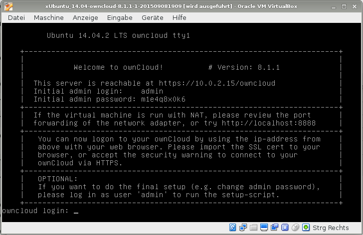
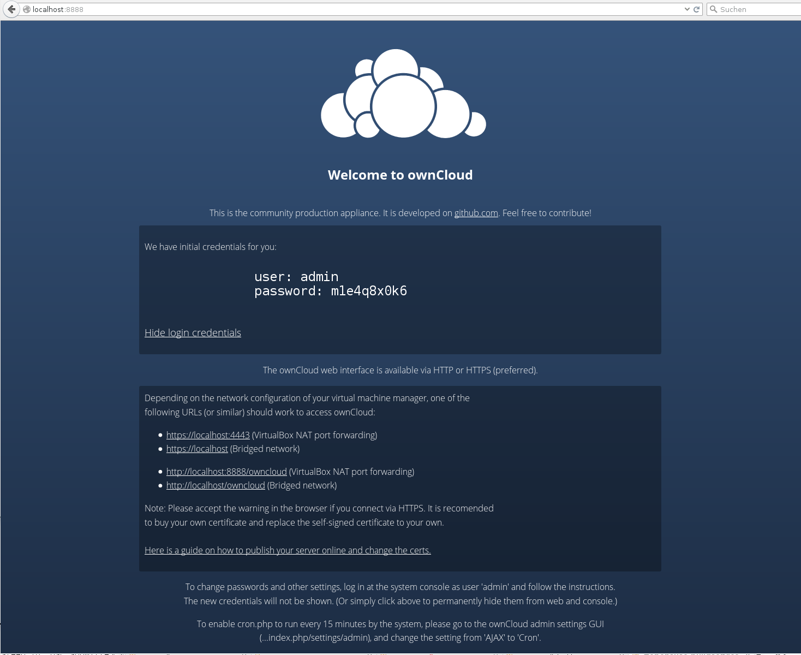

============================
ownCloud Community Appliance
============================

ownCloud has a publicly developed community appliance `on GitHub`_. Download the 
latest release from the Appliances tab on the `ownCloud server installation 
page`_. The easiest way to get the VM up and running is by using `VirtualBox`_ 
and downloading the OVA image from the installation page.

Instructions for VirtualBox and OVA
-----------------------------------

Follow these steps to get the appliance working:

1. Download the Virtual Machine image zip file and unpack it.

2. Start VirtualBox and click on *File ...* > *Import Appliance* and import 
   your new ownCloud image.
   
3. Click the green Start arrow. After a minute you should see the console 
   greeting message.

4. Note the username and password here. It is a random password that we generate 
   for you on first boot. If you log in at the console, you'll  be prompted to 
   change the password. This is optional.

5. With your Web browser try ``http://localhost:8888`` or 
   ``http://localhost:80`` or the address printed on the console. One of them 
   should work. If not, please review and adjust the network setup of 
   Virtualbox to bridged mode.

6. You should see a Web page with login credentials (if you haven't changed 
   them already) and a list of URLs to try to reach the ownCloud web 
   service.  Which one works, again depends on the network setup of your 
   hypervisor.

   
   *Click to enlarge*

.. note:: You should write down your admin password, and make sure the login 
   credentials are no longer displayed. Click the *[Hide Credentials]* button. 
   When using the ownCloud Proxy app, this Web page may be publicly visible.

.. note:: Inside the VM, ownCloud runs with a default disk size of 40 GB and its 
   own MySQL database. The ownCloud admin user is also a valid account on the 
   Ubuntu system that runs inside the VM. You can administer the VM via SSH.

**For VMware**

You can follow most of the steps above, however, after opening the VMX file, you will have to configure ``Bridged Network`` as *Network Adapter*

Software Appliances
-------------------

There are a number of unofficial pre-made virtual machine-based appliances:

-  `Tech and me - ownCloud VM on Ubuntu 16.04 with PHP 7, MySQL, and Apache`_, fully configured 
   environment.
-  `SUSE Studio, ownCloud on openSuSE`_, which runs directly from an USB stick.
-  `Amahi home server`_

.. _on Github: https://github.com/ownCloud/vm
.. _VirtualBox: https://www.virtualbox.org
.. _ownCloud server installation page: https://owncloud.org/install/#instructions-server 
.. _Amahi home server: https://wiki.amahi.org/index.php/OwnCloud
.. _Tech and me - ownCloud VM on Ubuntu 16.04 with PHP 7, MySQL, and Apache: https://www.techandme.se/pre-configured-owncloud-installaton/
.. _ownCloud 7 on Raspberry Pi (Arch Linux) using Lighttpd: http://eiosifidis.blogspot.de/2014/07/install-owncloud-7-on-raspberry-pi-arch.html
.. _OpenWrt Guide: http://wiki.openwrt.org/doc/howto/owncloud
.. _SUSE Studio, ownCloud on openSuSE: http://susestudio.com/a/TadMax/owncloud-in-a-box
.. _QNAP Guide: http://wiki.qnap.com/wiki/Category:OwnCloud
.. _Synology Package: http://www.cphub.net/index.php?id=40&pid=213
