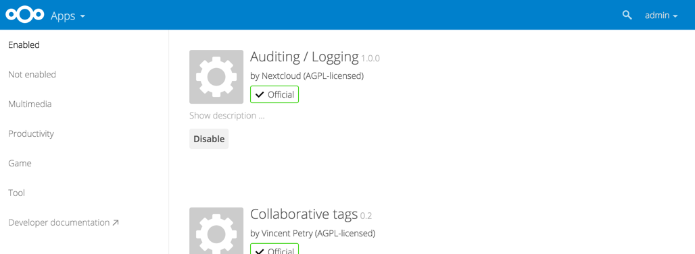

=============================
Installing and Managing Apps
=============================

After installing ownCloud, you may provide added functionality by installing applications.

Viewing Enabled Apps
--------------------

During the ownCloud installation, some apps are enabled by default. To see which apps are 
enabled go to your Apps page.

You will see which apps are enabled, not enabled, and recommended. You'll also see 
additional filters, such as Multimedia, PIM, and Productivity for finding apps quickly. 
The ``More apps`` link takes you to the ownCloud App Store, and the ``Add your app`` link 
takes you to the ownCloud Developer Manual.

Managing Apps
-------------

In the Apps page, you can enable or disable applications.Some apps have some configurable 
options on the Apps page, but mainly they are enabled or disabled here, and are 
configured on your ownCloud Admin page.

Adding Third Party Apps
-----------------------

Some apps are developed and supported by ownCloud directly, while other apps are created 
by third parties and available for your ownCloud server installation.  Apps developed
by the ownCloud community show a *recommended* designation. Any apps that are not
developed by ownCloud but have been reviewed by the ownCloud security team show a 
*3rd party* designation. Install unsupported apps at your own risk.

To understand what an application does, you can click the app name to view a description 
of the app and any of the app settings in the Application View field.  Clicking the 
*Enable* button will enable the app.  If the app is not part of the ownCloud installation,
it will be downloaded from the app store, installed and enabled. 

You can view new, unreviewed or unstable applications in the 
`ownCloud apps store <http://apps.owncloud.com/>`_.

To view or install apps from the ownCloud apps store:

1. Scroll to the bottom of the Apps Information Field.

2. Click *More apps*.

   The ownCloud apps store launches.

3. Read about any of the apps in the ownCloud app store and download any that you like.

4. Extract a downloaded compressed file and place the contents (which should themselves be 
contained in a folder with the app name) in the apps folder in your ownCloud 
installation, typically ``owncloud/apps``.

5. Ensure the permissions and ownership are similar to the other ownCloud apps. Typically, 
access rights are **rwxr-x---**, or **0750** in octal notation, and the owner and group 
are your HTTP user. On CentOS this is ``apache``, Ubuntu is ``www-data``, and on openSUSE 
is it ``wwwrun:www``.

Sometimes the installation of a third-party app fails silently, possibly because
``'appcodechecker' => true,`` is enabled in ``config.php``. When ``appcodechecker`` is 
enabled it checks if third-party apps are using the private API, rather than the public 
API. If they are then they will not be installed. 

.. note:: If you would like to create or add your own ownCloud app, please use the 
    *Add your App...* button on the same page. This button redirects you to the 
    `App Development documentation <https://doc.owncloud.org/server/8.0/developer_manual/app/index.html>`_,
    where you can find information about creating and adding your own apps.

Setting App Parameters
----------------------

Most app parameters are configured on your Admin page, and some are set in
:file:`config/config.php`. Always try your Admin page first.

Using Custom App Directories
----------------------------

Use the **apps_paths** array in `config.php` to set any custom apps directory locations. 
The key **path** defines the absolute file system path to the app folder. The key **url** 
defines the HTTP web path to that folder, starting at the ownCloud web root. The key 
**writable** indicates if a user can install apps in that folder.

.. note:: To ensure that the default **/apps/** folder only contains apps 
   shipped with ownCloud, follow this example to setup an **/apps2/** folder 
   which will be used to store all other apps.

.. code-block:: php

  <?php

    "apps_paths" => array (
        0 => array (
                "path"     => OC::$SERVERROOT."/apps",
                "url"      => "/apps",
                "writable" => false,
        ),
        1 => array (
                "path"     => OC::$SERVERROOT."/apps2",
                "url"      => "/apps2",
                "writable" => true,
        ),
    ),

Using Your Own Appstore
-----------------------

You can enable the installation of apps from your own apps store. This requires that you 
can write to at least one of the configured apps directories.

To enable installation from your own apps store:

1. Set the **appstoreenabled** parameter to "true".

   This parameter is used to enable your apps store in ownCloud.

2. Set the **appstoreurl** to the URL of your ownCloud apps store.

   This parameter is used to set the http path to the ownCloud apps store. The appstore 
   server must use :abbr:`OCS (Open Collaboration Services)`.

.. code-block:: php

  <?php

    "appstoreenabled" => true,
    "appstoreurl" => "http://api.apps.owncloud.com/v1",

    
