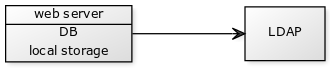
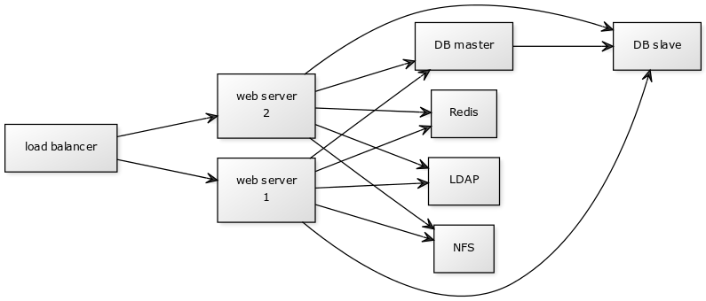
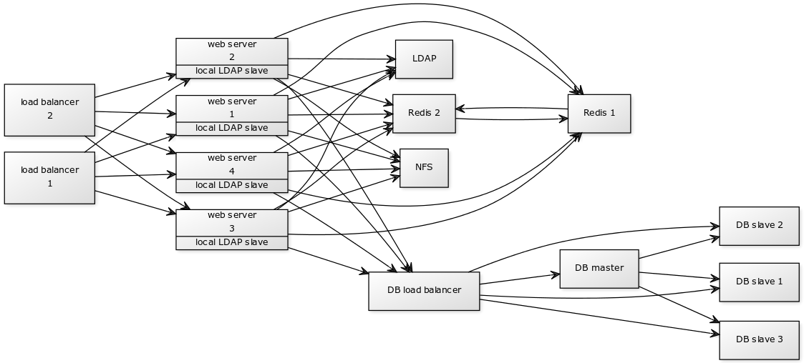

====================================
Nextcloud Deployment Recommendations
====================================

What is the best way to install and maintain Nextcloud? The answer to that is
*"it depends"* because every Nextcloud customer has their own
particular needs and IT infrastructure. Nextcloud and the LAMP stack are
highly-configurable, so we will present three typical scenarios and make
best-practice recommendations for both software and hardware.

General Recommendations
-----------------------

.. note:: Whatever the size of your organization, always keep one thing in mind:
   the amount of data stored in Nextcloud will only grow. Plan ahead.

Consider setting up a scale-out deployment, or using Federated Cloud Sharing to
keep individual Nextcloud instances to a manageable size.

.. comment: Federating instances seems the best way to grow organically in
   an enterprise. A lookup server to tie all the instances together under a
   single domain is being worked on.

* Operating system: Linux (Ubuntu 16.04 or Red Hat Enterprise Linux 7 is recommended).
* Web server: Apache 2.4.
* Database: MySQL/MariaDB.
* PHP 5.6+. PHP 5.6 is the minimum supported version. We recommend to deploy
  on PHP 7 if possible. This version is known to offer significant performance
  advantages. ``mod_php`` is the recommended Apache module due to
  vendor support and ease of configuration. ``php-fpm`` with Apache Event
  MPM (or nginx) is an alternative with potentially better scalability in
  high load and limited RAM environments. For the best results we recommend
  working with the Nextcloud GmbH enterprise support team for large deployments.

.. comment: mod_php is easier to set up, php-fpm with apache event MPM seems to
   scale better under load and limited RAM restrictions:
   http://blog.bitnami.com/2014/06/performance-enhacements-for-apache-and.html

Small Workgroups or Departments
-------------------------------

* Number of users
   Up to 150 users.

* Storage size
   100 GB to 10TB.

* High availability level
   Zero-downtime backups via Btrfs snapshots, component failure leads to
   interruption of service. Alternate backup scheme on other filesystems:
   nightly backups with service interruption.

Recommended System Requirements
^^^^^^^^^^^^^^^^^^^^^^^^^^^^^^^

One machine running the application server, Web server, database server and
local storage.

Authentication via an existing LDAP or Active Directory server.

.. comment:
    https://yuml.me
    [web server|DB; local storage]->[LDAP]

* Components
   One server with at least 2 CPU cores, 16GB RAM, local storage as needed.

* Operating system
   Enterprise-grade Linux distribution with full support from OS vendor. We
   recommend Red Hat Enterprise Linux 7 or Ubuntu 16.04.

* SSL Configuration
   The SSL termination is done in Apache. A standard SSL certificate is
   needed, installed according to the Apache documentation.

* Load Balancer
   None.

* Database
   MySQL, MariaDB or PostgreSQL. We currently recommend MySQL / MariaDB, as our
   customers have had good experiences when moving to a Galera cluster to
   scale the DB.

* Backup
   Install Nextcloud, Nextcloud data directory and database on Btrfs filesystem.
   Make regular snapshots at desired intervals for zero downtime backups.
   Mount DB partitions with the "nodatacow" option to prevent fragmentation.

   Alternatively, make nightly backups with service interruption:

   * Shut down Apache.
   * Create database dump.
   * Push data directory to backup.
   * Push database dump to backup.
   * Start Apache.

   Then optionally rsync to a backup storage or tape backup. (See the
   `Maintenance`_ section of the Administration manual for tips on backups
   and restores.)

* Authentication
   User authentication via one or several LDAP or Active Directory servers. (See
   `User Authentication with LDAP`_ for information on configuring Nextcloud to
   use LDAP and AD.)

* Session Management
   Local session management on the application server. PHP sessions are stored
   in a tmpfs mounted at the operating system-specific session storage
   location. You can find out where that is by running ``grep -R
   'session.save_path' /etc/php5`` and then add it to the ``/etc/fstab`` file,
   for example:
   ``echo "tmpfs /var/lib/php5/pool-www tmpfs defaults,noatime,mode=1777 0 0"
   >> /etc/fstab``.

* Memory Caching
   A memcache speeds up server performance, and Nextcloud supports four
   memcaches; refer to `Configuring Memory Caching`_ for information on
   selecting and configuring a memcache.

* Storage
   Local storage.

Mid-sized Enterprises
---------------------

* Number of users
   150 to 1,000 users.

* Storage size
   Up to 200TB.

* High availability level
   Every component is fully redundant and can fail without service interruption.
   Backups without service interruption

Recommended System Requirements
^^^^^^^^^^^^^^^^^^^^^^^^^^^^^^^

2 to 4 application servers.

A cluster of two database servers.

Storage on an NFS server.

Authentication via an existing LDAP or Active Directory server.

.. comment:
    https://yuml.me
    [load balancer]->[web server 1]
    [load balancer]->[web server 2]
    [web server 1]->[NFS]
    [web server 2]->[NFS]
    [web server 1]->[LDAP]
    [web server 2]->[LDAP]
    [web server 1]->[Redis]
    [web server 2]->[Redis]
    [web server 1]->[DB master]
    [web server 2]->[DB master]
    [web server 1]->[DB slave]
    [web server 2]->[DB slave]
    [DB master]->[DB slave]

* Components
   * 2 to 4 application servers with 4 sockets and 32GB RAM.
   * 2 DB servers with 4 sockets and 64GB RAM.
   * 1 HAproxy load balancer with 2 sockets and 16GB RAM.
   * NFS storage server as needed.

* Operating system
   Enterprise grade Linux distribution with full support from OS vendor. Red
   Hat Enterprise Linux or Ubuntu 16.04 are recommended.

* SSL Configuration
   The SSL termination is done in the HAProxy load balancer. A standard SSL
   certificate is needed, installed according to the `HAProxy documentation`_.

* Load Balancer
   HAProxy running on a dedicated server in front of the application servers.
   Sticky session needs to be used because of local session management on the
   application servers.

.. comment: (please add configuration details here)
.. comment: why sticky sessions? the nice thing about haproxy is that it can
   send requests to the application server with the least load. redis or
   memcached seem more appropriate. this is mid size already. the software
   stack should be the same as for L`_
   Frank: Yes. But this only works if haproxy can read the http stream which
   means that we have to terminate SSL in the haproxy instead of the Web server.
   Totally possible. Whatever you prefer :-)
   Jörn: AFAIK you need to do SSL offloading to do sticky sessions, because the
   load balancer has to look into the http stream or rely on the client IP to
   determine the Web server for the session. Not doing SSL offloading instead
   requires you to use a shared session (via memcached or redis) because the
   requests are distributed via round robin or least load. It allows you to
   scale out the ssl load by adding more applicaton servers. So ... I think it
   is exactly the other way round.

* Database
   MySQL/MariaDB Galera cluster with master-slave replication. The slave is
   only used as failover in case the master is down. This could be extended
   with a load balancer infront to distribute writes to the master and reads
   to the slave as well. (see "Database load balancer" below)

* Backup
   Minimum daily backup without downtime. All MySQL/MariaDB statements should
   be replicated to a backup MySQL/MariaDB slave instance.

    * Create a snapshot on the NFS storage server.
    * At the same time stop the MySQL replication.
    * Create a MySQL dump of the backup slave.
    * Push the NFS snapshot to the backup.
    * Push the MySQL dump to the backup.
    * Delete the NFS snapshot.
    * Restart MySQL replication.

* Authentication
   User authentication via one or several LDAP or Active Directory servers.
   (See `User Authentication with LDAP`_  for information on configuring
   Nextcloud to use LDAP and AD.)

* LDAP
   Read-only slaves should be deployed on every application server for
   optimal scalability

* Session Management
   Session management on the application server. PHP sessions are stored
   in a tmpfs mounted at the operating system-specific session storage
   location. You can find out where that is by running ``grep -R
   'session.save_path' /etc/php5`` and then add it to the ``/etc/fstab`` file,
   for example:
   ``echo "tmpfs /var/lib/php5/pool-www tmpfs defaults,noatime,mode=1777 0 0"
   >> /etc/fstab``.

* Memory Caching
   A memcache speeds up server performance, and Nextcloud supports four
   memcaches; refer to `Configuring Memory Caching`_ for information on
   selecting and configuring a memcache.

* Storage
   Use an off-the-shelf NFS solution, such as IBM Elastic Storage or RedHat
   Ceph.

Large Enterprises and Service Providers
---------------------------------------

* Number of users
   5,000 to >100,000 users.

* Storage size
   Up to 1 petabyte.

* High availabily level
   Every component is fully redundant and can fail without service interruption.
   Backups without service interruption

Recommended System Requirements
^^^^^^^^^^^^^^^^^^^^^^^^^^^^^^^

4 to 20 application/Web servers.

A cluster of two or more database servers which are behind a load balancer to
send all writes to the master and reads to the slaves. (see "Database load balancer"
below)

Storage is an NFS server, or an object store that is S3 compatible.

Cloud federation for a distributed setup over several data centers.

Authentication via an existing LDAP or Active Directory server, or SAML.

.. comment:
    https://yuml.me
    [load balancer 1]->[web server 1|local LDAP slave]
    [load balancer 1]->[web server 2|local LDAP slave]
    [load balancer 1]->[web server 3|local LDAP slave]
    [load balancer 1]->[web server 4|local LDAP slave]
    [load balancer 2]->[web server 1]
    [load balancer 2]->[web server 2]
    [load balancer 2]->[web server 3]
    [load balancer 2]->[web server 4]
    [web server 1]->[NFS]
    [web server 2]->[NFS]
    [web server 3]->[NFS]
    [web server 4]->[NFS]
    [web server 1]->[LDAP]
    [web server 2]->[LDAP]
    [web server 3]->[LDAP]
    [web server 4]->[LDAP]
    [web server 1]->[Redis 1]
    [web server 2]->[Redis 1]
    [web server 3]->[Redis 1]
    [web server 4]->[Redis 1]
    [web server 1]->[Redis 2]
    [web server 2]->[Redis 2]
    [web server 3]->[Redis 2]
    [web server 4]->[Redis 2]
    [Redis 1]->[Redis 2]
    [Redis 2]->[Redis 1]
    [web server 1]->[DB load balancer]
    [web server 2]->[DB load balancer]
    [web server 3]->[DB load balancer]
    [web server 4]->[DB load balancer]
    [DB load balancer]->[DB master]
    [DB load balancer]->[DB slave 1]
    [DB load balancer]->[DB slave 2]
    [DB load balancer]->[DB slave 3]
    [DB master]->[DB slave 1]
    [DB master]->[DB slave 2]
    [DB master]->[DB slave 3]

* Components
   * 4 to 20 application servers with 4 sockets and 64GB  RAM.
   * 4 DB servers with 4 sockets and 128GB RAM plus a DB load balancer
     (see "Database load balancer" below)
   * 2 load balancer - either HAProxy with keepalived (heartbeat) and a shared
     virutal IP address as a software solution or a hardware load balancer. For
     the HAProxy we recommend at least 2 sockets and 16GB RAM each.
   * NFS storage server as needed.

* Operating system
   RHEL 7 with latest service packs.

* SSL Configuration
   The SSL termination is done in the load balancer. A standard SSL certificate
   is needed, installed according to the load balancer documentation.

* Load Balancer
   A redundant load-balancer with heartbeat, for example `HAProxy`_.
   This runs two load balancers in front of the application servers.

* Database
   MySQL/MariaDB Galera Cluster with master - slave replication (master & 3 slaves).
   The load balancer infront distributes writes to the master and reads to the
   slaves. (see "Database load balancer" below)

* Backup
   Minimum daily backup without downtime. All MySQL/MariaDB statements should
   be replicated to a backup MySQL/MariaDB slave instance.

    * Create a snapshot on the NFS storage server.
    * At the same time stop the MySQL replication.
    * Create a MySQL dump of the backup slave.
    * Push the NFS snapshot to the backup.
    * Push the MySQL dump to the backup.
    * Delete the NFS snapshot.
    * Restart MySQL replication.

* Authentication
   User authentication via one or several LDAP or Active Directory
   servers, or SAML/Shibboleth. (See `User Authentication with LDAP`_.)

* LDAP
   Read-only slaves should be deployed on every application server for
   optimal scalability.

* Session Management
   Redis should be used for the session management storage.

* Caching
   Redis for distributed in-memory caching (see `Configuring Memory
   Caching`_).

* Storage
   An off-the-shelf NFS solution should be used. Examples are IBM Elastic
   Storage or RedHAT Ceph. Optionally, an S3 compatible object store can also
   be used.

Hardware Considerations
-----------------------

* Solid-state drives (SSDs) for I/O.
* Separate hard disks for storage and database, SSDs for databases.
* Multiple network interfaces to distribute server synchronisation and backend
  traffic across multiple subnets.

Single Machine / Scale-Up Deployment
^^^^^^^^^^^^^^^^^^^^^^^^^^^^^^^^^^^^

The single-machine deployment is widely used in the community.

Pros:

* Easy setup: no session storage daemon, use tmpfs and memory caching to
  enhance performance, local storage.
* No network latency to consider.
* To scale buy a bigger CPU, more memory, larger hard drive, or additional hard
  drives.

Cons:

* Fewer high availability options.
* The amount of data in Nextcloud tends to continually grow. Eventually a
  single machine will not scale; I/O performance decreases and becomes a
  bottleneck with multiple up- and downloads, even with solid-state drives.

Scale-Out Deployment
^^^^^^^^^^^^^^^^^^^^

Provider setup:

* DNS round robin to HAProxy servers (2-n, SSL offloading, cache static
  resources)
* Least load to Apache servers (2-n)
* Memcached/Redis for shared session storage (2-n)
* Database cluster with single Master, multiple slaves and proxy to split
  requests accordingly (2-n) - HAProxy or `MaxScale`_ are possible proxy
  solutions to load balance the writes to the master and reads to the slaves
  (see "Database load balancer" below)
* GPFS or Ceph via phprados (2-n, 3 to be safe, Ceph 10+ nodes to see speed
  benefits under load)

Pros:

* Components can be scaled as needed.
* High availability.
* Test migrations easier.

Cons:

* More complicated to setup.
* Network becomes the bottleneck (10GB Ethernet recommended).
* Currently DB filecache table will grow rapidly, making migrations painful in
  case the table is altered.

What About Nginx / PHP-FPM?
^^^^^^^^^^^^^^^^^^^^^^^^^^^

Could be used instead of HAproxy as the load balancer.
But on uploads stores the whole file on disk before handing it over to PHP-FPM.

A Single Master DB is Single Point of Failure, Does Not Scale
^^^^^^^^^^^^^^^^^^^^^^^^^^^^^^^^^^^^^^^^^^^^^^^^^^^^^^^^^^^^^

When master fails another slave can become master.

A multi-master setup with Galera cluster is not supported, because we require
``READ-COMMITTED`` as transaction isolation level. `Galera doesn't support this
with a master-master replication`_ which will lead to deadlocks during uploads
of multiple files into one directory for example.

Database load balancer
^^^^^^^^^^^^^^^^^^^^^^

When Galera cluster is used as DB cluster solution, we recommend to use
`MaxScale`_ as load balancer infront of the cluster to distribute writes to
the master node and reads to the slaves.

As alternative also `HAProxy can be used as load balancer for the DB`_.

Software Considerations
-----------------------

Operating System
^^^^^^^^^^^^^^^^

We are dependent on distributions that offer an easy way to install the various
components in up-to-date versions. We recommend Red Hat Enterprise Linux 7 or
Ubuntu 16.04 - for both commercial support can be purchased. Debian
and Ubuntu are free of cost, and include newer software packages. CentOS is the
community-supported free-of-cost Red Hat Enterprise Linux clone.

Web server
^^^^^^^^^^

Taking Apache and Nginx as the contenders, Apache with mod_php is currently the
best option, as Nginx does not support all features necessary for enterprise
deployments. Mod_php is recommended instead of PHP_FPM, because in scale-out
deployments separate PHP pools are simply not necessary.

Relational Database
^^^^^^^^^^^^^^^^^^^

More often than not the customer already has an opinion on what database to
use. In general, the recommendation is to use what their database administrator
is most familiar with. Taking into account what we are seeing at customer
deployments, we recommend MySQL/MariaDB in a master - slave deployment with a
MySQL proxy in front of them to send updates to master, and selects to the
slave(s). (see "Database load balancer" above)

.. comment: MySQL locks tables for schema updates and might even have to copy
   the whole table. That is pretty much a non-starter for migrations unless you
   are using a scale out deployment where you can apply the schema changes to
   each slave individually. Even then each migration might take several hours.
   Make sure you have enough disk space. You have been warned.

.. comment: By default Nextcloud uses the utf8 character set with utf8_bin
   collation on MySQL installations. As a result 4 byte UTF characters like
   emojis cannot be used. See the config.php option ``'mysql.utf8mb4'`` to
   switch to 4 byte UTF characters on MySQL.

The second best option is PostgreSQL (alter table does not lock table, which
makes migration less painful) although we have yet to find a customer who uses a
master-slave setup.

.. comment: PostgreSQL may produce excessive amounts of dead tuples due to
   Nextcloud transactions preventing the execution of the autovacum process.

What about the other DBMS?

* Sqlite is adequate for simple testing, and for low-load single-user
  deployments. It is not adequate for production systems.
* Microsoft SQL Server is not a supported option.
* For Oracle DB support please `contact the Nextcloud team`_ to get more
  information on this.

File Storage
------------

While many customers are starting with NFS, sooner or later that requires scale-out storage. Currently the options are GPFS or GlusterFS, or an object store protocol like S3 or Swift. S3 also allows access to Ceph Storage.

.. comment: A proof of concept implementation based on
   [phprados](https://github.com/ceph/phprados) that talks directly to a
   [ceph](http://ceph.com/) cluster without having to use temp files is [in
   development](https://github.com/owncloud/objectstore/pull/26).

.. comment: NFS can be used but needs to be micro-managed to distribute users
   on multiple storages. If you want to go that route configure ldap to provide
   a custom home folder location. That allows you to move each users data
   folder to different nfs mounts.

Session Storage
---------------

* Redis: provides persistence, nice graphical inspection tools available,
  supports Nextcloud high-level file locking.

* If Shibboleth is a requirement you must use Memcached, and it can also be
  used to scale-out shibd session storage (see `Memcache StorageService`_).

.. comment: High Availability / Failover deployment
   Use Case: site replication -> different problem

References
----------

`Database High Availability`_

`Performance enhancements for Apache and PHP`_

`How to Set Up a Redis Server as a Session Handler for PHP on Ubuntu 14.04`_

.. TODO ON RELEASE: Update version number below on release
.. _Maintenance:
   https://docs.nextcloud.org/server/11/admin_manual/maintenance/index.html
.. _User Authentication with LDAP:
   https://docs.nextcloud.org/server/11/admin_manual/configuration_user/user_auth_ldap.html
.. _Configuring Memory Caching:
   https://docs.nextcloud.org/server/11/admin_manual/configuration_server/caching_configuration.html
.. _Nextcloud Server or Enterprise Edition:
   https://nextcloud.com/enterprise/

.. _Memcache StorageService:
   https://wiki.shibboleth.net/confluence/display/SHIB2/
   NativeSPStorageService#NativeSPStorageService-MemcacheStorageService

.. _Database High Availability:
   http://www.severalnines.com/blog/become-mysql-dba-blog-series-database-high-
   availability
.. _Performance enhancements for Apache and PHP:
   http://blog.bitnami.com/2014/06/performance-enhacements-for-apache-and.html
.. _How to Set Up a Redis Server as a Session Handler for PHP on Ubuntu 14.04:
   https://www.digitalocean.com/community/tutorials/how-to-set-up-a-redis-server
   -as -a-session-handler-for-php-on-ubuntu-14-04
.. _HAProxy documentation:
   http://www.haproxy.org/#docs
.. _Galera doesn't support this with a master-master replication:
   http://galeracluster.com/documentation-webpages/isolationlevels.html#understanding-isolation-levels
.. _contact the Nextcloud team:
   https://nextcloud.com/contact/
.. _HAProxy can be used as load balancer for the DB:
   https://severalnines.com/blog/avoiding-deadlocks-galera-set-haproxy-single-node-writes-and-multi-node-reads
.. _MaxScale:
   https://mariadb.com/products/mariadb-maxscale
.. _HAProxy:
   http://www.haproxy.org/
