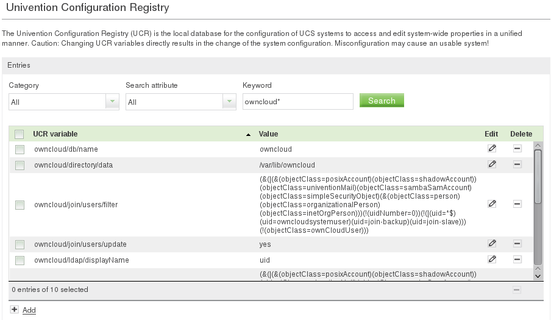
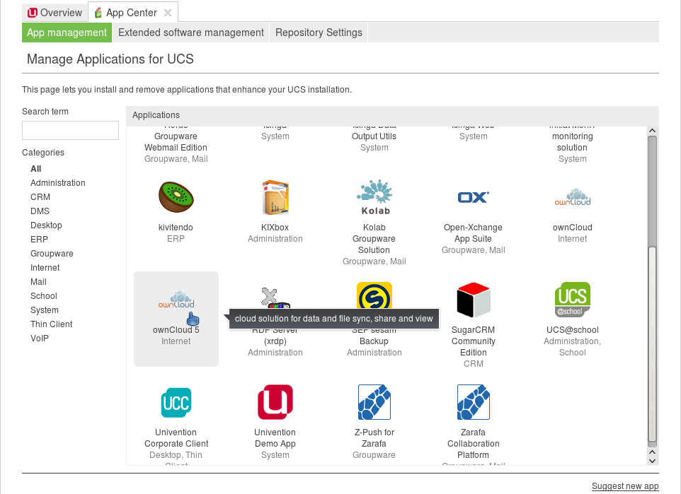
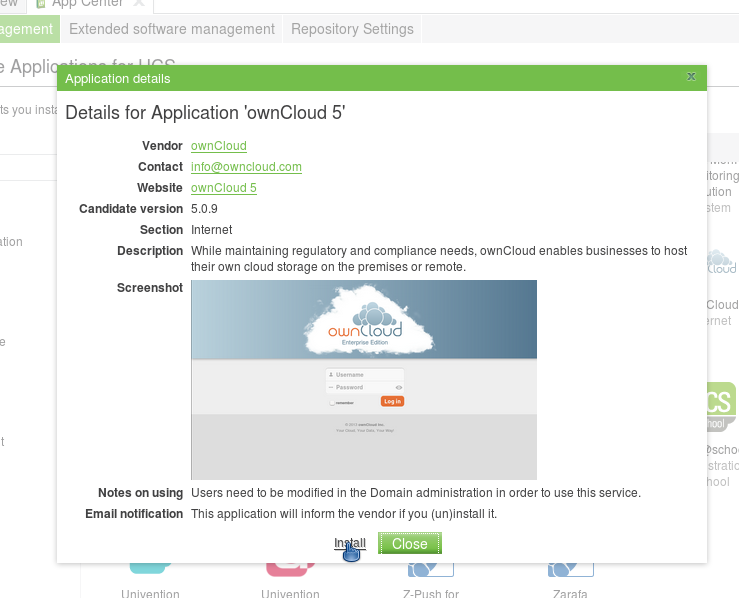
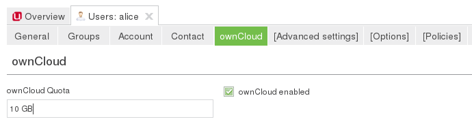
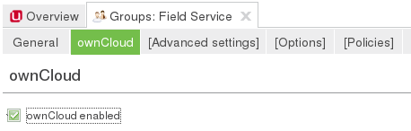

Univention Corporate Server
---------------------------

Subscribers to the ownCloud Enterprise edition can also integrate with
:abbr:`UCS (Univention Corporate Server)`.

.. _preconfig:

Pre configuration
^^^^^^^^^^^^^^^^^

ownCloud makes use of the UCR, the Univention Configuration Registry. The values
are being read during installation, most of them can be changed later, too.
Changes done directly via ownCloud are not taken over to UCR. We think we found
sane defaults, nevertheless you might have your own requirements. The
installation script will listen to the UCR keys listed below. In case you want
to override any default setting, simply add the key in question to the UCR and
assign your required value.

.. tabularcolumns:: |l|p{5cm}|p{5cm}|l|
.. cssclass:: longtable
.. csv-table::
  :header: Key, Default, Description, Introduced
  :widths: 20, 30, 30, 20

  "owncloud/directory/data", "/var/lib/owncloud", "Specifies where the file storage will be placed", "2012.0.1"
  "owncloud/db/name",   "owncloud",	"Name of the MySQL database. ownCloud will create an own user for it.",	2012.0.1
  "owncloud/user/quota",	"(empty)",	"The default quota, when a user is being added. Assign values in human readable strings, e.g. “2 GB”. Unlimited if empty.",	2012.0.1
  "owncloud/user/enabled",	0,	"Whether a new user is allowed to use ownCloud by default.",	2012.0.1
  "owncloud/group/enabled",	"0",	"Whether a new group is allowed to be used in ownCloud by default.",	2012.4.0.4
  "owncloud/ldap/base/users",	"cn=users,$ldap_base",	"The users-subtree in the LDAP directory. If left blank it will fall back to the LDAP base.",	2012.4.0.4
  "owncloud/ldap/base/groups",	"cn=groups,$ldap_base",	"The groups-subtree in the LDAP directory. If left blank it will fall back to the LDAP base.",	2012.4.0.4
  "owncloud/ldap/groupMemberAssoc",	"uniqueMember",	"The LDAP attribute showing the group-member relationship. Possible values: uniqueMember, memberUid and member",	2012.4.0.4
  "owncloud/ldap/tls",	1,	"Whether to talk to the LDAP server via TLS.",	2012.0.1
  "owncloud/ldap/disableMainServer",	0,	"Deactivates the (first) LDAP Configuration",	5.0.9
  "owncloud/ldap/cacheTTL",	600,	"Lifetime of the ownCloud LDAP Cache in seconds",	5.0.9
  "owncloud/ldap/UUIDAttribute",	"(empty)",	"Attribute that provides a unique value for each user and group entry. Empty value for autodetection.",	5.0.9
  "owncloud/ldap/loginFilter",	"(&(\|(&(objectClass=posixAccount) (objectClass=shadowAccount)) (objectClass=univentionMail) (objectClass=sambaSamAccount) (objectClass=simpleSecurityObject) (&(objectClass=person) (objectClass=organizationalPerson) (objectClass=inetOrgPerson))) (!(uidNumber=0)) (!(uid=*$)) (&(uid=%uid) (ownCloudEnabled=1)))",	"The LDAP filter that shall be used when a user tries to log in.",	2012.0.1
  "owncloud/ldap/userlistFilter",	"(&(\|(&(objectClass=posixAccount) (objectClass=shadowAccount)) (objectClass=univentionMail) (objectClass=sambaSamAccount) (objectClass=simpleSecurityObject) (&(objectClass=person) (objectClass=organizationalPerson) (objectClass=inetOrgPerson))) (!(uidNumber=0))(!(uid=*$)) (&(ownCloudEnabled=1)))",	"The LDAP filter that shall be used when the user list is being retrieved (e.g. for sharing)",	2012.0.1
  "owncloud/ldap/groupFilter",	"(&(objectClass=posixGroup) (ownCloudEnabled=1))",	"The LDAP filter that shall be used when the group list is being retrieved (e.g. for sharing)",	2012.4.0.4
  "owncloud/ldap/internalNameAttribute",	"uid",	"Attribute that should be used to create the user's owncloud internal name",	5.0.9
  "owncloud/ldap/displayName",	"uid", "The LDAP attribute that should be displayed as name in ownCloud",	2012.0.1
  "owncloud/ldap/user/searchAttributes",	"uid,givenName,sn,description,employeeNumber,mailPrimaryAddress",	"Attributes taken into consideration when searching for users (comma separated)",	5.0.9
  "owncloud/ldap/user/quotaAttribute",	"ownCloudQuota",	"Name of the quota attribute. The default attribute is provided by owncloud-schema.",	5.0.9
  "owncloud/ldap/user/homeAttribute",	"(empty)",	"Attribute that should be used to create the user's owncloud internal home folder",	5.0.9
  "owncloud/ldap/group/displayName",	"cn",	"The LDAP attribute that should be used as groupname in ownCloud",	2012.4.0.4
  "owncloud/ldap/group/searchAttributes",	"cn,description, mailPrimaryAddress",	"Attributes taken into consideration when searching for groups (comma separated)",	5.0.9
  "owncloud/join/users/update",	"yes",	"Wether ownCloud LDAP schema should be applied to existing users",	2012.0.1
  "owncloud/group/enableDomainUsers",	"1",	"Wether the group “Domain Users” shall be enabled for ownCloud on install",	2012.4.0.4
  "owncloud/join/users/filter",	"(&(\|(&(objectClass=posixAccount) (objectClass=shadowAccount)) (objectClass=univentionMail) (objectClass=sambaSamAccount) (objectClass=simpleSecurityObject) (&(objectClass=person) (objectClass=organizationalPerson) (objectClass=inetOrgPerson))) (!(uidNumber=0)) (!(\|(uid=*$) (uid=owncloudsystemuser) (uid=join-backup) (uid=join-slave))) (!(objectClass=ownCloudUser)))",	"Filters, on which LDAP users the ownCloud schema should be applied to. The default excludes system users and already ownCloudUsers.",	2012.0.1
  "owncloud/join/groups/filter",	"(empty)",	"Filters which LDAP groups will be en/disabled for ownCloud when running the script /usr/share/owncloud/update-groups.sh",	2012.4.0.4

If you want to override the default settings, simply create the key in
question in the UCR and assign your required value, for example::

  ucr set owncloud/user/enabled=1

or via UMC:

Installation
^^^^^^^^^^^^

Now, we are ready to install ownCloud. This can be either done through the UCS
App Center (recommended) or by downloading the packages.

UCS App Center
""""""""""""""

Open the Univention Management Console and choose the App Center module. You
will see a variety of available applications, including ownCloud.

Click on ownCloud 5 and follow the instructions.

In the UCS App Center, you can also upgrade from ownCloud 4.5 by installing
ownCloud 5.0. They are provided as separate apps. It is only possible to have
one version of ownCloud installed.

Manually by download
""""""""""""""""""""

Download the integration packages `from our website`_ and install them from
within your download folder (note: the package owncloud-unsupported is
optional) via command line:

::

	dpkg -i owncloud*.deb

ownCloud will be configured to fully work with LDAP.

Reinstallation
""""""""""""""

When ownCloud was installed before and uninstalled via AppCenter or via command
line using apt-get remove, ownCloud can be simply installed again. The old
configuration will be used again.

When an older ownCloud was installed and has been purged (only possible via
command line using apt-get purge) the old configuration is gone, but data is
left. This blocks an installation. You can either install the old version and
upgrade to ownCloud 5 or (re)move the old data. This is done by removing the
MySQL database "ownCloud" using the command line:

::

	mysql -u root -e "DROP DATABASE owncloud" -p`tail /etc/mysql.secret

In this case you probably also want to remove the data directory
**/var/lib/owncloud** although this is not mandatory.

Postconfiguration (optional)
^^^^^^^^^^^^^^^^^^^^^^^^^^^^

There is only one local admin user “owncloudadmin”, you can find his password in
`/etc/owncloudadmin.secret`. Use this account, if you want to change basic
ownCloud settings.

In the installation process a virtual host is set up (Apache is required
therefore). If you want to modify the settings, edit
:file:`/etc/apache2/sites-available/owncloud` and restart the web server. You
might want to do it to enable HTTPS connections. Besides that, you can edit the
**.htaccess-File in /var/www/owncloud/**. In the latter file there are also the
PHP limits for file transfer specified.

Using ownCloud
^^^^^^^^^^^^^^
If you decided to enable every user by default to use ownCloud, simply
open up http://myserver.com/owncloud/ and log in with your LDAP
credentials and enjoy.

If you did not, go to the UMC and enable the users who shall have access
(see picture below). Then, login at http://myserver.com/owncloud/ with
your LDAP credentials.

Updating users can also be done by the script
:file:`/usr/share/owncloud/update-users.sh` . It takes the following UCR
variables as parameters: **owncloud/user/enabled** for enabling or disabling,
**owncloud/user/quota** as the Quota value and **owncloud/join/users/filter** as
LDAP filter to select the users to update.

Groups 2012.4.0.4
"""""""""""""""""

Since ownCloud Enterprise 2012.4.0.4 group support is enabled. Groups,
that are activated for ownCloud usage, can be used to share files to
instead of single users, for example. It is also important to note, that
users can only share within groups where they belong to. Groups can be
enabled and disabled via UCM as shown in the screen shot below.

Another way to enable or disable groups is to use the script
:file:`/usr/share/owncloud/update-groups.sh`. Currently, it takes an argument
which can be 1=enable groups or 0=disable groups. The filter applied is being
taken from the UCR variable **owncloud/join/groups/filter**. In case it is
empty, a message will be displayed.

.. _from our website: https://owncloud.com/download
